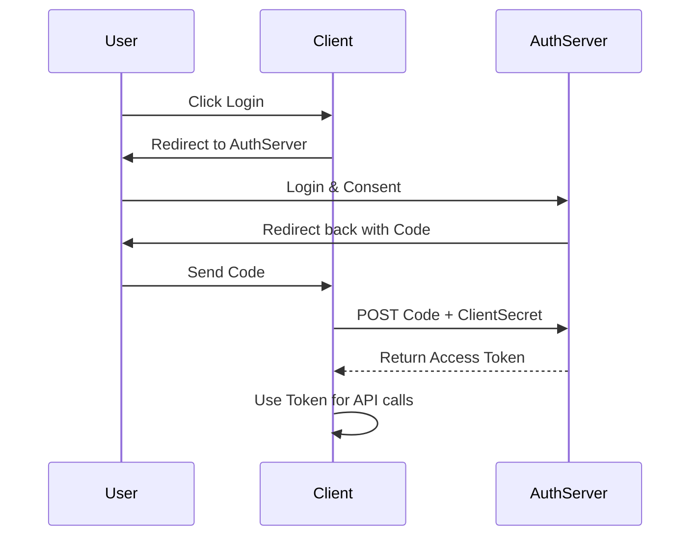

# OAuth 2.0

## Summary
OAuth 2.0 is the industry-standard protocol for authorization. It focuses on client developer simplicity while providing specific authorization flows for web applications, desktop applications, mobile phones, and living room devices. It allows a user to grant a third-party application limited access to their resources on another server (e.g., "Log in with Google" or "Access my GitHub repos") without sharing their password.

## Detailed Explanation

### Core Roles
1.  **Resource Owner**: The user who owns the data (You).
2.  **Client**: The application requesting access (e.g., Your App).
3.  **Authorization Server**: The server verifying identity and issuing tokens (e.g., Google Accounts).
4.  **Resource Server**: The server hosting the user's data (e.g., Google Drive API).

### Grant Types (Flows)
*   **Authorization Code**: Most common. Used for server-side apps. Exchanges a code for a token.
*   **PKCE (Proof Key for Code Exchange)**: Extension of Auth Code for mobile/SPAs (public clients).
*   **Client Credentials**: Machine-to-Machine (M2M) communication. No user involved.
*   **Implicit**: Legacy flow for browsers (DEPRECATED in favor of PKCE).

### The Authorization Code Flow
1.  **User clicks "Login"**: Client redirects User to Auth Server.
2.  **User Consents**: User logs in and grants permission.
3.  **Auth Code**: Auth Server redirects User back to Client with a temporary `code`.
4.  **Exchange**: Client sends `code` + `client_secret` to Auth Server (back-channel).
5.  **Token**: Auth Server returns `access_token` (and optionally `refresh_token`).
6.  **Access**: Client uses `access_token` to call Resource Server.

### Implementation in Go (Golang)

Go has an excellent standard-like library: `golang.org/x/oauth2`.

#### Configuration & Redirection

```go
package main

import (
	"context"
	"fmt"
	"net/http"

	"golang.org/x/oauth2"
	"golang.org/x/oauth2/github"
)

var oauthConf = &oauth2.Config{
	ClientID:     "YOUR_CLIENT_ID",
	ClientSecret: "YOUR_CLIENT_SECRET",
	Scopes:       []string{"repo", "user"},
	Endpoint:     github.Endpoint,
	RedirectURL:  "http://localhost:8080/callback",
}

// Step 1: Redirect user to consent page
func handleLogin(w http.ResponseWriter, r *http.Request) {
	// State should be a random string to prevent CSRF
	url := oauthConf.AuthCodeURL("random-state-string", oauth2.AccessTypeOffline)
	http.Redirect(w, r, url, http.StatusTemporaryRedirect)
}

// Step 2: Handle callback and exchange code for token
func handleCallback(w http.ResponseWriter, r *http.Request) {
	state := r.FormValue("state")
	if state != "random-state-string" {
		http.Error(w, "State invalid", http.StatusBadRequest)
		return
	}

	code := r.FormValue("code")
	if code == "" {
		http.Error(w, "Code not found", http.StatusBadRequest)
		return
	}

	// Exchange code for token
	token, err := oauthConf.Exchange(context.Background(), code)
	if err != nil {
		http.Error(w, err.Error(), http.StatusInternalServerError)
		return
	}

	fmt.Fprintf(w, "Access Token: %s\n", token.AccessToken)
	// Now use token to make requests...
}

func main() {
	http.HandleFunc("/login", handleLogin)
	http.HandleFunc("/callback", handleCallback)
	http.ListenAndServe(":8080", nil)
}
```

#### Making Authenticated Requests

```go
func getResources(token *oauth2.Token) {
	ctx := context.Background()
	// Create an http.Client that automatically adds the Authorization header
	// and refreshes the token if necessary.
	client := oauthConf.Client(ctx, token)

	resp, err := client.Get("https://api.github.com/user")
	if err != nil {
		// Handle error
	}
	defer resp.Body.Close()
	// Process response...
}
```

### Sequence Diagram



## Interview Questions

**Q: What is the difference between Authentication and Authorization?**
**A:** Authentication (AuthN) is verifying *who* you are (Identity). Authorization (AuthZ) is verifying *what* you can do (Permissions). OAuth 2.0 is an Authorization framework, though it's often used for AuthN via OIDC.

**Q: What is OIDC (OpenID Connect)?**
**A:** OIDC is an identity layer built *on top* of OAuth 2.0. While OAuth 2.0 provides an Access Token (for APIs), OIDC adds an ID Token (JWT) that contains user profile information, standardizing how client apps "log in" users.

**Q: Why do we need the 'state' parameter?**
**A:** To prevent Cross-Site Request Forgery (CSRF). The client generates a random string, sends it in the request, and verifies that the response contains the same string. This ensures the response comes from the flow the user initiated.

**Q: When should I use the Implicit Flow?**
**A:** Rarely/Never. It was designed for browsers before CORS was widely supported. It returns tokens in the URL fragment, which is insecure. Modern SPAs should use **Authorization Code Flow with PKCE**, which avoids exposing tokens in the URL and verifies the client identity.
