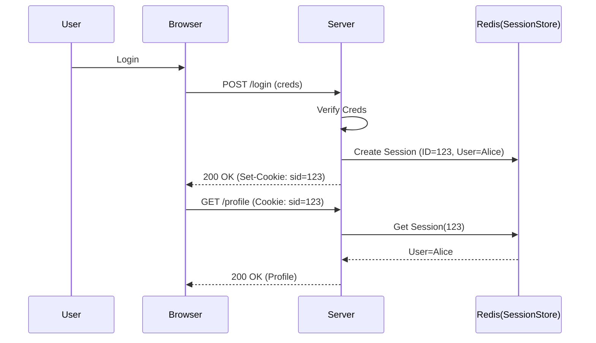

# Session-Based Authentication

## Summary
Session-based authentication (also known as Cookie-based authentication) is a stateful authentication mechanism. When a user logs in, the server creates a "session" record in memory or a database and sends a unique **Session ID** to the client via a Cookie. For subsequent requests, the client's browser automatically sends the cookie, allowing the server to look up the user's state. It is the traditional way of handling auth in web applications.

## Detailed Explanation

### How it Works
1.  **Client Login**: User sends credentials to the server.
2.  **Server Verification**: Server verifies credentials.
3.  **Session Creation**: Server creates a session entry in its store (Memory, Redis, DB) containing user info.
4.  **Cookie Issue**: Server responds with a `Set-Cookie` header containing the Session ID.
    *   `Set-Cookie: session_id=xyz123; HttpOnly; Secure; SameSite=Strict`
5.  **Subsequent Requests**: Browser automatically includes the Cookie in headers.
6.  **Lookup**: Server extracts Session ID, finds the session in the store, and identifies the user.

### Stateful vs Stateless
*   **Stateful (Sessions)**: Server knows about active sessions. It creates a burden on the server (storage) but offers control (e.g., "force logout user").
*   **Stateless (Tokens)**: Server doesn't store state. Token contains the info.

### Security Best Practices
*   **HttpOnly**: Flag prevents JavaScript from reading the cookie (mitigates XSS).
*   **Secure**: Flag ensures cookie is sent only over HTTPS.
*   **SameSite**: Flag (`Strict` or `Lax`) helps prevent CSRF attacks.

### Implementation in Go (Golang)

The standard for Go is `github.com/gorilla/sessions`.

#### Setup and Usage

```go
package main

import (
	"fmt"
	"net/http"
	"os"

	"github.com/gorilla/sessions"
)

// Initialize the store.
// In production, use a secure key from environment variables.
var store = sessions.NewCookieStore([]byte(os.Getenv("SESSION_KEY")))

func login(w http.ResponseWriter, r *http.Request) {
	session, _ := store.Get(r, "session-name")

	// Set user as authenticated
	session.Values["authenticated"] = true
	session.Values["username"] = "alice"
	
	// Save (encodes and writes the cookie)
	session.Save(r, w)
	
	fmt.Fprintln(w, "You have logged in!")
}

func secret(w http.ResponseWriter, r *http.Request) {
	session, _ := store.Get(r, "session-name")

	// Check if user is authenticated
	if auth, ok := session.Values["authenticated"].(bool); !ok || !auth {
		http.Error(w, "Forbidden", http.StatusForbidden)
		return
	}

	fmt.Fprintln(w, "The cake is a lie!")
}

func logout(w http.ResponseWriter, r *http.Request) {
	session, _ := store.Get(r, "session-name")

	// Revoke users authentication
	session.Values["authenticated"] = false
	session.Options.MaxAge = -1 // Delete cookie
	session.Save(r, w)
	
	fmt.Fprintln(w, "Logged out")
}

func main() {
	// Secure cookie settings
	store.Options = &sessions.Options{
		Path:     "/",
		MaxAge:   86400 * 7,
		HttpOnly: true,
		Secure:   true, // Set to false for localhost without https
	}

	http.HandleFunc("/login", login)
	http.HandleFunc("/secret", secret)
	http.HandleFunc("/logout", logout)

	http.ListenAndServe(":8080", nil)
}
```

### Sequence Diagram



## Interview Questions

**Q: What is the main difference between Session-based and Token-based authentication?**
**A:** State. Session-based is **stateful** (server stores the session data), while Token-based is **stateless** (the token contains the data). Sessions are harder to scale (need shared session store like Redis) but easier to invalidate.

**Q: What is CSRF and why are sessions vulnerable to it?**
**A:** Cross-Site Request Forgery (CSRF). Because browsers automatically send cookies to the target domain, a malicious site can trigger a request to your bank (if you are logged in) without your knowledge. Tokens (in headers) are generally immune to CSRF because the browser doesn't send them automatically; JavaScript must attach them.

**Q: What do the HttpOnly and Secure flags do?**
**A:** `HttpOnly` prevents client-side scripts (`document.cookie`) from accessing the cookie, protecting against XSS theft. `Secure` ensures the cookie is only transmitted over encrypted (HTTPS) connections.

**Q: How do you scale session-based auth horizontally?**
**A:** You cannot store sessions in the web server's memory because the next request might hit a different server. You must use a distributed session store (like Redis or Memcached) or "Sticky Sessions" (Load Balancer routes user to same server, though this is less robust).
