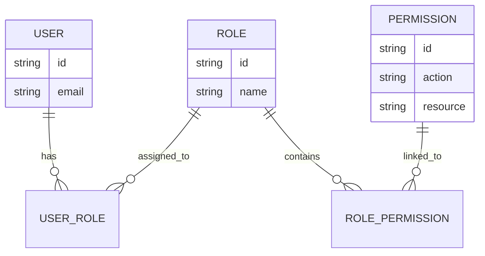

#API
---
---

# Role-Based Access Control (RBAC)

## Summary
**Role-Based Access Control (RBAC)** is an authorization strategy that regulates access to resources based on the roles assigned to individual users. Instead of assigning permissions directly to users (which becomes unmanageable at scale), permissions are grouped into **Roles**, and users are mapped to those roles.

- **Roles**: Logical containers for permissions that represent a job function or responsibility (e.g., `Admin`, `Editor`, `FinanceManager`).
- **Permissions**: Granular definitions of allowed actions on specific resources (e.g., `create:invoice`, `read:report`, `delete:user`).
- **Roles vs. Permissions**: Roles define **who** a user is within the organization, while Permissions define **what** can be done. A user "has a role," and a role "has permissions."

## Detailed Explanation

### Data Model
The standard implementation of RBAC relies on a many-to-many relationship structure. A user can have multiple roles, and a role can contain multiple permissions.



### Casbin Library in Go
In the Go (Golang) ecosystem, **Casbin** is the standard library for access control. It uses a configuration-based approach where you define a "Model" (the logic) and a "Policy" (the data).

1. **Model Definition (`rbac_model.conf`)**:
   Uses the PERM metamodel (Policy, Effect, Request, Matcher).
   ```ini
   [request_definition]
   r = sub, obj, act

   [policy_definition]
   p = sub, obj, act

   [role_definition]
   g = _, _

   [policy_effect]
   e = some(where (p.eft == allow))

   [matchers]
   m = g(r.sub, p.sub) && r.obj == p.obj && r.act == p.act
   ```

2. **Policy Definition (`policy.csv` or DB)**:
   ```csv
   p, admin, /api/v1/users, write
   p, viewer, /api/v1/users, read
   g, alice, admin
   ```

### Middleware Implementation
In Go, RBAC is typically enforced via middleware. This ensures that authorization logic is decoupled from business logic.

```go
func RBACMiddleware(e *casbin.Enforcer) gin.HandlerFunc {
    return func(c *gin.Context) {
        // 1. Get subject from context (set by Authentication middleware)
        sub, _ := c.Get("user_role") 
        
        // 2. Define object and action from the request
        obj := c.Request.URL.Path
        act := c.Request.Method

        // 3. Enforce policy
        ok, err := e.Enforce(sub, obj, act)
        if err != nil {
            c.AbortWithStatusJSON(500, gin.H{"error": "Internal auth error"})
            return
        }

        if !ok {
            c.AbortWithStatusJSON(403, gin.H{"error": "Access denied"})
            return
        }
        c.Next()
    }
}
```

### Hard-coded vs Database-driven Roles
*   **Hard-coded (Static) Roles**:
    *   Defined in code or local configuration files (e.g., `policy.csv`).
    *   **Use case**: Small internal tools or systems where roles never change.
    *   **Pros**: High performance, simple setup.
    *   **Cons**: Requires redeployment to update permissions.
*   **Database-driven (Dynamic) Roles**:
    *   Stored in a database (Postgres, MongoDB) using a **Casbin Adapter**.
    *   **Use case**: SaaS platforms, multi-tenant applications, or systems with an Admin UI for permission management.
    *   **Pros**: Real-time updates without downtime; supports thousands of roles/policies.
    *   **Cons**: Adds database latency (mitigated via caching).

## Interview Questions
1.  **How does RBAC differ from ABAC (Attribute-Based Access Control)?**
    *   RBAC uses roles as proxies for permissions. ABAC uses attributes (e.g., "User must be the owner of this record" or "Access only allowed during business hours") to make decisions.
2.  **What is "Role Explosion" and how do you prevent it?**
    *   It occurs when you create too many specific roles (e.g., `Editor_Level_1`, `Editor_Level_2`) to handle edge cases. It is prevented by using **Role Hierarchies** (inheritance) or mixing in ABAC for fine-grained checks.
3.  **Why should you check for permissions instead of roles in your code?**
    *   Checking `if user.IsAdmin()` makes the code rigid. Checking `if enforcer.Enforce(user, "resource", "delete")` allows you to change which roles can delete resources in the database without touching a single line of application code.
4.  **How do you handle role inheritance in Casbin?**
    *   By using the `g = _, _` definition in the model and defining relationships in the policy, such as `g, manager, employee`, which grants managers all permissions held by employees.
