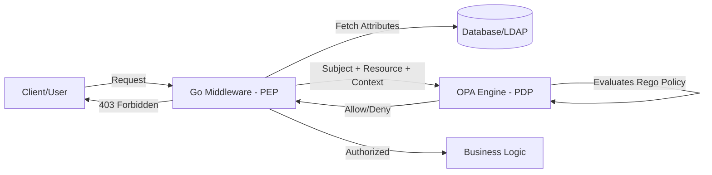

#API
---
---

# Attribute-Based Access Control (ABAC)

Attribute-Based Access Control (ABAC) is an authorization model that defines permissions based on **attributes** rather than just roles. It provides the highest level of granularity for access control by evaluating "Who is requesting access to what, under which conditions, and what are they trying to do?"

## Summary

In ABAC, access decisions are made by evaluating policies against the attributes of the entities involved in a request:

- **Subject Attributes**: Data about the user or service making the request (e.g., `user_id`, `role`, `department`, `security_clearance`, `email`).
- **Resource Attributes**: Data about the object being accessed (e.g., `owner`, `file_type`, `sensitivity_level`, `created_at`, `status`).
- **Action Attributes**: What the subject is trying to do (e.g., `read`, `write`, `delete`, `approve`, `execute`).
- **Environment Attributes**: Contextual data about the request itself (e.g., `current_time`, `request_ip`, `location`, `system_threat_level`).

### ABAC vs. RBAC
Unlike **Role-Based Access Control (RBAC)**, which is static (User -> Role -> Permission), ABAC is dynamic. 
*Example*: RBAC says "Managers can read reports." ABAC says "Managers can read reports *only if* they belong to the same department as the report owner *and* it is during business hours."

---

## Detailed Explanation

### 1. The ABAC Flow
The process typically involves a **Policy Enforcement Point (PEP)**—usually a middleware in your Go API—and a **Policy Decision Point (PDP)** like OPA.



### 2. Policy Engines: OPA & Rego
Implementing ABAC from scratch in Go code using nested `if-else` blocks is unmaintainable. Instead, we use **Open Policy Agent (OPA)**, which uses a declarative language called **Rego**.

**Example Rego Policy (`policy.rego`):**
```rego
package authz

default allow = false

# Allow access if:
allow {
    # 1. Action is 'read'
    input.action == "read"
    
    # 2. Subject and Resource belong to the same department
    input.subject.department == input.resource.department
    
    # 3. Environment: It's currently business hours (9 AM - 5 PM)
    input.env.hour >= 9
    input.env.hour <= 17
}

# Administrative override
allow {
    input.subject.role == "admin"
}
```

### 3. Go Middleware Integration
To integrate ABAC in a Go service, you can embed OPA as a library or call it via HTTP. Using the OPA Go SDK is standard for high-performance requirements.

```go
package middleware

import (
	"context"
	"net/http"
	"time"

	"github.com/open-policy-agent/opa/rego"
)

func ABACMiddleware(regoQuery rego.PreparedEvalQuery) func(http.Handler) http.Handler {
	return func(next http.Handler) http.Handler {
		return http.HandlerFunc(func(w http.ResponseWriter, r *http.Request) {
			// 1. Construct Input (Attributes)
			input := map[string]interface{}{
				"subject": map[string]interface{}{
					"user": "alice",
					"department": "engineering",
					"role": "developer",
				},
				"resource": map[string]interface{}{
					"type": "document",
					"department": "engineering",
				},
				"action": r.Method,
				"env": map[string]interface{}{
					"hour": time.Now().Hour(),
				},
			}

			// 2. Evaluate Policy
			results, err := regoQuery.Eval(context.Background(), rego.EvalInput(input))
			if err != nil || len(results) == 0 || !results[0].Expressions[0].Value.(bool) {
				http.Error(w, "Forbidden", http.StatusForbidden)
				return
			}

			next.ServeHTTP(w, r)
		})
	}
}
```

### 4. Flexibility vs. Complexity
*   **Flexibility**: Permits complex logic (e.g., "Allow access to PRs if user is a reviewer AND hasn't reached their daily limit").
*   **Complexity**: Requires an external policy engine, learning Rego, and potentially fetching extra attributes from databases (which can increase latency).

---

## Interview Questions

### 1. How does ABAC solve the "Role Explosion" problem in RBAC?
In RBAC, as business requirements grow, you end up creating roles like `Manager`, `RegionalManager`, `RegionalManagerReadOnly`, etc. In ABAC, you simply keep one `Manager` role and use attributes (like `region` or `permissions_level`) to dynamically filter access.

### 2. What are the performance implications of ABAC in a Go microservice?
ABAC requires more data (attributes) than RBAC. Fetching these from a database or a remote PDP (via HTTP) adds latency. In Go, this is mitigated by:
- Embedding OPA as a library (using WASM or native Go evaluation).
- Caching common attributes in-memory (using `sync.Map` or Redis).
- Using "Partial Evaluation" to pre-calculate parts of the policy.

### 3. Explain the "Environment" attribute with a practical Go example.
Environment attributes represent global context. In Go, you might use `time.Now()` to enforce time-based access or `r.RemoteAddr` to restrict access to a specific VPN range or IP whitelist.

### 4. How do you handle "Deny by Default" in Rego?
By defining `default allow = false` at the top of the Rego package. This ensures that if no rules explicitly evaluate to true, the request is rejected, following the principle of least privilege.
