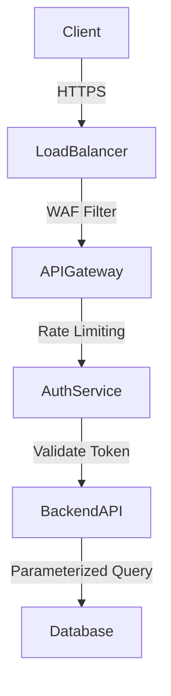

# API Security Best Practices

## Summary
Securing an API requires a defense-in-depth approach, moving beyond just simple authentication. It involves ensuring encrypted communication (HTTPS), validating all user input to prevent injection attacks, limiting request rates to prevent abuse, and configuring proper HTTP security headers. Implementing these best practices mitigates most common vulnerabilities and reduces the attack surface significantly.

## Detailed Explanation

### 1. Always Use HTTPS (TLS)
**Why**: Encrypts data in transit. Without it, credentials (Basic Auth, Bearer Tokens) and sensitive data are visible to anyone on the network (Man-in-the-Middle attacks).
**How**: Use free certificates from Let's Encrypt. In Go, you can use `golang.org/x/crypto/acme/autocert` for automatic HTTPS.

### 2. Rate Limiting (Throttling)
**Why**: Prevents abuse (DoS), brute-force password guessing, and excessive resource usage by a single user or bot.
**How**: Use the "Leaky Bucket" or "Token Bucket" algorithm.

#### Go Implementation (Token Bucket)
Using `golang.org/x/time/rate`.

```go
package main

import (
    "net/http"
    "time"
    "golang.org/x/time/rate"
)

// 1 request per second, with a burst of 3
var limiter = rate.NewLimiter(1, 3)

func limit(next http.Handler) http.Handler {
    return http.HandlerFunc(func(w http.ResponseWriter, r *http.Request) {
        if !limiter.Allow() {
            http.Error(w, "Too Many Requests", http.StatusTooManyRequests)
            return
        }
        next.ServeHTTP(w, r)
    })
}

func main() {
    mux := http.NewServeMux()
    mux.HandleFunc("/", func(w http.ResponseWriter, r *http.Request) {
        w.Write([]byte("Welcome!"))
    })
    
    // Wrap entire mux with rate limiter
    http.ListenAndServe(":8080", limit(mux))
}
```

### 3. Input Validation & Sanitization
**Why**: Never trust client input. It is the primary vector for SQL Injection, XSS, and Command Injection.
**How**: 
*   **Validate**: Check type, length, and format (e.g., email regex) *before* processing.
*   **Sanitize**: Remove unsafe characters.
*   **Use Strong Types**: Decode JSON into strict structs, not `map[string]interface{}`.

```go
type UserInput struct {
    Email string `json:"email" validate:"required,email"`
    Age   int    `json:"age" validate:"gte=0,lte=130"`
}

// Use 'go-playground/validator' library
```

### 4. HTTP Security Headers
**Why**: Browser security features that protect clients from XSS, Clickjacking, and MIME-sniffing.
**Key Headers**:
*   `Strict-Transport-Security` (HSTS): Enforce HTTPS.
*   `Content-Security-Policy` (CSP): Whitelist sources for scripts/styles (mitigates XSS).
*   `X-Content-Type-Options`: `nosniff` (prevents MIME confusion).
*   `X-Frame-Options`: `DENY` (prevents Clickjacking).

#### Go Middleware for Headers

```go
func securityHeaders(next http.Handler) http.Handler {
    return http.HandlerFunc(func(w http.ResponseWriter, r *http.Request) {
        // Enforce HTTPS for 1 year, include subdomains
        w.Header().Set("Strict-Transport-Security", "max-age=31536000; includeSubDomains")
        // Prevent MIME sniffing
        w.Header().Set("X-Content-Type-Options", "nosniff")
        // Prevent Clickjacking
        w.Header().Set("X-Frame-Options", "DENY")
        // Basic CSP
        w.Header().Set("Content-Security-Policy", "default-src 'self'")
        
        next.ServeHTTP(w, r)
    })
}
```

### 5. CORS (Cross-Origin Resource Sharing)
**Why**: Browsers block cross-domain requests by default. If your API is on `api.com` and frontend on `app.com`, you must explicitly allow it.
**Warning**: Avoid `Access-Control-Allow-Origin: *` in production unless it's a public API. It allows *any* site to call your API with the user's credentials.

### 6. Least Privilege Principle
**Why**: If an attacker compromises a token, they should only access what that specific user needs, not everything.
**How**:
*   **Database**: The DB user for the API should not be `root`. It should only have `SELECT/INSERT/UPDATE` on specific tables.
*   **Scopes**: Use OAuth Scopes (e.g., `read:user` vs `write:admin`) to limit token power.

### Security Architecture Diagram



## Interview Questions

**Q: What is the purpose of HSTS?**
**A:** HTTP Strict Transport Security (HSTS) tells the browser to *only* communicate with the server over HTTPS. It prevents "SSL Stripping" attacks where an attacker downgrades the connection to HTTP. Once the browser sees the header, it remembers to always use HTTPS for that domain for the specified `max-age`.

**Q: Why shouldn't you return verbose error messages to the client?**
**A:** Stack traces or database errors (e.g., "SQL Syntax Error near...") leak implementation details that help attackers find vulnerabilities (like SQL Injection points or framework versions). Always log the full error internally but return a generic message (e.g., "Internal Server Error") to the client.

**Q: What is the difference between Whitelisting and Blacklisting input?**
**A:** **Whitelisting** (Allow-list) accepts *only* known good input (e.g., "only allow a-z"). **Blacklisting** (Deny-list) rejects known bad input (e.g., "remove <script> tags"). Whitelisting is far more secure because it's impossible to list every possible bad pattern (attacker evasion).

**Q: How does CORS protect the user?**
**A:** CORS is a browser security feature. It doesn't protect the *API* (server still receives the request); it protects the *user* by preventing a malicious site (`evil.com`) from reading the response of a request made to `bank.com` using the user's cookies/session.
