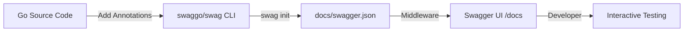

#API
---
---

## Summary
Swagger and OpenAPI are the industry standards for describing, documenting, and consuming RESTful web services. While **OpenAPI** refers to the vendor-neutral specification (the "standard"), **Swagger** is the popular suite of tools (UI, Editor, Codegen) used to implement that specification. In the Go ecosystem, these tools enable "Documentation as Code," allowing developers to generate interactive API explorers and client SDKs directly from source code annotations, ensuring that documentation stays in sync with the implementation.

## Detailed Explanation

### OpenAPI vs Swagger: The Distinction
Historically, the project started as **Swagger** in 2011. In 2016, the Swagger 2.0 specification was donated to the Linux Foundation and renamed the **OpenAPI Specification (OAS)**.
*   **OpenAPI:** The specification itself (OAS 3.0, 3.1). It is a document (YAML or JSON) that defines your API's endpoints, input/output parameters, and authentication schemes.
*   **Swagger:** A brand of tools owned by SmartBear. When people say "Swagger UI," they mean the interactive web page that lets you test API calls.

### Why Use OpenAPI?
1.  **Interactivity:** Swagger UI provides a "Try it out" feature to test endpoints without external tools like Postman.
2.  **Client Generation:** Tools like `openapi-generator` can create client libraries in 40+ languages from a single OAS file.
3.  **Single Source of Truth:** Contracts are defined clearly, reducing friction between frontend and backend teams.
4.  **Automation:** Documentation can be generated automatically during the build process.

### Schema Structure
An OpenAPI document typically consists of:
-   **openapi**: Semantic version number of the OAS.
-   **info**: Metadata (Title, Version, Description).
-   **servers**: Connectivity information (Base URLs).
-   **paths**: The available endpoints and operations (GET, POST, etc.).
-   **components**: Reusable objects like Schemas (Data models) and Security Schemes.

### Go Integration: swaggo/swag
In Go, the most common way to implement OpenAPI is using the `swaggo/swag` library. It parses specific comments (annotations) in your code to generate the `swagger.json/yaml` files.

#### 1. Generation Flow


#### 2. Go Implementation Example
To use `swag`, you add general info to your `main.go` and specific annotations to your handlers.

**Main API Info:**
```go
// @title           User Management API
// @version         1.0
// @description     This is a sample server for managing users.
// @host            localhost:8080
// @BasePath        /api/v1
func main() {
    // router setup...
}
```

**Handler and Struct Tags:**
```go
// User represents the data model for a user
type User struct {
    ID    int    `json:"id" example:"1"`
    Name  string `json:"name" example:"John Doe"`
    Email string `json:"email" example:"john@example.com"`
}

// GetUserByID godoc
// @Summary      Get a user by ID
// @Description  get string by ID
// @Tags         users
// @Accept       json
// @Produce      json
// @Param        id   path      int  true  "User ID"
// @Success      200  {object}  User
// @Failure      404  {object}  map[string]string
// @Router       /users/{id} [get]
func GetUserByID(c *gin.Context) {
    // implementation...
}
```

#### 3. Serving the Documentation
After running `swag init`, you serve the generated docs using a middleware like `gin-swagger`:

```go
import (
    _ "myproject/docs" // Import generated docs
    "github.com/swaggo/gin-swagger"
    "github.com/swaggo/files"
)

func main() {
    r := gin.Default()
    // Swagger endpoint
    r.GET("/swagger/*any", ginSwagger.WrapHandler(swaggerFiles.Handler))
    r.Run()
}
```

## Interview Questions

**Q: What is the main difference between Swagger 2.0 and OpenAPI 3.0?**
**A:** OpenAPI 3.0 is the evolution of Swagger 2.0. Key changes include a more modular structure (using `components`), support for multiple server URLs, improved support for JSON Schema, and the introduction of "Links" and "Callbacks" for describing complex API flows and webhooks.

**Q: How do you handle authentication (e.g., JWT) in a Swagger definition?**
**A:** You define a `securityScheme` in the `components` section (e.g., type `apiKey` or `http` with scheme `bearer`). Then, you apply it globally or to specific operations using the `@Security` annotation in Go, which allows Swagger UI to include the `Authorization` header in requests.

**Q: What is "API-First" design vs. "Code-First" documentation?**
**A:** API-First involves writing the OpenAPI YAML/JSON file *before* any code to agree on the contract. Code-First (like `swaggo`) involves writing the code and annotations first, then generating the documentation from it. Code-First is often faster for small teams, while API-First is better for large-scale enterprise collaboration.

**Q: Why might you choose `swaggo/swag` over manually writing a `swagger.yaml` file?**
**A:** `swaggo/swag` ensures that the documentation is a "living document." Since the annotations live right above the Go handlers, developers are more likely to update them when they change the code, preventing the "stale documentation" problem. It also allows the use of Go's type system to automatically define schemas for request/response bodies.
