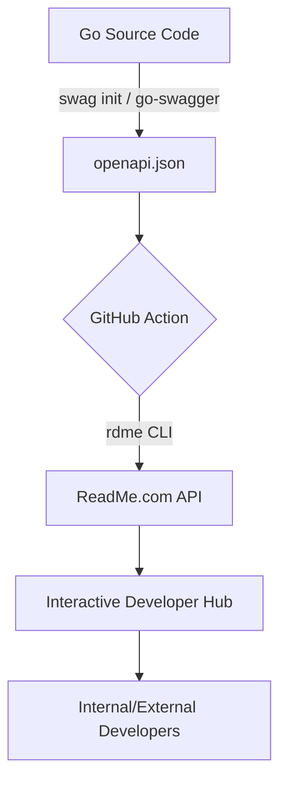

#API
---
---

# ReadMe.com: Interactive API Documentation

ReadMe.com is a specialized "Documentation-as-a-Service" platform that transforms static API specifications (like OpenAPI/Swagger) into interactive developer hubs. Unlike static generators (like Redoc), ReadMe provides a live environment where developers can authenticate, execute API calls directly from the browser, and view real-time logs.

## Summary
ReadMe acts as a bridge between backend API implementations and the developer experience (DX). It automates the creation of API explorers, provides a CMS for technical guides, manages versioning, and offers "API Metrics" to see how users interact with specific endpoints. For Go developers, the typical workflow involves generating an OpenAPI spec from code comments and syncing it to ReadMe via CI/CD pipelines.

## Detailed Explanation

### What is ReadMe?
ReadMe is a Developer Hub platform. While tools like Swagger UI provide a basic interface for testing, ReadMe offers a full-suite solution including:
- **Interactive API Explorer:** A "Try It" console that handles authentication (API Keys, OAuth2) automatically.
- **Markdown Guides:** A CMS for tutorials, recipes, and conceptual documentation.
- **Changelogs:** A dedicated section to communicate API updates and breaking changes.
- **Community Support:** Built-in discussion forums and "Suggest Edits" features.

### Key Features
1.  **OpenAPI Native:** Deep support for OpenAPI 3.0 and 3.1. It preserves schemas, descriptions, and examples defined in the spec.
2.  **Live Metrics:** By using a ReadMe SDK (middleware), you can see real-time API logs in the documentation, allowing developers to debug their own requests.
3.  **Authentication Orchestration:** Simplifies the process of showing users their actual API keys within the documentation.
4.  **Versioning:** Manage multiple versions of your API documentation (e.g., `v1.0` vs `v2.0-beta`) simultaneously.

### Integration Workflow
The most efficient way to use ReadMe is the **"Spec-First" or "Code-First" sync** approach. Instead of manually editing the docs, you update your source code or spec file and push it to ReadMe.



### Go Integration: CI/CD Pipeline
In a Go environment, you typically use a tool like `swag` (Swaggo) to generate documentation from comments.

#### 1. Generate Spec in Go
Install the generator:
```bash
go install github.com/swaggo/swag/cmd/swag@latest
```

Annotate your code:
```go
// @Summary Get User by ID
// @Description get string by ID
// @ID get-string-by-id
// @Param id path int true "User ID"
// @Success 200 {object} model.User
// @Router /users/{id} [get]
func GetUser(c *gin.Context) { ... }
```

Generate:
```bash
swag init -g cmd/api/main.go --output docs/
```

#### 2. Sync to ReadMe via GitHub Actions
ReadMe provides the `rdme` CLI tool. The best practice is to automate this on every push to the `main` branch.

**`.github/workflows/docs.yml`**
```yaml
name: Sync API Docs to ReadMe
on:
  push:
    branches: [main]

jobs:
  deploy:
    runs-on: ubuntu-latest
    steps:
      - uses: actions/checkout@v4

      - name: Setup Go
        uses: actions/setup-go@v4
        with:
          go-version: '1.21'

      - name: Generate OpenAPI Spec
        run: |
          go install github.com/swaggo/swag/cmd/swag@latest
          swag init -g cmd/api/main.go

      - name: Push to ReadMe
        uses: readmeio/rdme@v8
        with:
          rdme: openapi ./docs/swagger.json --key=${{ secrets.README_API_KEY }} --id=${{ secrets.README_DEFINITION_ID }}
```

## Interview Questions

1.  **How does ReadMe handle API authentication for end-users?**
    ReadMe allows you to define authentication schemes (Header, Query, Basic, OAuth2). You can also use "Personalized Docs" to programmatically inject the user's actual API keys into the documentation if they are logged into your main application.

2.  **What is the difference between syncing an OpenAPI spec and using ReadMe's Manual Editor?**
    Syncing (via CLI/API) ensures the documentation is the "Source of Truth" derived from code, preventing drift. The Manual Editor is better for conceptual guides and non-API reference content that doesn't exist in a machine-readable spec.

3.  **How would you handle breaking changes in ReadMe?**
    Use the **Versioning** feature. You create a new version (e.g., `v2.0`) in the ReadMe dashboard, and then target your CI/CD pipeline to that version ID using the `--version` flag in the `rdme` CLI.

4.  **What is the "ReadMe Metrics" SDK and why is it useful?**
    It is a middleware (available for Go, Node, etc.) that sends a copy of API request/response metadata to ReadMe. It allows developers to see their own request history directly in the docs, making it a powerful debugging tool.

5.  **If your Go project uses `buf` (Protocol Buffers/gRPC), how do you integrate with ReadMe?**
    ReadMe is primarily OpenAPI-centric. You would need to use a plugin like `protoc-gen-openapi` to convert your Proto definitions into an OpenAPI JSON/YAML file first, then push that file to ReadMe.
