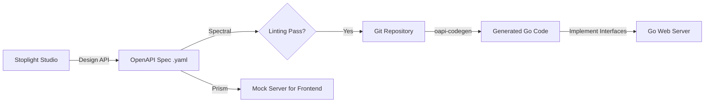

#API
---
---

# Stoplight: API Design & Documentation

## Summary
Stoplight is a comprehensive API design and documentation platform that facilitates a **Design-First** approach to API development. It provides a suite of tools—including Stoplight Studio (visual editor), Spectral (linting), and Prism (mocking)—to help teams create high-quality OpenAPI specifications before writing code. In a Go ecosystem, Stoplight serves as the "Source of Truth," where the API contract is defined and then used to generate type-safe Go boilerplate using tools like `oapi-codegen`.

---

## Detailed Explanation

### What is Stoplight?
Stoplight is an API lifecycle management platform centered around the **OpenAPI Specification (OAS)**. Unlike tools that simply host documentation, Stoplight provides an Integrated Development Environment (IDE) specifically for APIs.

#### Key Components:
1.  **Stoplight Studio**: A visual editor for modeling APIs without needing to write raw YAML/JSON. It supports complex schemas, reusable components ($refs), and multi-file projects.
2.  **Spectral**: An open-source JSON/YAML linter. It allows teams to enforce "API Style Guides" (e.g., "all property names must be camelCase", "every endpoint must have a 401 response").
3.  **Prism**: An open-source HTTP Mock and Proxy server. It uses your OpenAPI files to spin up a local mock server that validates requests against the spec.
4.  **Elements**: A set of UI components for rendering beautiful, interactive API documentation from OpenAPI documents.

### Design-First vs. Code-First

| Feature | Design-First (Stoplight) | Code-First (Swag/Swagger-Go) |
| :--- | :--- | :--- |
| **Workflow** | Define spec → Generate code → Implement | Write code → Add annotations → Generate spec |
| **Consistency** | High (Enforced by linters before coding) | Variable (Depends on annotation accuracy) |
| **Parallelism** | Frontend/Mobile can mock API immediately | Frontend must wait for backend implementation |
| **Truth** | The OpenAPI file is the contract | The Code is the contract |

### Stoplight Features for Go Developers
*   **Visual Modeling**: Avoid manual YAML errors in complex Go `struct` mappings by designing visually.
*   **Style Guides**: Ensure that your Go microservices expose consistent APIs across the organization using Spectral rules.
*   **Shared Models**: Create a central "Models" repository in Stoplight and reference them across different Go services to ensure type consistency.

### Integration: Design-First Workflow with Go
The most efficient way to use Stoplight with Go is to treat the OpenAPI file as the blueprint for your application.

#### The Workflow Diagram


#### Step-by-Step Implementation:
1.  **Design in Stoplight**: Use Stoplight Studio to create your paths, schemas, and security schemes. Export the `openapi.yaml`.
2.  **Lint with Spectral**: Run `spectral lint openapi.yaml` in your CI/CD pipeline to ensure the design meets company standards.
3.  **Generate Go Stubs**: Use `oapi-codegen` to generate Chi, Echo, or Gin boilerplate.
    ```bash
    # Install generator
    go install github.com/deepmap/oapi-codegen/v2/cmd/oapi-codegen@latest

    # Generate types and server interface
    oapi-codegen -package api -generate types,server,spec openapi.yaml > api/api.gen.go
    ```
4.  **Implement the Interface**: `oapi-codegen` generates a Go `interface`. You only need to create a struct that satisfies that interface.
    ```go
    type Server struct{}

    func (s *Server) GetUserById(w http.ResponseWriter, r *http.Request, id string) {
        // Business logic here
    }
    ```

---

## Interview Questions

### 1. What are the primary advantages of a Design-First approach using tools like Stoplight?
**Answer:** Design-first allows stakeholders to review the API contract before any code is written, reducing costly refactors later. It enables parallel development (frontend can use Prism mocks while backend develops), ensures consistency via Spectral style guides, and results in a more developer-friendly API.

### 2. How does Stoplight's Spectral help in a microservices architecture?
**Answer:** In microservices, consistency is a major challenge. Spectral allows you to define a "Global Style Guide." When every team designs their API in Stoplight, Spectral automatically flags violations (e.g., missing versioning, inconsistent error formats), ensuring that all microservices look and feel like they were built by the same team.

### 3. How do you handle the synchronization between a Stoplight design and a Go implementation?
**Answer:** The best practice is to use a code generator like `oapi-codegen`. The `openapi.yaml` exported from Stoplight is the "Source of Truth." You should never manually edit the generated Go files. If the API needs to change, update the design in Stoplight, re-export the YAML, and re-run the generator. This ensures the Go code always matches the contract.

### 4. What is the role of Prism in the Stoplight ecosystem?
**Answer:** Prism is a mock server. It takes an OpenAPI specification and starts a local server that mimics the API. It validates incoming requests against the spec and returns example responses defined in the YAML. This allows frontend developers to test their code against a "live" API without the backend being ready.

### 5. Why prefer Stoplight over writing OpenAPI YAML manually in VS Code?
**Answer:** While you can write YAML manually, Stoplight Studio provides visual feedback, real-time linting, and a simplified interface for managing `$ref` pointers and complex nested objects, which are error-prone in raw YAML. It also provides built-in documentation previewing and collaboration features for non-technical stakeholders.
