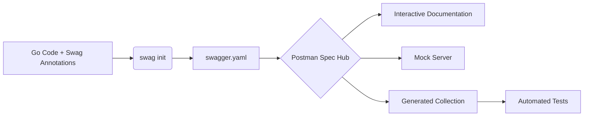

#API
---
---

# Postman Documentation

## Summary

Postman has evolved from a simple REST client into a comprehensive API platform. As a documentation tool, it excels by transforming **Collections**—groups of saved API requests—into human-readable, web-hosted documentation. Its "API-First" philosophy in 2025/2026 emphasizes **Spec Hub**, allowing developers to maintain a single source of truth (OpenAPI) that bidirectionally syncs with documentation. For Go developers, Postman provides a seamless bridge between backend implementation and consumer-facing guides, enabling automated documentation updates via CI/CD pipelines.

---

## Detailed Explanation

### 1. From Collections to Docs
The core of Postman documentation is the **Collection**. Every request saved in a collection includes:
- **Metadata**: Names, descriptions (Markdown supported), and folder hierarchies.
- **Parameters**: Detailed explanations for headers, query params, and path variables.
- **Authentication**: Documentation on how to obtain and use tokens (OAuth2, API Keys, etc.).

Postman automatically renders these details into a polished web interface, searchable and organized by folders.

### 2. The Power of Examples
Documentation without response samples is incomplete. In Postman, you can save **Examples** (snapshots of a request/response pair).
- **Multi-scenario**: Save examples for `200 OK`, `400 Bad Request`, and `401 Unauthorized`.
- **Automatic Code Snippets**: Postman generates snippets in Go (native, Resty, etc.), Python, JavaScript, and more.
- **Dynamic Updates**: If the API changes, updating the example in the collection automatically refreshes the documentation.

### 3. Publishing Features
- **Spec Hub (2025 Focus)**: Instead of manually building collections, developers import **OpenAPI 3.0/3.1** specs. Postman then generates and syncs the documentation.
- **Public vs. Private**: Documentation can be hosted on a public URL (with custom branding) or restricted to team members via workspaces.
- **Versioning**: Maintain multiple versions of docs (e.g., `v1.0` vs `v2.0`) linked to different collection tags.

### 4. Mock Servers
Postman Mock Servers use your saved **Examples** to simulate an API.
- **Rapid Prototyping**: Frontend teams can develop against the mock while the Go backend is still being built.
- **Pattern Matching**: The mock server looks at the request headers/body and returns the example that matches most closely.

### 5. Go (Golang) Integration Workflow
In a Go context, manual documentation is a maintenance nightmare. The industry-standard approach uses an **API-First** or **Code-First-to-Spec** workflow.

#### The Workflow:
1. **Code with Annotations**: Use libraries like `swag` (for Gin/Echo/Fiber) to annotate Go code.
2. **Generate Spec**: Run `swag init` to produce a `swagger.yaml` or `swagger.json`.
3. **Import to Postman**: Upload the spec to **Spec Hub**.
4. **Bidirectional Sync**: Postman generates a collection from the spec. Any changes in the Go code (and thus the spec) can be pushed to Postman via the **Postman API** or **CLI**.



#### Example: Go Gin Annotation
```go
// @Summary Get User Details
// @Description Get details of a specific user by ID
// @Tags users
// @Accept  json
// @Produce  json
// @Param   id     path    int     true  "User ID"
// @Success 200 {object} models.User
// @Router /users/{id} [get]
func GetUser(c *gin.Context) {
    // Implementation
}
```

---

## Interview Questions

### 1. How does Postman distinguish between a "Collection" and an "API" in its current platform?
**Answer:** A Collection is a group of executable requests, often used for testing or organization. An "API" (within the API Builder/Spec Hub) is a higher-level construct that represents the lifecycle of an API, including its definition (OpenAPI/GraphQL), versions, documentation, and linked collections.

### 2. Why are "Examples" critical for Postman Mock Servers?
**Answer:** Mock Servers rely on Examples to know what to return. Without examples, the mock server has no data to serve. By saving multiple examples for a single request, you can test how your frontend handles different status codes and data structures.

### 3. How can you automate Postman documentation updates from a Go CI/CD pipeline?
**Answer:** You can use the **Postman CLI** or **Newman**. A common pattern is:
1. Generate the OpenAPI spec in the pipeline.
2. Use the Postman API (`PUT /apis/{apiId}/versions/{versionId}/definition`) to upload the new spec.
3. Postman's bidirectional sync then updates the linked documentation automatically.

### 4. What is the benefit of using "Spec Hub" over manually creating documentation in Postman?
**Answer:** Spec Hub enforces a "Single Source of Truth." It allows for governance (linting the spec against standards), ensures that documentation never drifts from the actual API definition, and supports advanced OpenAPI features (like `$ref` for reusable components) that manual collections might handle poorly.

### 5. How does Postman handle sensitive data in public documentation?
**Answer:** Postman uses **Environments** and **Variables**. In documentation, variables like `{{baseUrl}}` are rendered as placeholders. Sensitive values (like `api_key`) should be stored in "Secret" type variables or Environment variables that are *not* included in the public publish settings.
