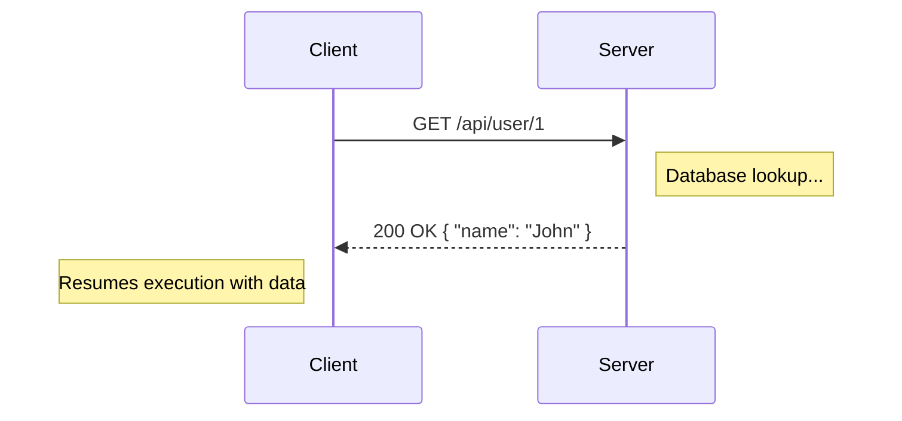
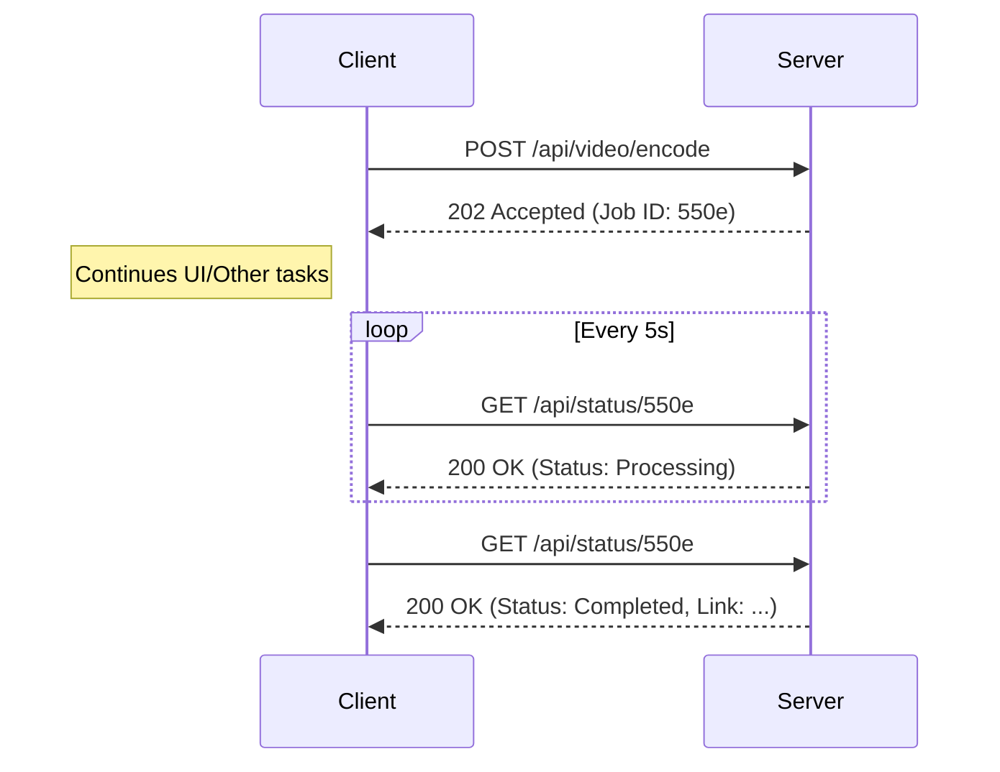

#API
---
---

# Synchronous vs Asynchronous APIs

## Summary
The fundamental difference between Synchronous and Asynchronous APIs lies in the **execution flow** and how the client handles the **waiting period**:

*   **Synchronous (Sync):** The client sends a request and **blocks** (waits) until the server returns a response. The execution is linear.
*   **Asynchronous (Async):** The client sends a request and receives an immediate acknowledgment (e.g., `202 Accepted`). The actual processing happens in the background, and the client is notified later or polls for the result.

| Feature | Synchronous | Asynchronous |
| :--- | :--- | :--- |
| **Blocking** | Yes (Client thread is held) | No (Client is free to do other work) |
| **Responsiveness** | Dependent on server processing time | High (Immediate acknowledgment) |
| **Complexity** | Simple (Standard Request/Response) | Higher (Requires Job IDs, Polling, or Webhooks) |
| **Reliability** | Connection must stay open | Better for long-running or unstable tasks |
| **Use Case** | CRUD, Auth, Real-time data | Video encoding, Reports, Batch processing |

---

## Detailed Explanation

### Request/Response Cycle vs. Fire-and-Forget
#### Synchronous (Request/Response)
In a synchronous cycle, the lifecycle of the request is tied to the lifecycle of the TCP connection. If a server takes 30 seconds to generate a report, the client's connection must remain open for those 30 seconds. This is the standard model for REST and GraphQL.

#### Asynchronous (Non-blocking)
Async APIs decouple the "trigger" from the "result." They typically follow one of three patterns:
1.  **Fire-and-Forget:** Client triggers an event (e.g., logging) and doesn't wait for any result.
2.  **Polling:** The server returns a `job_id`. The client periodically sends requests to a status endpoint to check if the task is finished.
3.  **Callbacks / Webhooks:** The client provides a URL where the server will send a POST request once the processing is complete.

### Sequence Diagrams

#### Synchronous Flow (Standard HTTP)


#### Asynchronous Flow (Polling Pattern)


### Latency Implications
*   **Synchronous:** High processing latency leads to "Head-of-Line" blocking. If a web server has a limited thread pool, slow synchronous requests will consume all available threads, causing a denial of service for fast requests.
*   **Asynchronous:** Hides latency. While the total "Wall Clock" time to finish a task might be longer (due to queueing), the system remains highly responsive to the user.

### Use Cases
*   **Synchronous:** 
    *   Authenticating a user (you can't proceed without the token).
    *   Fetching price data for a checkout page.
    *   Standard CRUD operations on a small database.
*   **Asynchronous:**
    *   Processing large CSV uploads.
    *   Sending a "Forgot Password" email (Fire-and-forget).
    *   Interacting with third-party APIs that have unpredictable latency.

### Go Context (Golang)

In Go, we leverage goroutines and channels to transition from synchronous handlers to asynchronous processing patterns.

#### Synchronous HTTP Handler
In this pattern, the handler waits for the result. The connection is held open.

```go
func syncHandler(w http.ResponseWriter, r *http.Request) {
    // Blocking call: the handler waits here
    data, err := db.QueryHeavyData() 
    if err != nil {
        http.Error(w, err.Error(), 500)
        return
    }
    json.NewEncoder(w).Encode(data)
}
```

#### Asynchronous Pattern (Goroutine/Channel)
In an Async API, we respond immediately and pass the work to a background process.

```go
func asyncHandler(w http.ResponseWriter, r *http.Request) {
    jobID := generateUUID()
    
    // 1. Kick off background work
    go func(id string) {
        result := performHeavyComputation()
        saveToRedis(id, result)
        log.Printf("Job %s completed", id)
    }(jobID)

    // 2. Respond immediately with 202 Accepted
    w.WriteHeader(http.StatusAccepted)
    fmt.Fprintf(w, `{"job_id": "%s", "status": "processing"}`, jobID)
}
```
*Note: For production, instead of raw goroutines, you would use a persistent task queue like **Asynq** or **RabbitMQ** to ensure jobs aren't lost if the server restarts.*

---

## Interview Questions

1.  **If an API is slow, should you always make it asynchronous?**
    *   *Answer:* No. Async adds complexity (state management, polling, retry logic). First, try optimizing the query, adding caching, or using a CDN. Only go async if the task genuinely takes longer than a typical HTTP timeout (e.g., > 10-30s).

2.  **How do you handle error reporting in an Asynchronous API?**
    *   *Answer:* Since the initial request returns `202 Accepted`, you cannot return a processing error (like "Invalid File Format") in the first response. You must store the error state in the job record, which the client discovers during polling or via a webhook.

3.  **In Go, does a goroutine make an API asynchronous to the client?**
    *   *Answer:* Only if the HTTP handler returns a response *before* the goroutine finishes. If the handler uses a channel to wait for the goroutine's result, the client still perceives it as a synchronous, blocking request.

4.  **What is a "Zombie Job" in an Async API?**
    *   *Answer:* A job that was triggered and acknowledged, but the background worker crashed or failed to update the status. Implementing timeouts and "Dead Letter Queues" is essential to manage these.

5.  **What are the security risks of Webhooks?**
    *   *Answer:* Since the server is calling the client, the client must verify the request's authenticity (usually via a HMAC signature in the header) to ensure it's not receiving fake data from an attacker.
