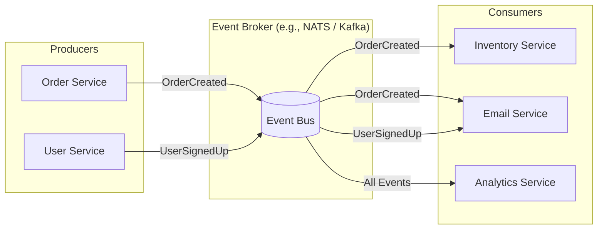

#API
---
---

## Summary

**Event-Driven Architecture (EDA)** is a software design pattern where system components communicate by producing, detecting, and consuming discrete **events**. Instead of direct, synchronous requests (like REST or gRPC), services react to state changes asynchronously. This pattern is fundamental for building highly decoupled, scalable, and resilient distributed systems, particularly in microservices environments using Go.

## Detailed Explanation

### 1. Core Components

*   **Producers**: Components that capture a state change and emit it as an event. They do not know who will consume the event or what will happen next.
*   **Events**: Small, immutable records of "what happened" (e.g., `UserCreated`, `PaymentProcessed`).
*   **Brokers (Event Bus)**: The intermediary that routes events from producers to consumers. Common brokers include NATS, Apache Kafka, RabbitMQ, or AWS EventBridge.
*   **Consumers**: Services that listen for specific events and execute business logic in response.

### 2. Architecture Diagram (MermaidJS)



### 3. Key Benefits

*   **Loose Decoupling**: Services only depend on the event schema, not on the availability or location of other services.
*   **Scalability**: Consumers can be scaled independently based on the volume of events they process.
*   **Fault Tolerance**: If a consumer is down, events can be buffered in the broker and processed once the consumer recovers.
*   **Agility**: New functionality (e.g., an "Analytics Service") can be added by simply subscribing to existing events without modifying the producers.

### 4. Implementation in Go

Go's concurrency primitives (`channels`, `goroutines`) make it exceptionally suited for EDA.

#### A. Simple In-Memory Event Bus
For internal communication within a single Go process.

```go
package main

import (
	"fmt"
	"sync"
)

type Event struct {
	Type string
	Data interface{}
}

type EventBus struct {
	mu          sync.RWMutex
	subscribers map[string][]chan Event
}

func NewEventBus() *EventBus {
	return &EventBus{
		subscribers: make(map[string][]chan Event),
	}
}

func (eb *EventBus) Subscribe(eventType string) chan Event {
	eb.mu.Lock()
	defer eb.mu.Unlock()
	
	ch := make(chan Event, 10)
	eb.subscribers[eventType] = append(eb.subscribers[eventType], ch)
	return ch
}

func (eb *EventBus) Publish(event Event) {
	eb.mu.RLock()
	defer eb.mu.RUnlock()
	
	if subs, ok := eb.subscribers[event.Type]; ok {
		for _, ch := range subs {
			// Non-blocking send to avoid hanging the publisher
			select {
			case ch <- event:
			default:
			}
		}
	}
}

func main() {
	bus := NewEventBus()
	userCreatedChan := bus.Subscribe("UserCreated")

	// Consumer
	go func() {
		for event := range userCreatedChan {
			fmt.Printf("Consumer received: %s with data %v\n", event.Type, event.Data)
		}
	}()

	// Producer
	bus.Publish(Event{Type: "UserCreated", Data: "UserID: 123"})
}
```

#### B. Distributed EDA (Integration)
In production, Go developers often use libraries like [Watermill](https://watermill.io/) or the [NATS Go Client](https://github.com/nats-io/nats.go). These provide features like:
- **At-least-once delivery**: Ensuring events aren't lost.
- **Poison pill handling**: Dealing with failing messages.
- **Consumer groups**: Scaling processing across multiple instances.

### 5. Challenges and Mitigation
*   **Eventual Consistency**: State might not be updated across all services immediately. Use **Sagas** or **Transactional Outbox** patterns to manage complex flows.
*   **Complexity**: Harder to trace a single request through the system. Use **OpenTelemetry** and correlation IDs.

---

## Interview Questions

1.  **What is the difference between a Message Queue and an Event Stream?**
    *   *Answer:* A queue usually deletes a message once consumed by a single worker (point-to-point). A stream (like Kafka) persists events and allows multiple different consumers to read the same history at their own pace (pub/sub).

2.  **How do you handle Idempotency in a Go consumer?**
    *   *Answer:* Since events can be delivered more than once (At-least-once delivery), consumers should check an `event_id` or `transaction_id` against a database (e.g., using a unique constraint or a "processed_events" table) before acting.

3.  **How would you implement the "Transactional Outbox" pattern in Go?**
    *   *Answer:* Instead of publishing directly to a broker, save the event in the same database transaction as your business logic (into an `outbox` table). A separate background worker (using a ticker or DB binlog) then reads from this table and publishes to the broker.

4.  **Why use `sync.RWMutex` instead of a regular `sync.Mutex` in a custom Event Bus?**
    *   *Answer:* `RWMutex` allows multiple concurrent readers (consumers checking subscriptions) while ensuring exclusive access for writers (adding new subscribers), which improves performance in read-heavy subscription scenarios.

5.  **What happens if your Go channel-based event bus is full?**
    *   *Answer:* If the buffer is full, the sender will block unless a `select` with a `default` case is used. In a distributed system, this is why we use persistent brokers like NATS JetStream or Kafka to buffer events on disk.
