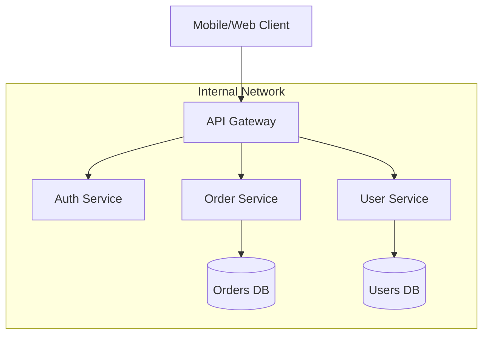

#API
---
---

## Summary

An **API Gateway** is a server that acts as an API front-end, receiving external requests, enforcing policies (security, throttling), and routing them to the appropriate backend microservices. It serves as a single entry point for a system, decoupling internal microservice implementations from external clients. In Go-based architectures, API gateways are valued for their high concurrency performance and low latency, often implemented using high-performance frameworks like **KrakenD** or **Tyk**.

## Detailed Explanation

### 1. Key Roles of an API Gateway

*   **Routing (Reverse Proxy)**: The gateway acts as a reverse proxy, directing requests to specific service instances based on path, headers, or query parameters.
*   **Authentication & Authorization**: Centralizes security by verifying API keys, JWT tokens, or OAuth2 credentials before the request reaches internal services.
*   **Rate Limiting & Throttling**: Protects backend services from being overwhelmed by limiting the number of requests a client can make within a timeframe.
*   **API Composition/Aggregation**: Combines data from multiple microservices into a single response, reducing the number of round-trips for the client (e.g., fetching user profile and order history in one call).
*   **Request/Response Transformation**: Modifies headers, converts protocols (e.g., REST to gRPC), or strips sensitive internal metadata before sending the response to the client.

### 2. Architecture Pattern: The Edge Gateway



### 3. Implementation Patterns

*   **Gateway Pattern**: A single gateway for all clients. Simple but can become a bottleneck or a single point of failure (SPOF).
*   **Backend for Frontend (BFF)**: Specific gateways tailored for different client types (e.g., a Mobile Gateway vs. a Web Gateway). This allows optimizing the payload for specific devices.
*   **Sidecar (Service Mesh)**: While a Gateway handles "North-South" traffic (external to internal), a Service Mesh handles "East-West" traffic (service to service).

### 4. Go Implementation Context

Go is a premier choice for API Gateways due to its lightweight threads (Goroutines) and excellent networking standard library.

#### A. Native Go: `httputil.ReverseProxy`
For simple gateways or the "Strangler Fig" pattern, Go's standard library provides a robust reverse proxy.

```go
package main

import (
	"net/http"
	"net/http/httputil"
	"net/url"
)

func main() {
	// Destination service
	target, _ := url.Parse("http://localhost:8081")
	proxy := httputil.NewSingleHostReverseProxy(target)

	http.HandleFunc("/", func(w http.ResponseWriter, r *http.Request) {
		// Custom logic: Add Auth headers, logging, etc.
		r.Header.Set("X-Proxy-Source", "Go-Gateway")
		proxy.ServeHTTP(w, r)
	})

	http.ListenAndServe(":8080", nil)
}
```

#### B. High-Performance Go Gateways
*   **KrakenD**: An ultra-high-performance, stateless API gateway. It focuses on **Aggregation** (merging multiple backends into one endpoint) and uses a declarative JSON configuration. It is often faster than Nginx for specific API tasks.
*   **Tyk**: A feature-rich API management platform written in Go. It includes a dashboard, developer portal, and deep support for middleware plugins (using Go or Python).

## Interview Questions

**Q: What is the difference between an API Gateway and a Load Balancer?**
**A:** A Load Balancer (OSI Layer 4 or 7) primarily distributes traffic across multiple instances of the *same* service to ensure availability. An API Gateway (OSI Layer 7) is "API-aware"; it routes traffic to *different* services based on the API path, performs request transformation, and handles cross-cutting concerns like Auth and Rate Limiting.

**Q: Why use an API Gateway instead of letting clients call microservices directly?**
**A:** Calling microservices directly exposes internal architecture, leads to "chatty" clients (multiple requests for one screen), and forces every microservice to implement its own security and rate-limiting logic. The gateway centralizes these concerns and simplifies the client's interface.

**Q: What is the "Strangler Fig" pattern in the context of Gateways?**
**A:** It is a migration strategy where an API Gateway is placed in front of a legacy monolith. New features are developed as microservices, and the Gateway routes those specific paths to the new services while keeping the rest routed to the monolith. Over time, the monolith is "strangled" until it can be decommissioned.

**Q: How do you handle a single point of failure (SPOF) with an API Gateway?**
**A:** You deploy multiple instances of the gateway behind a high-availability Load Balancer (like AWS ALB or Cloudflare). Since modern Go gateways like KrakenD are stateless, scaling horizontally is straightforward.
