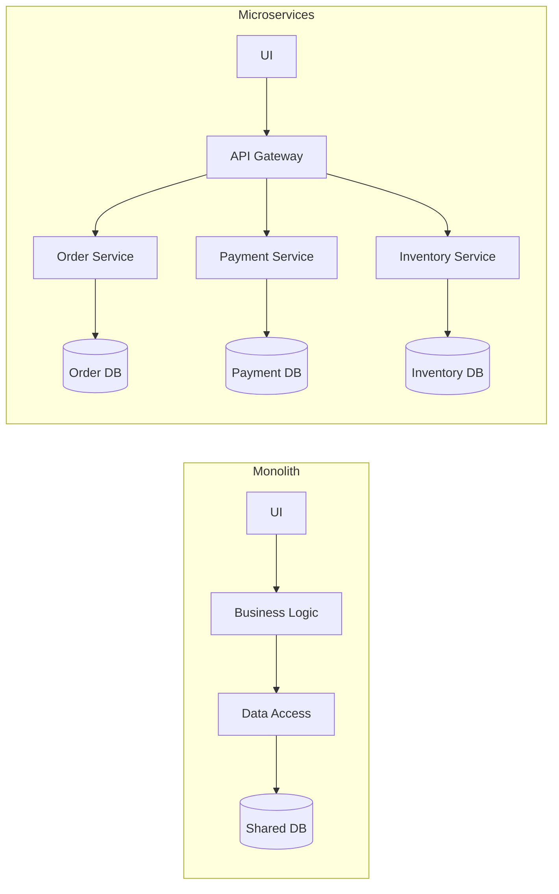
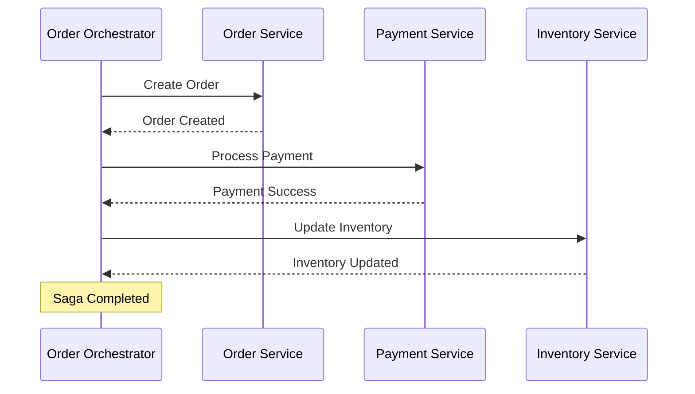

#API
---
---

# Microservices Architecture

## Summary

Microservices architecture is an architectural style that structures an application as a collection of small, autonomous services modeled around a business domain. Unlike a monolithic architecture where all components share the same memory space and database, microservices are independently deployable, scalable, and use decentralized data management. In the context of Go (Golang), microservices leverage the language's strong support for concurrency, efficient binary size, and high-performance networking capabilities through protocols like gRPC and HTTP/2.

## Detailed Explanation

### Monolith vs. Microservices

| Feature | Monolithic Architecture | Microservices Architecture |
| :--- | :--- | :--- |
| **Deployment** | Single unit, all-or-nothing. | Independent deployment per service. |
| **Scalability** | Horizontal scaling of the entire app. | Granular scaling of specific services. |
| **Fault Tolerance** | Single failure can crash the whole app. | Failure isolation; services can fail independently. |
| **Data** | Single, shared database. | Database-per-service (decentralized). |
| **Complexity** | Simple at first, complex as it grows. | Operational complexity (distributed systems). |



### Inter-service Communication

In a distributed environment, services must communicate reliably. There are two primary patterns:

1.  **Synchronous (Request/Response):**
    *   **HTTP/REST:** Standard for public-facing APIs. Easy to debug but carries JSON overhead.
    *   **gRPC:** High-performance, binary protocol using Protocol Buffers (protobuf) and HTTP/2. Preferred for internal service-to-service communication in Go due to strict typing and low latency.

2.  **Asynchronous (Message-Driven):**
    *   Uses message brokers (RabbitMQ, Kafka, NATS).
    *   Reduces coupling and improves system resilience.

### Data Management and Distributed Transactions

The **Database-per-Service** pattern ensures services are loosely coupled but introduces the challenge of maintaining data consistency across services. Since traditional ACID transactions aren't feasible across distributed databases, we use the **Saga Pattern**.

#### Saga Pattern
A Saga is a sequence of local transactions. If one local transaction fails, the Saga executes a series of **compensating transactions** to undo the changes made by preceding transactions.

*   **Choreography:** Services exchange events without a central orchestrator. Each service listens for events and decides its next action.
*   **Orchestration:** A central controller (Orchestrator) tells the services which local transactions to execute.



### Go Examples: Creating a Small Microservice Structure

Go is ideal for microservices because it compiles to a static binary, making it perfect for Docker containers.

#### 1. Simple gRPC Service Definition (Protobuf)
```protobuf
syntax = "proto3";

package order;
option go_package = "./pb";

service OrderService {
  rpc CreateOrder(OrderRequest) returns (OrderResponse);
}

message OrderRequest {
  string user_id = 1;
  float amount = 2;
}

message OrderResponse {
  string order_id = 1;
  string status = 2;
}
```

#### 2. Implementing the Service in Go
```go
package main

import (
	"context"
	"log"
	"net"

	"google.golang.org/grpc"
	"github.com/google/uuid"
	"your-repo/pb"
)

type server struct {
	pb.UnimplementedOrderServiceServer
}

func (s *server) CreateOrder(ctx context.Context, req *pb.OrderRequest) (*pb.OrderResponse, error) {
	log.Printf("Received order for user %s with amount %.2f", req.UserId, req.Amount)
	
	// Business logic: Save to DB, call other services via Saga, etc.
	orderID := uuid.New().String()

	return &pb.OrderResponse{
		OrderId: orderID,
		Status:  "Created",
	}, nil
}

func main() {
	lis, err := net.Listen("tcp", ":50051")
	if err != nil {
		log.Fatalf("failed to listen: %v", err)
	}

	s := grpc.NewServer()
	pb.RegisterOrderServiceServer(s, &server{})

	log.Println("Order Service is running on port 50051...")
	if err := s.Serve(lis); err != nil {
		log.Fatalf("failed to serve: %v", err)
	}
}
```

## Interview Questions

**Q: What is the main difference between API Gateway and Service Mesh?**
**A:** An **API Gateway** handles "North-South" traffic (client-to-server), focusing on authentication, rate limiting, and request routing. A **Service Mesh** (like Istio or Linkerd) handles "East-West" traffic (service-to-service), providing observability, mutual TLS (mTLS), and advanced traffic management within the cluster.

**Q: How do you handle distributed transactions in Microservices?**
**A:** Distributed transactions are typically handled using the **Saga Pattern**. Instead of a single global transaction (which is hard to scale and fragile), a Saga breaks the process into local transactions with corresponding compensating actions to maintain eventual consistency if a failure occurs.

**Q: Why is gRPC often preferred over REST for internal microservice communication?**
**A:** gRPC uses **Protocol Buffers** (binary format) instead of JSON (text format), which results in smaller payloads and faster serialization. It also leverages **HTTP/2**, allowing for multiplexing several requests over a single connection and providing built-in support for streaming.

**Q: What is the "Sidecar" pattern?**
**A:** The Sidecar pattern involves deploying a helper component (like a proxy for a Service Mesh or a log shipper) alongside the main application container within the same pod or host. This allows the application to focus on business logic while the sidecar handles cross-cutting concerns like networking or monitoring.
