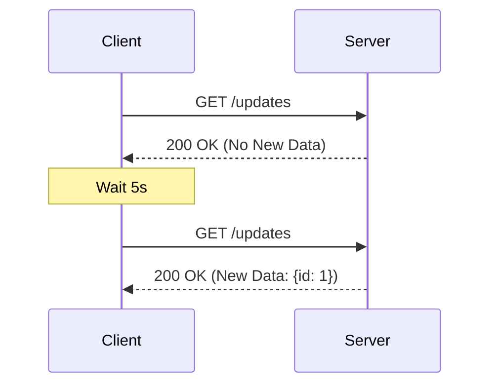
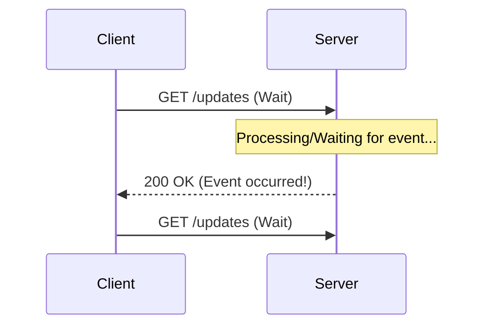
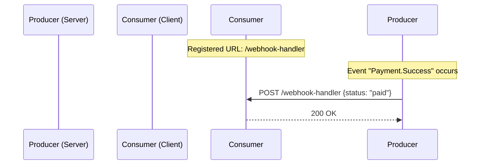

#API
---
---

# Webhooks vs Polling

## Summary
In distributed systems, communication between services can be initiated by the consumer (**Polling**) or the producer (**Webhooks**). **Polling** involves the client repeatedly asking the server for updates at specific intervals. **Webhooks**, conversely, follow an "event-driven" or "push" model where the server sends data to the client as soon as an event occurs. Choosing between them depends on the required real-time nature of the data, resource constraints, and whether the client can expose a public endpoint.

---

## Detailed Explanation

### 1. Short Polling
The client sends an HTTP request to the server at fixed intervals (e.g., every 5 seconds). The server responds immediately, even if there is no new data.



### 2. Long Polling
The client sends a request, and the server holds the connection open until new data is available or a timeout occurs. This reduces the number of empty responses compared to short polling.



### 3. Webhooks
Webhooks are "reverse APIs." The client provides a URL to the server (registration). When a specific event happens on the server, it sends an HTTP POST request to that URL.



---

## Comparison: Pros and Cons

| Feature | Polling (Short) | Webhooks |
| :--- | :--- | :--- |
| **Direction** | Client-to-Server (Pull) | Server-to-Client (Push) |
| **Efficiency** | Low (Resource waste on empty checks) | High (Only executes on events) |
| **Latency** | Dependent on polling interval | Near real-time |
| **Complexity** | Simple to implement | Requires public URL and security (HMAC) |
| **Accessibility** | Works behind NAT/Firewalls | Requires reachable endpoint |

### When to use which?
- **Use Polling when**: The client is behind a firewall/NAT and cannot receive inbound requests, or when the data changes so frequently that a push model would overwhelm the client.
- **Use Webhooks when**: You need real-time updates for infrequent events (e.g., payment confirmations, GitHub commits, CI/CD status).

---

## Go (Golang) Implementation Examples

### 1. Ticker-based Poller (Short Polling)
This example demonstrates a client that checks an external API every 2 seconds.

```go
package main

import (
	"context"
	"fmt"
	"io"
	"net/http"
	"time"
)

func startPoller(ctx context.Context, url string, interval time.Duration) {
	ticker := time.NewTicker(interval)
	defer ticker.Stop()

	for {
		select {
		case <-ctx.Done():
			return
		case <-ticker.C:
			resp, err := http.Get(url)
			if err != nil {
				fmt.Printf("Error polling: %v\n", err)
				continue
			}
			body, _ := io.ReadAll(resp.Body)
			resp.Body.Close()
			fmt.Printf("Polled Data: %s\n", string(body))
		}
	}
}
```

### 2. Webhook Receiver Handler
This example demonstrates a server that listens for incoming POST requests from a producer.

```go
package main

import (
	"encoding/json"
	"fmt"
	"net/http"
)

type WebhookPayload struct {
	Event string `json:"event"`
	Data  string `json:"data"`
}

func webhookHandler(w http.ResponseWriter, r *http.Request) {
	if r.Method != http.MethodPost {
		http.Error(w, "Method not allowed", http.StatusMethodNotAllowed)
		return
	}

	var payload WebhookPayload
	err := json.NewDecoder(r.Body).Decode(&payload)
	if err != nil {
		http.Error(w, "Bad request", http.StatusBadRequest)
		return
	}

	// Logic to process the event
	fmt.Printf("Received Webhook: %s with data: %s\n", payload.Event, payload.Data)

	w.WriteHeader(http.StatusOK)
}

func main() {
	http.HandleFunc("/webhooks/receive", webhookHandler)
	http.ListenAndServe(":8080", nil)
}
```

---

## Interview Questions

1. **What is the main drawback of Short Polling in a high-scale system?**
   - It creates unnecessary traffic and high CPU/Memory usage on the server due to processing many requests that return "No Data."

2. **How do Webhooks handle security to ensure the request comes from the trusted producer?**
   - Typically through **HMAC signatures**. The producer signs the payload with a secret key and sends it in a header (e.g., `X-Hub-Signature`). The receiver recalculates the hash and compares it.

3. **What happens if the Webhook receiver is down?**
   - Most producers implement a **retry strategy** (often exponential backoff). If the receiver fails to return a 2xx status code, the producer will attempt to send the payload again later.

4. **In Go, how would you handle a long-running Poller to ensure it doesn't leak resources?**
   - Use `context.Context` for cancellation and `time.Ticker` (closing it with `defer ticker.Stop()`) to ensure the goroutine terminates gracefully.

5. **Compare Webhooks with WebSockets.**
   - Webhooks are HTTP POST requests for discrete events (Server -> Client). WebSockets provide a persistent, full-duplex TCP connection for continuous bi-directional data flow (e.g., chat apps).
