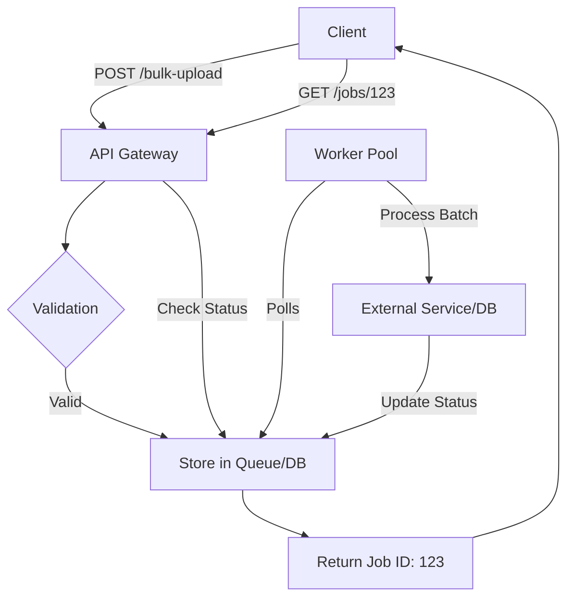

#API
---
---

# Batch Processing

## Summary

**Batch Processing** is the execution of a series of jobs or data operations in a group (batch) without manual intervention. In the context of APIs and Backend systems, it involves collecting data over a period of time or in specific sizes before processing it as a single unit. This contrasts with **Real-time Processing**, where data is processed immediately as it arrives. Batch processing is essential for high-throughput scenarios, periodic reports, and data synchronization tasks (ETL).

---

## Detailed Explanation

### Real-time vs. Batch Processing

| Feature | Real-time (Stream) | Batch Processing |
| :--- | :--- | :--- |
| **Latency** | Low (milliseconds to seconds) | High (minutes to hours) |
| **Throughput** | Limited by individual request overhead | Optimized for large volumes |
| **Data Scope** | Single record or small window | Entire dataset or large chunks |
| **Use Case** | Chat, Fraud detection, Live UI updates | Payroll, Billing, Data Warehousing |

### ETL (Extract, Transform, Load)
Batch processing is a cornerstone of **ETL** pipelines:
1.  **Extract**: Read large amounts of data from source systems (APIs, DBs, Files).
2.  **Transform**: Clean, normalize, and convert data into the target format.
3.  **Load**: Write the resulting data into a destination (Data Warehouse, S3).

### Bulk APIs
Bulk APIs allow clients to perform operations on multiple resources in a single HTTP request, reducing the overhead of multiple TCP handshakes and header parsing.

**Common Patterns:**
1.  **Synchronous Bulk**: The server processes all items and returns the result once finished.
    - *Risk*: Request timeouts if the batch is too large.
2.  **Asynchronous Bulk (Job Pattern)**:
    - Client POSTs a batch of data.
    - Server returns `202 Accepted` with a `job_id`.
    - Client polls `/jobs/{id}` or receives a Webhook when finished.



### Processing Patterns in Go

#### 1. Worker Pools
In Go, batch processing is often implemented using **Worker Pools** to limit concurrency and manage resource usage.

```go
package main

import (
	"fmt"
	"sync"
)

func worker(id int, jobs <-chan int, results chan<- int, wg *sync.WaitGroup) {
	defer wg.Done()
	for j := range jobs {
		fmt.Printf("worker %d processing job %d\n", id, j)
		results <- j * 2
	}
}

func main() {
	const numJobs = 10
	jobs := make(chan int, numJobs)
	results := make(chan int, numJobs)
	var wg sync.WaitGroup

	// Start 3 workers
	for w := 1; w <= 3; w++ {
		wg.Add(1)
		go worker(w, jobs, results, &wg)
	}

	// Send jobs
	for j := 1; j <= numJobs; j++ {
		jobs <- j
	}
	close(jobs)

	// Wait for workers and close results
	wg.Wait()
	close(results)

	for res := range results {
		fmt.Println("Result:", res)
	}
}
```

#### 2. Streaming Large Datasets (JSON/CSV)
When dealing with "Batch" files (e.g., a 2GB CSV), you should never load the entire file into memory. Instead, use Go's streaming capabilities.

**Example: Reading CSV Stream**
```go
func processLargeCSV(reader io.Reader) error {
	r := csv.NewReader(reader)
	for {
		record, err := r.Read()
		if err == io.EOF {
			break
		}
		if err != nil {
			return err
		}
		// Process individual record without loading the whole file
		process(record)
	}
	return nil
}
```

**Example: JSON Stream Decoding**
```go
func decodeJSONStream(reader io.Reader) {
	dec := json.NewDecoder(reader)
	// Read open bracket [
	_, _ = dec.Token()
	
	for dec.More() {
		var m MyStruct
		err := dec.Decode(&m)
		if err != nil {
			log.Fatal(err)
		}
		// Process 'm' immediately
	}
}
```

---

## Interview Questions

1.  **How do you handle partial failures in a Batch API?**
    - *Answer*: Use an "All-or-Nothing" strategy (Transactions) for small batches, or a "Partial Success" response (returning a list of errors per index) for large asynchronous batches.
2.  **What is Idempotency in Batch Processing?**
    - *Answer*: Ensuring that if a batch is submitted twice (e.g., due to a network retry), the system doesn't create duplicate records. This is usually handled via unique keys or request IDs.
3.  **When would you prefer Batch Processing over Stream Processing?**
    - *Answer*: When high throughput is more important than low latency, when the processing requires looking at the entire dataset (e.g., sorting, total aggregates), or when the downstream system has strict rate limits.
4.  **How do you prevent a "Slow Consumer" in a Go worker pool?**
    - *Answer*: Use buffered channels, implement timeouts using `context.Context`, and monitor queue depth to trigger horizontal scaling.
5.  **Explain the "Checkpointing" pattern in Batch jobs.**
    - *Answer*: Storing the state/offset of processed items in a database so that if a job crashes, it can resume from the last successful record instead of starting from the beginning.
