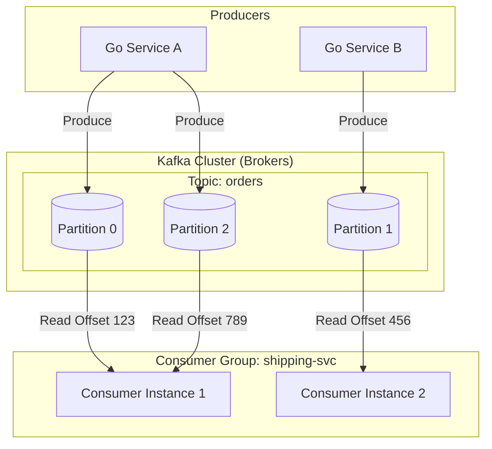

#API
---
---

# Apache Kafka for Go Developers

## Summary
Apache Kafka is a distributed, partitioned, and replicated **event streaming platform**. Unlike traditional message brokers (like RabbitMQ) that delete messages after consumption, Kafka is a **distributed commit log**. It stores data as an immutable sequence of records, allowing multiple consumers to read the same data at their own pace. For Go developers, Kafka provides a high-throughput, low-latency backbone for microservices, using libraries like `segmentio/kafka-go` (pure Go) or `confluent-kafka-go` (CGO/librdkafka).

---

## Detailed Explanation

### Core Concepts

#### 1. Topics & Partitions
*   **Topic**: A logical category or feed name to which records are published.
*   **Partition**: Topics are divided into partitions to allow for horizontal scaling. Each partition is an ordered, immutable sequence of records.
*   **Scalability**: A single topic can be spread across multiple brokers by increasing the partition count.

#### 2. Offsets
*   Every message within a partition is assigned a unique, sequential ID called an **offset**.
*   Offsets are local to the partition. To uniquely identify a message, you need: `(Topic, Partition, Offset)`.

#### 3. Consumer Groups
*   A mechanism to parallelize message consumption.
*   **Load Balancing**: Each partition is assigned to exactly one consumer in a group. If you have 4 partitions and 4 consumers in a group, each consumer handles 1 partition.
*   **Rebalancing**: If a consumer joins or leaves, Kafka redistributes the partitions among the remaining members.

#### 4. Log-based Storage
*   Kafka treats data as a **circular buffer** or append-only log on disk.
*   **Retention**: Messages are kept for a configured period (e.g., 7 days) or until a size limit is reached, regardless of whether they have been consumed.
*   **Sequential I/O**: High performance is achieved by avoiding random disk seeks and utilizing the OS page cache.

### Architecture Diagram



### Go Integration

#### Option A: `segmentio/kafka-go` (Recommended for Go-native feel)
A pure Go library that supports `context.Context` and has a clean, modern API.

**Producer Example:**
```go
import "github.com/segmentio/kafka-go"

writer := &kafka.Writer{
    Addr:     kafka.TCP("localhost:9092"),
    Topic:    "user-events",
    Balancer: &kafka.LeastBytes{},
}

err := writer.WriteMessages(ctx,
    kafka.Message{Key: []byte("user-1"), Value: []byte("signed-up")},
)
```

**Consumer Example:**
```go
reader := kafka.NewReader(kafka.ReaderConfig{
    Brokers:  []string{"localhost:9092"},
    GroupID:  "email-service-group",
    Topic:    "user-events",
    MaxBytes: 10e6, // 10MB
})

for {
    msg, err := reader.ReadMessage(ctx)
    if err != nil {
        break
    }
    fmt.Printf("Message: %s\n", string(msg.Value))
}
```

#### Option B: `IBM/sarama`
A widely used pure Go client (formerly Shopify). It is feature-rich but has a more complex, asynchronous API that can be harder to tune for beginners.

---

## Interview Questions

1.  **How does Kafka achieve high throughput despite writing to disk?**
    *   *Answer:* It uses **Sequential I/O** (appending to logs), **Zero-copy** (transferring data from disk to network without copying to user-space), and heavy reliance on the **OS Page Cache**.

2.  **What happens if a Consumer Group has more consumers than partitions?**
    *   *Answer:* The extra consumers will remain idle. Only one consumer can read from a specific partition at a time within a group to guarantee ordering.

3.  **Explain the difference between "At-least-once" and "Exactly-once" delivery in a Go application.**
    *   *At-least-once:* Consumer processes the message and then commits the offset. If processing fails after work but before commit, the message is retried (duplicate).
    *   *Exactly-once (EoS):* Requires Kafka Transactions. Supported in Go via `confluent-kafka-go` (librdkafka) or careful manual transaction management with `sarama`.

4.  **How do you handle a "Rebalance" in Go?**
    *   *Answer:* You must implement "Clean up" logic (closing database connections, flushing buffers) when Kafka signals the consumer is losing its partitions. Most Go libraries provide "rebalance listeners" or hooks for this.

5.  **Why would you use `confluent-kafka-go` over `kafka-go`?**
    *   *Answer:* Use `confluent-kafka-go` if you need **Exactly-once semantics (EoS)**, official Confluent support, or access to the latest C-level optimizations from `librdkafka`. Use `kafka-go` for pure Go environments (no CGO) and simpler implementations.
