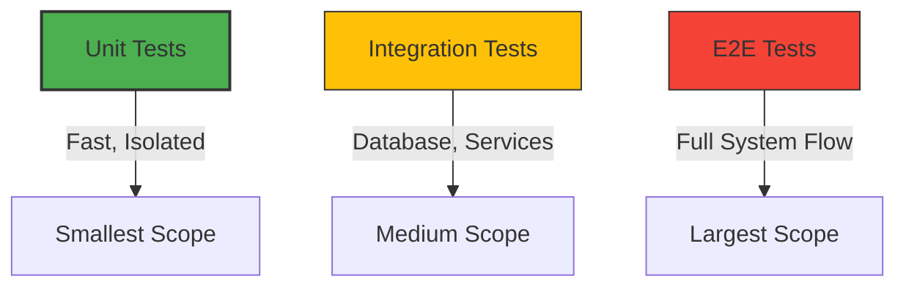

#API
---
---

# Unit Testing for APIs in Go

## Summary
Unit testing in Go focuses on verifying the correctness of individual components (functions, methods, or handlers) in isolation from external dependencies like databases or third-party APIs. The goal is to ensure that a specific unit of logic behaves as expected across various input scenarios.

Key characteristics of Go unit tests:
- **Isolation**: Dependencies are mocked or stubbed using interfaces and dependency injection.
- **Speed**: Tests run in memory and finish in milliseconds.
- **Standard Library First**: Go provides powerful built-in tools (`testing`, `net/http/httptest`) that often make external frameworks unnecessary.



---

## Detailed Explanation

### 1. The Standard `testing` Package
Go's built-in `testing` package provides the foundation. Test files must end in `_test.go` and functions must start with `Test`.

```go
func TestCalculateTotal(t *testing.T) {
    result := CalculateTotal(10, 20)
    expected := 30
    if result != expected {
        t.Errorf("expected %d, got %d", expected, result)
    }
}
```

### 2. Table-Driven Tests Pattern
This is the idiomatic way to write tests in Go. It involves defining a slice of anonymous structs (the "table") and iterating through them to run multiple test cases using `t.Run`.

```go
func TestValidateEmail(t *testing.T) {
    tests := []struct {
        name  string
        email string
        want  bool
    }{
        {"valid email", "test@example.com", true},
        {"missing @", "testexample.com", false},
        {"empty string", "", false},
    }

    for _, tt := range tests {
        t.Run(tt.name, func(t *testing.T) {
            if got := ValidateEmail(tt.email); got != tt.want {
                t.Errorf("ValidateEmail() = %v, want %v", got, tt.want)
            }
        })
    }
}
```

### 3. Testing Handlers with `net/http/httptest`
The `httptest` package allows you to simulate HTTP requests and record responses without starting a real server.

- **`httptest.NewRequest`**: Creates an `*http.Request`.
- **`httptest.NewRecorder`**: An implementation of `http.ResponseWriter` that captures the response.

#### Example: Testing a Gin Handler
```go
func TestGetUserHandler(t *testing.T) {
    // Setup router and handler
    gin.SetMode(gin.TestMode)
    r := gin.Default()
    r.GET("/user/:id", GetUserHandler)

    // Create request and recorder
    req, _ := http.NewRequest(http.MethodGet, "/user/123", nil)
    w := httptest.NewRecorder()

    // Perform request
    r.ServeHTTP(w, req)

    // Assertions
    if w.Code != http.StatusOK {
        t.Errorf("expected status 200, got %d", w.Code)
    }
}
```

### 4. Dependency Injection for Testability
To isolate logic, pass dependencies (DB, Mailer, etc.) as **interfaces**. This allows you to inject "mocks" during testing.

```go
// Interface defines the behavior
type UserRepository interface {
    GetByID(id string) (*User, error)
}

// Service uses the interface
type UserService struct {
    Repo UserRepository
}

// Mock implementation for testing
type MockRepo struct{}
func (m *MockRepo) GetByID(id string) (*User, error) {
    return &User{ID: "123", Name: "Test User"}, nil
}

func TestUserService_Get(t *testing.T) {
    mock := &MockRepo{}
    service := UserService{Repo: mock}
    
    user, err := service.GetByID("123")
    // Assert user and error...
}
```

---

## Interview Questions

1. **What is the difference between `t.Error` and `t.Fatal`?**
   - `t.Error` (and `t.Errorf`) logs the error but continues test execution.
   - `t.Fatal` (and `t.Fatalf`) logs the error and stops the current test immediately (useful for failed setups).

2. **How do you run tests in parallel in Go?**
   - Call `t.Parallel()` at the beginning of the test function. In table-driven tests, it should be called inside each `t.Run` subtest.

3. **How do you check for race conditions during testing?**
   - Run tests with the `-race` flag: `go test -race ./...`.

4. **What is "Test Coverage" and how do you view it?**
   - It measures the percentage of code executed by tests. Use `go test -cover` for a summary or `go test -coverprofile=cp.out && go tool cover -html=cp.out` for a visual report.

5. **Why are interfaces critical for unit testing in Go?**
   - They allow for "decoupling." You can swap real implementations (e.g., a real SQL database) with lightweight mocks or stubs that return predictable data, ensuring the test only evaluates the unit's logic.
