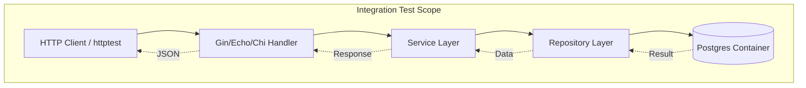

#API
---
---

# Integration Testing for APIs in Go

## Summary
Integration testing in Go focuses on verifying that different modules or services of an application work together correctly. Unlike unit tests, which isolate functions, integration tests validate the interaction between the **API Handler**, **Business Logic (Service)**, and **Infrastructure (Database/External APIs)**. In the Go ecosystem, this typically involves spinning up real dependencies (like PostgreSQL or Redis) using Docker to ensure that SQL queries, transaction boundaries, and network protocols behave as expected in a production-like environment.

## Detailed Explanation

### 1. The Integration Scope
Integration tests sit between unit tests and End-to-End (E2E) tests. In a standard Go "Clean Architecture" or "Hexagonal" setup, the integration test ensures that:
- The **Transport Layer** (HTTP/gRPC) correctly parses requests.
- The **Service Layer** applies logic across multiple repositories.
- The **Data Layer** executes valid SQL against a real engine.



### 2. Dependency Management with `testcontainers-go`
The modern standard for Go integration testing is [testcontainers-go](https://golang.testcontainers.org/). It allows you to programmatically manage the lifecycle of Docker containers within your `go test` suite.

**Key Advantages:**
- **No Mocking Errors**: You test against the actual database engine, catching syntax errors or version-specific behavior that mocks miss.
- **Isolated Environments**: Every test run (or suite) can have a fresh, ephemeral database.
- **Wait Strategies**: Go can wait for the database to be "Ready" (log matching or port checking) before starting tests.

### 3. Database Migrations and State
To ensure the database schema is correct, integration tests usually run migrations (using libraries like `golang-migrate` or `go-goose`) against the container before executing the test logic.

### 4. Testing HTTP Handlers
Using `net/http/httptest`, Go provides a built-in way to simulate HTTP requests without opening a network port, though for full integration, starting a `httptest.NewServer` is preferred to test the entire middleware chain and network stack.

---

## Go Examples

### Setting up a Postgres Container
This example demonstrates how to use `testcontainers-go` to provide a real database for your tests.

```go
package integration

import (
	"context"
	"database/sql"
	"fmt"
	"testing"

	_ "github.com/lib/pq"
	"github.com/testcontainers/testcontainers-go"
	"github.com/testcontainers/testcontainers-go/wait"
)

func setupPostgres(ctx context.Context) (testcontainers.Container, *sql.DB, error) {
	req := testcontainers.ContainerRequest{
		Image:        "postgres:15-alpine",
		ExposedPorts: []string{"5432/tcp"},
		Env: map[string]string{
			"POSTGRES_USER":     "user",
			"POSTGRES_PASSWORD": "password",
			"POSTGRES_DB":       "testdb",
		},
		WaitingFor: wait.ForLog("database system is ready to accept connections"),
	}

	container, err := testcontainers.GenericContainer(ctx, testcontainers.GenericContainerRequest{
		ContainerRequest: req,
		Started:          true,
	})
	if err != nil {
		return nil, nil, err
	}

	host, _ := container.Host(ctx)
	port, _ := container.MappedPort(ctx, "5432")

	dsn := fmt.Sprintf("host=%s port=%s user=user password=password dbname=testdb sslmode=disable", host, port.Port())
	db, err := sql.Open("postgres", dsn)
	
	return container, db, err
}
```

### Full Integration Flow: DB -> Handler -> Response
Testing a `CreateUser` endpoint with a real database.

```go
func TestCreateUser_Integration(t *testing.T) {
	ctx := context.Background()
	
	// 1. Setup Infrastructure
	container, db, err := setupPostgres(ctx)
	if err != nil {
		t.Fatal(err)
	}
	defer container.Terminate(ctx)

	// 2. Initialize App Components
	repo := NewUserRepository(db)
	handler := NewUserHandler(repo) // Assuming a standard Injector pattern

	// 3. Prepare Request
	userJSON := `{"username": "johndoe", "email": "john@example.com"}`
	req := httptest.NewRequest("POST", "/users", strings.NewReader(userJSON))
	rec := httptest.NewRecorder()

	// 4. Execute
	handler.ServeHTTP(rec, req)

	// 5. Assertions
	if rec.Code != http.StatusCreated {
		t.Errorf("expected 201, got %d", rec.Code)
	}

	// Verify Data in DB
	var email string
	err = db.QueryRow("SELECT email FROM users WHERE username = 'johndoe'").Scan(&email)
	if err != nil {
		t.Fatalf("could not find user in database: %v", err)
	}
}
```

---

## Interview Questions

### 1. What is the main difference between using a "Mock" and "Testcontainers" in Go?
**Answer:** Mocks simulate the behavior of a dependency (like a DB) based on assumptions. If your SQL query has a syntax error, the mock won't catch it. Testcontainers spin up a real instance of the dependency, ensuring that the actual interaction, constraints, and data types are validated.

### 2. How do you handle database cleanup between integration tests in Go?
**Answer:** There are three common strategies:
- **Container per suite**: Start the container once in `TestMain`, and use transactions (`db.Begin()`) in each test, rolling them back at the end.
- **Truncation**: Manually truncate all tables after each test run.
- **Unique Schemas**: Create a new Postgres schema for every test to ensure isolation.

### 3. When should you prefer Integration tests over Unit tests?
**Answer:** Use integration tests for code that interacts with external systems (Databases, Cache, Third-party APIs) or when testing complex business workflows that span multiple services where the "glue" code is the most likely place for bugs.

### 4. How does `httptest.NewServer` differ from `httptest.NewRecorder`?
**Answer:** `NewRecorder` captures the response of a handler function directly (in-memory). `NewServer` starts a real local server on a random port, allowing you to test the actual HTTP client, network timeouts, and full middleware stacks as they would run in production.
