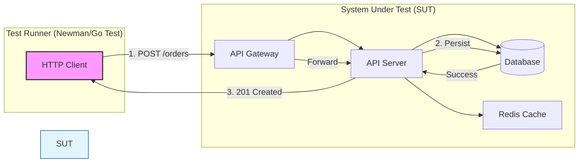

#API
---
---

# Functional Testing (E2E) for APIs

## Summary
Functional Testing, often referred to as **End-to-End (E2E) Testing** in the context of APIs, is a "black-box" testing methodology used to verify that an API behaves exactly as expected from the perspective of an external consumer. Unlike unit or integration tests, E2E functional tests validate the entire system flow—including load balancers, routing, business logic, and database persistence—without mocking internal components. The primary goal is to ensure the API meets business requirements and handles real-world scenarios correctly.

## Detailed Explanation

Functional testing focuses on **what** the system does rather than **how** it does it. In an API context, this means sending HTTP requests and asserting that the response codes, headers, and payloads match the technical specification.

### 1. Happy Paths vs. Error Cases
*   **Happy Paths:** Validating the "golden path" where everything works correctly (e.g., creating a user with valid data returns `201 Created` and the user object).
*   **Error Cases:** Ensuring the API gracefully handles invalid inputs, unauthorized access, and resource conflicts (e.g., sending an invalid email returns `400 Bad Request` with a descriptive error message).
*   **User Perspective:** Tests are written based on user stories (e.g., "As a user, I should be able to search for products and add them to my cart").

### 2. Tooling for API E2E
*   **Postman / Newman:** Postman allows for manual testing and collection building. **Newman** is the CLI companion that runs these collections in CI/CD pipelines.
*   **Venom:** A specialized tool (by OVH) that allows defining test suites in YAML, capable of testing APIs, databases, and message queues in a single workflow.
*   **Go-based Suites:** Using Go's `testing` package along with libraries like `httpexpect` or `testify` to build programmatic test suites that run against a deployed environment.

### 3. Testing Flow in Go
In Go, a robust E2E suite usually involves:
1.  **Environment Setup:** Provisioning dependencies (e.g., using `testcontainers-go` to spin up a real Postgres instance).
2.  **Server Start:** Running the API server in a separate goroutine or a dedicated container.
3.  **Client Execution:** Using an HTTP client to hit the server's actual network address.
4.  **Assertion:** Verifying state changes in the database after the API call.

## Go Example: E2E Test Suite

This example demonstrates a separate test suite that hits a running instance of the API.

```go
// e2e_test.go
package e2e_test

import (
	"bytes"
	"encoding/json"
	"net/http"
	"testing"
	"time"

	"github.com/stretchr/testify/assert"
)

const baseURL = "http://localhost:8080/api/v1"

func TestUserLifecycle_E2E(t *testing.T) {
	client := &http.Client{Timeout: 5 * time.Second}

	// 1. Happy Path: Create User
	userPayload := map[string]string{
		"username": "tester_go",
		"email":    "test@example.com",
	}
	body, _ := json.Marshal(userPayload)

	resp, err := client.Post(baseURL+"/users", "application/json", bytes.NewBuffer(body))
	assert.NoError(t, err)
	assert.Equal(t, http.StatusCreated, resp.StatusCode)

	// 2. Happy Path: Fetch Created User
	var createdUser map[string]interface{}
	json.NewDecoder(resp.Body).Decode(&createdUser)
	userID := createdUser["id"].(string)

	resp, err = client.Get(baseURL + "/users/" + userID)
	assert.NoError(t, err)
	assert.Equal(t, http.StatusOK, resp.StatusCode)

	// 3. Error Case: Duplicate Username
	resp, err = client.Post(baseURL+"/users", "application/json", bytes.NewBuffer(body))
	assert.NoError(t, err)
	assert.Equal(t, http.StatusConflict, resp.StatusCode)
}
```

## Mermaid Flow



## Interview Questions

**Q: What is the main difference between Integration Testing and Functional E2E testing?**
**A:** Integration testing focuses on the technical communication between two components (e.g., "Does the API talk to the DB?"). Functional E2E testing focuses on the business outcome from a user's perspective, involving the entire stack (e.g., "If I place an order, is the stock reduced and an email sent?").

**Q: Why would you use Newman instead of just Go tests for API E2E?**
**A:** Newman allows QA teams or non-Go developers to write and maintain tests in Postman. It's also highly portable and can be used to test APIs written in any language, whereas Go tests are usually preferred when the testing logic requires complex data manipulation or deeper integration with Go's ecosystem (like Testcontainers).

**Q: How do you handle "flaky" E2E tests caused by network latency or slow startup?**
**A:** Implement **Retries** and **Health Checks**. Before running the test suite, use a "wait-for" script or a loop in Go that pings the `/health` endpoint of the API until it returns a 200 OK.

**Q: In a Go E2E test, should you use `httptest.NewRecorder()`?**
**A:** No. `httptest.NewRecorder()` is for unit testing handlers in isolation. For E2E, you should use `httptest.NewServer()` (which starts a real listener on a random port) or hit a fully deployed staging environment using a standard `http.Client`.
