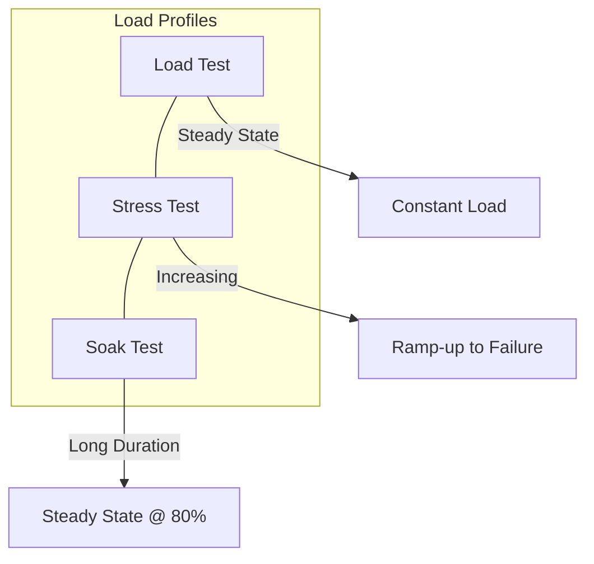
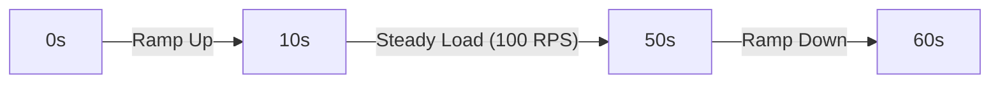
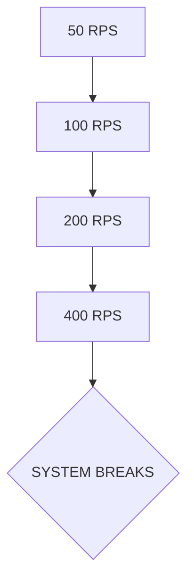

#API
---
---

# Load Testing for APIs

## Summary

Load testing is a subset of **Performance Engineering** designed to determine how a system behaves under a specific expected load. It is crucial for identifying bottlenecks, ensuring Service Level Objectives (SLOs), and validating system stability before production.

*   **Performance Testing**: The broad category of testing to determine speed, responsiveness, and stability.
*   **Load Testing**: Testing the system under a "normal" or "expected" peak load (e.g., 100 RPS) to ensure it meets latency requirements.
*   **Stress Testing**: Pushing the system beyond its limits until it breaks to identify the failure point and how it recovers (Self-healing).
*   **Soak (Endurance) Testing**: Running the system at a high but sustainable load for a long period (hours or days) to detect memory leaks, resource exhaustion, or disk space issues.



---

## Detailed Explanation

### Key Metrics
To analyze an API's performance, we focus on the **Golden Signals**:

1.  **Latency (Response Time)**: The time it takes for a request to be processed.
    *   **p50 (Median)**: Average user experience.
    *   **p95/p99**: The "tail latency" experienced by the slowest 5% or 1% of users. Critical for finding edge-case bottlenecks.
2.  **Throughput (RPS/TPS)**: Requests Per Second or Transactions Per Second. The volume of work the system handles.
3.  **Error Rate**: The percentage of requests that result in failure (4xx/5xx). A system might have low latency only because it is failing fast.
4.  **Saturation**: How "full" your service is (CPU, Memory, IO, Connection Pools).

### Tools

*   **k6 (Grafana)**: Modern tool written in Go but scripted in JavaScript. Excellent for CI/CD integration and developer experience.
*   **Vegeta**: A versatile HTTP load testing tool and library written in Go. Ideal for constant rate testing and embedding in Go binaries.
*   **Hey**: A tiny CLI tool (inspired by ApacheBench) written in Go. Great for quick, ad-hoc tests from the terminal.

### Go Example: Load Testing with Vegeta

While `k6` is popular for scripts, `Vegeta` is often used as a library within Go projects for custom load testing harnesses.

```go
package main

import (
	"fmt"
	"os"
	"time"

	vegeta "github.com/tsenart/vegeta/v12/lib"
)

func main() {
	// Define the load profile: 100 Requests Per Second
	rate := vegeta.Rate{Freq: 100, Per: time.Second}
	duration := 5 * time.Second

	// Define the target API
	targeter := vegeta.NewStaticTargeter(vegeta.Target{
		Method: "GET",
		URL:    "http://localhost:8080/api/v1/health",
	})

	attacker := vegeta.NewAttacker()

	var metrics vegeta.Metrics
	for res := range attacker.Attack(targeter, rate, duration, "API Load Test") {
		metrics.Add(res)
	}
	metrics.Close()

	// Output Results
	fmt.Printf("--- Load Test Results ---\n")
	fmt.Printf("Total Requests: %d\n", metrics.Requests)
	fmt.Printf("Mean Latency:   %s\n", metrics.Latencies.Mean)
	fmt.Printf("p99 Latency:    %s\n", metrics.Latencies.P99)
	fmt.Printf("Success Ratio:  %.2f%%\n", metrics.Success*100)

	if metrics.Success < 0.95 {
		fmt.Println("Test FAILED: Success rate below 95%")
		os.Exit(1)
	}
}
```

### Load Curve Diagrams

**1. Standard Load Test (Steady State)**


**2. Stress Test (Step Load)**


---

## Interview Questions

1.  **What is the difference between p99 and Average latency, and why does p99 matter more for APIs?**
    *   *Answer*: Average (Mean) hides outliers. p99 represents the worst-case scenario for 1% of users. In a microservices architecture, if one service has high p99, it can cause a "fan-out" effect where the entire user request slows down.

2.  **How do you identify a memory leak during a load test?**
    *   *Answer*: Perform a **Soak Test**. Monitor the Resident Set Size (RSS) memory over time. If memory usage continuously climbs and never plateaus or returns to baseline after the test, a leak is likely.

3.  **What is "Warm-up" time in load testing?**
    *   *Answer*: It's the period at the start of a test where the system initializes (JIT compilation, connection pool creation, cache warming). Measurements taken during this time are often discarded to get a realistic "steady-state" performance.

4.  **If your API has low latency but 50% Error Rate, is it performing well?**
    *   *Answer*: No. This is often called "failing fast." The system might be returning `503 Service Unavailable` or `429 Too Many Requests` immediately without doing any work, which results in deceptively low latency.

5.  **How would you simulate a "Thundering Herd" problem?**
    *   *Answer*: Use a **Spike Test**. Configure the tool (like k6 or Vegeta) to suddenly jump from 0 to maximum capacity in a very short interval to see if the auto-scaler or circuit breakers can handle the surge.
