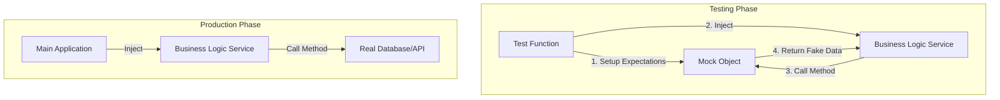

#API
---
---

## Mocking APIs & Dependencies in Go

Mocking is a technique used in unit testing to replace real dependencies (database, external APIs, file systems) with controlled objects that simulate their behavior. In Go, mocking relies heavily on **interfaces** to decouple the consumer from the implementation.

### ## Summary
Mocking provides **isolation** and **fast feedback**. By replacing heavy dependencies with lightweight mocks, developers can:
1.  **Isolate Logic**: Ensure the test validates the unit of code, not the underlying database or network.
2.  **Simulate Edge Cases**: Easily trigger timeouts, 500 errors, or specific data conditions that are hard to reproduce in production.
3.  **Speed**: Tests run in milliseconds because they avoid I/O operations.

---

### ## Detailed Explanation

#### 1. Interfaces as Contracts
In Go, mocking is impossible without interfaces. Interfaces define "what" an object can do, allowing the "how" (implementation) to be swapped during testing.



#### 2. Popular Mocking Tools
*   **gomock (GoMock)**: The most "official" framework. It uses a code generator (`mockgen`) to create mock implementations of interfaces.
    *   *Pros*: Feature-rich, strict call ordering, strong community support.
    *   *Cons*: Verbose syntax, requires a separate generation step.
*   **testify/mock**: Part of the popular `stretchr/testify` toolkit.
    *   *Pros*: Very readable `On(...).Return(...)` syntax.
    *   *Cons*: Reflection-based (slightly slower), less strict than gomock by default.
*   **moq**: A simpler tool that generates a struct where each method is a function field.
    *   *Pros*: Very "Go-idiomatic," no DSL (Domain Specific Language) to learn.
    *   *Cons*: Manual tracking of call counts if needed.
*   **httptest (Standard Library)**: Specifically for mocking external HTTP services by starting a local server that your code hits instead of the real URL.

#### 3. The Pattern: Generate -> Expect -> Run
1.  **Define Interface**: `type UserRepository interface { GetUser(id int) (*User, error) }`
2.  **Generate Mock**: Run `mockgen` or `moq` to create `MockUserRepository`.
3.  **Setup Expectations**: Tell the mock what to return when called with specific arguments.
4.  **Inject and Assert**: Pass the mock into your service and verify the service's output.

---

### ## Go Example: Mocking a Repository with `testify`

**1. The Code (Service and Interface)**
```go
// user.go
type User struct {
    ID   int
    Name string
}

type UserRepository interface {
    FindByID(id int) (*User, error)
}

type UserService struct {
    repo UserRepository
}

func (s *UserService) GetUserName(id int) (string, error) {
    user, err := s.repo.FindByID(id)
    if err != nil {
        return "", err
    }
    return user.Name, nil
}
```

**2. The Test (using testify/mock)**
```go
// user_test.go
import (
    "testing"
    "errors"
    "github.com/stretchr/testify/assert"
    "github.com/stretchr/testify/mock"
)

// MockUserRepository is the mock type
type MockUserRepository struct {
    mock.Mock
}

func (m *MockUserRepository) FindByID(id int) (*User, error) {
    args := m.Called(id)
    return args.Get(0).(*User), args.Error(1)
}

func TestGetUserName_Success(t *testing.T) {
    mockRepo := new(MockUserRepository)
    service := UserService{repo: mockRepo}

    // Expectation: When FindByID(1) is called, return a User and nil error
    mockRepo.On("FindByID", 1).Return(&User{ID: 1, Name: "Alice"}, nil)

    name, err := service.GetUserName(1)

    assert.NoError(t, err)
    assert.Equal(t, "Alice", name)
    mockRepo.AssertExpectations(t) // Verify FindByID was actually called
}

func TestGetUserName_Error(t *testing.T) {
    mockRepo := new(MockUserRepository)
    service := UserService{repo: mockRepo}

    // Expectation: Return an error
    mockRepo.On("FindByID", 99).Return((*User)(nil), errors.New("not found"))

    name, err := service.GetUserName(99)

    assert.Error(t, err)
    assert.Equal(t, "", name)
}
```

---

### ## Interview Questions

1.  **Why do we mock interfaces instead of concrete types in Go?**
    *   *Answer*: Go is statically typed. To swap a real dependency for a fake one at runtime, the consumer must depend on an interface. This allows the compiler to accept any type that satisfies the interface methods.

2.  **What is the difference between a Mock and a Stub?**
    *   *Answer*: A **Stub** provides canned answers to calls made during the test. A **Mock** is more advanced; it allows you to verify *how* it was called (e.g., "was this method called exactly once with these arguments?").

3.  **How would you mock an external HTTP API that your service calls?**
    *   *Answer*: Use the `net/http/httptest` package. You start a `httptest.NewServer`, which provides a local URL. You inject this URL into your service client. The server handler can return specific JSON payloads or error codes to test your client's response handling.

4.  **When should you NOT mock?**
    *   *Answer*: When testing the actual integration with a database (use a real database like PostgreSQL in a container via `testcontainers-go`) or when mocking becomes so complex that you are essentially re-implementing the dependency's logic.

5.  **What does "Interface Pollution" mean in the context of mocking?**
    *   *Answer*: Creating interfaces for every single struct just "in case" you need to mock them, even if there is only one implementation. Go best practice suggests defining interfaces where they are **used**, not where they are implemented.
