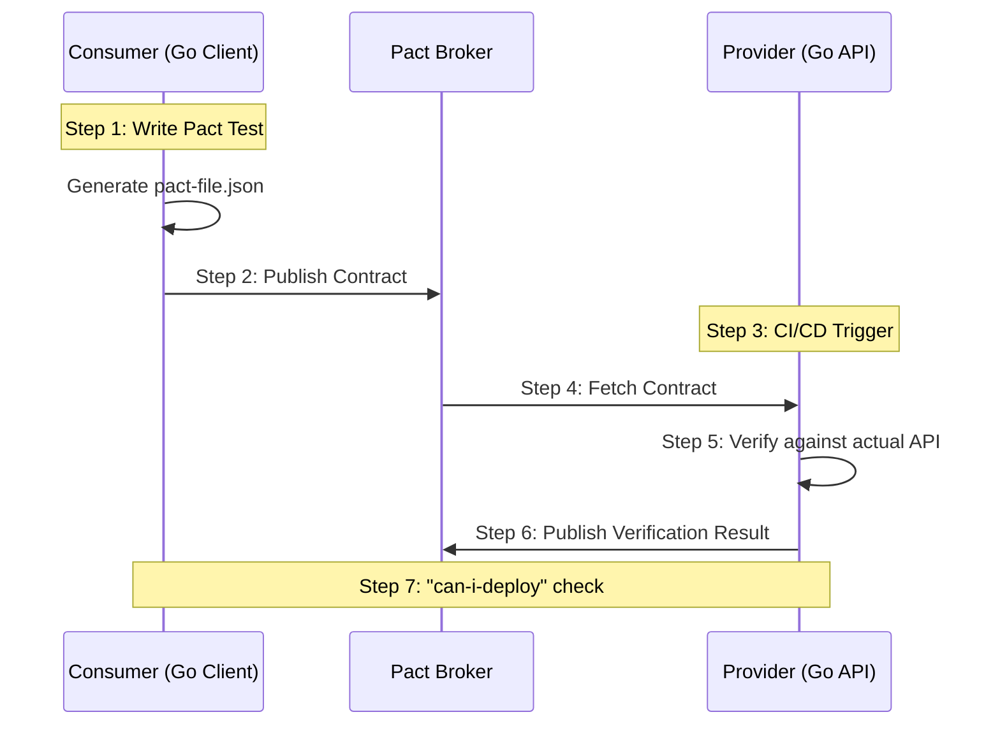

#API
---
---

# Contract Testing with Pact (Go)

## Summary
**Contract Testing** is a methodology used to ensure that two separate systems (typically a **Consumer** and a **Provider**) share a compatible understanding of their API interaction. Unlike end-to-end (E2E) tests which require both systems to be live, contract testing tests each side in isolation against a shared "Contract."

**Consumer-Driven Contracts (CDC)** is the most common pattern, where the consumer defines the expectations. This approach prevents breaking changes by ensuring providers are notified immediately if they modify an API in a way that would break a specific consumer.

---

## Detailed Explanation

### 1. The Core Concepts
*   **Consumer:** The service that calls the API (e.g., a Frontend or another Microservice).
*   **Provider:** The service that provides the API (e.g., a Backend REST API).
*   **Contract (Pact File):** A JSON file generated by the consumer that contains the requests it plans to make and the responses it expects.
*   **Pact Broker:** A central repository (usually a service) where consumers upload contracts and providers fetch them for verification.

### 2. The Pact Workflow
1.  **Consumer Test:** The consumer writes a mock-based test. Instead of calling the real provider, it calls a **Pact Mock Server**.
2.  **Pact Generation:** Successful tests generate a **Pact File**.
3.  **Publishing:** The Pact file is uploaded to the **Pact Broker**.
4.  **Provider Verification:** The provider fetches the Pact file and "replays" the requests against its actual running code.
5.  **Results:** The provider sends the verification result back to the Broker.

### 3. Verification Flow


---

## Go Implementation Example

Using the modern `pact-go/v2` library (Rust core).

### Consumer Side (Client)
```go
func TestConsumer(t *testing.T) {
    mockProvider, err := pact.NewV2Consumer(pact.Config{
        Consumer: "OrderService",
        Provider: "ProductService",
    })
    
    // Define the interaction
    err = mockProvider.
        AddInteraction().
        Given("A product with ID 123 exists").
        UponReceiving("A request for product 123").
        WithRequest(pact.Request{
            Method: "GET",
            Path:   "/products/123",
        }).
        WillRespondWith(pact.Response{
            Status: 200,
            Body:   pact.Like(Product{ID: "123", Name: "Laptop"}), // Matcher: "Like" checks structure, not exact value
        }).
        ExecuteTest(t, func(config pact.MockServerConfig) error {
            // Act: Call the mock server using your actual client code
            client := NewClient(config.Host, config.Port)
            product, err := client.GetProduct("123")
            
            // Assert: Standard Go assertions
            assert.NoError(t, err)
            assert.Equal(t, "123", product.ID)
            return nil
        })
}
```

### Provider Side (Verification)
```go
func TestProvider(t *testing.T) {
    verifier := pact.HTTPVerifier{}

    // Verify the Pact against the local running provider
    err := verifier.VerifyProvider(t, pact.VerifyRequest{
        ProviderBaseURL: "http://localhost:8080",
        PactURLs:        []string{"./pacts/order_service-product_service.json"},
        ProviderStatesSetupURL: "http://localhost:8080/pact-setup", // Handles "Given" states
    })
    assert.NoError(t, err)
}
```

---

## Interview Questions

### 1. How does Contract Testing differ from Mocking or Integration Testing?
*   **Mocking:** Usually happens inside a single project's unit tests. If the real API changes, your mocks remain "green" (false positive).
*   **Contract Testing:** Connects the mock to the real provider. If the provider changes, the contract verification fails.
*   **Integration Testing (E2E):** Requires all services to be deployed. It is slow, brittle, and hard to debug. Contract testing provides the same safety but is fast and runs in isolation.

### 2. What are "Provider States"?
They are "Pre-conditions" defined by the consumer (using the `Given` clause). The provider must set up its environment (e.g., seed a database with a specific record) before running that specific contract test to ensure the scenario can be satisfied.

### 3. What is the "Pact Broker" and why is it necessary?
The Broker is a hub that manages contract versions. It solves the "orchestration" problem: it knows which version of the Consumer is compatible with which version of the Provider. It provides the `can-i-deploy` tool, which prevents a service from being deployed to production if its contract is not verified.

### 4. What is a "Breaking Change" in CDC?
A breaking change occurs when the Provider modifies an existing field or endpoint that a Consumer has explicitly declared in their contract. If the Provider adds a *new* field that no consumer is using yet, it is *not* a breaking change because it won't affect existing pacts.

### 5. Why should you use "Matchers" (like `Like`, `Term`, `EachLike`) instead of exact values?
Using exact values (e.g., `Name: "iPhone 15"`) makes tests brittle because data changes. Matchers allow you to verify the **schema and types** (e.g., `Name` must be a string) rather than the specific data, making the contract robust against data volatility while still ensuring structural integrity.
