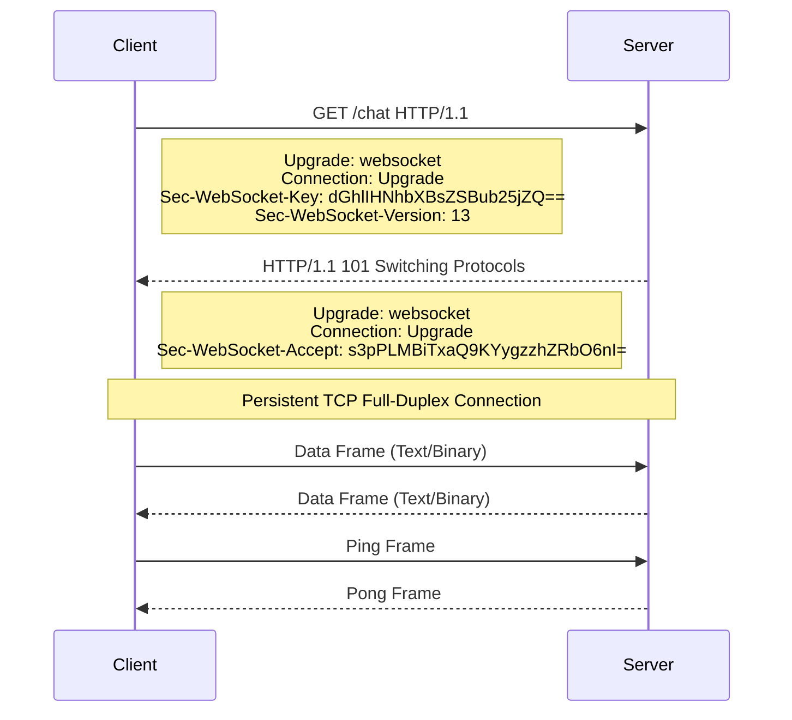

#API
---
---

# WebSockets

## Summary
WebSockets is a communication protocol that provides **full-duplex**, **bidirectional** communication over a single, long-lived TCP connection. It starts as an HTTP request which is "upgraded" to the WebSocket protocol. Unlike the request-response model of HTTP, WebSockets allow both client and server to push data at any time, making it ideal for low-latency applications like real-time chats, financial tickers, and collaborative tools.

## Detailed Explanation

### 1. The Handshake Process
The connection starts with an HTTP GET request containing specific headers. If the server supports the protocol, it returns an `HTTP 101 Switching Protocols` status.



**Key Headers:**
*   `Upgrade: websocket`: Informs the server to switch protocols.
*   `Sec-WebSocket-Key`: A random base64-encoded value used by the server to prove it received the request.
*   `Sec-WebSocket-Accept`: The server's response hash (SHA-1 of the key + a magic GUID `258EAFA5-E914-47DA-95CA-C5AB0DC85B11`).

### 2. Frame Structure (RFC 6455)
WebSockets transmit data in "frames" rather than streams.
*   **FIN**: 1 bit. Indicates if this is the final fragment of a message.
*   **Opcode**: 4 bits. Defines the type of frame:
    *   `0x1`: Text
    *   `0x2`: Binary
    *   `0x8`: Close
    *   `0x9`: Ping
    *   `0xA`: Pong
*   **Masking**: Client-to-server frames **must** be masked to prevent proxy cache poisoning. Server-to-client frames are not masked.

### 3. Keepalives (Ping/Pong)
To prevent intermediate load balancers or firewalls from closing "idle" connections, the protocol uses heartbeats:
*   The server (or client) sends a **Ping** frame.
*   The receiver must respond with a **Pong** frame as soon as possible.

---

### 4. Go Implementation: Simple Chat Hub
Using the popular `github.com/gorilla/websocket` library.

#### The Hub (Manager)
The Hub manages the set of active clients and broadcasts messages.

```go
package main

import (
	"github.com/gorilla/websocket"
	"net/http"
)

type Hub struct {
	clients    map[*Client]bool
	broadcast  chan []byte
	register   chan *Client
	unregister chan *Client
}

func newHub() *Hub {
	return &Hub{
		broadcast:  make(chan []byte),
		register:   make(chan *Client),
		unregister: make(chan *Client),
		clients:    make(map[*Client]bool),
	}
}

func (h *Hub) run() {
	for {
		select {
		case client := <-h.register:
			h.clients[client] = true
		case client := <-h.unregister:
			if _, ok := h.clients[client]; ok {
				delete(h.clients, client)
				close(client.send)
			}
		case message := <-h.broadcast:
			for client := range h.clients {
				select {
				case client.send <- message:
				default:
					close(client.send)
					delete(h.clients, client)
				}
			}
		}
	}
}
```

#### The Client & Upgrader
The `Upgrader` converts an HTTP connection to a WebSocket connection.

```go
var upgrader = websocket.Upgrader{
	ReadBufferSize:  1024,
	WriteBufferSize: 1024,
	CheckOrigin: func(r *http.Request) bool {
		return true // Warning: Use proper origin checks in production
	},
}

type Client struct {
	hub  *Hub
	conn *websocket.Conn
	send chan []byte
}

func (c *Client) readPump() {
	defer func() {
		c.hub.unregister <- c
		c.conn.Close()
	}()
	for {
		_, message, err := c.conn.ReadMessage()
		if err != nil {
			break
		}
		c.hub.broadcast <- message
	}
}

func (c *Client) writePump() {
	for message := range c.send {
		w, err := c.conn.NextWriter(websocket.TextMessage)
		if err != nil {
			return
		}
		w.Write(message)
		if err := w.Close(); err != nil {
			return
		}
	}
}

func serveWs(hub *Hub, w http.ResponseWriter, r *http.Request) {
	conn, _ := upgrader.Upgrade(w, r, nil)
	client := &Client{hub: hub, conn: conn, send: make(chan []byte, 256)}
	client.hub.register <- client
	go client.writePump()
	go client.readPump()
}
```

## Interview Questions

1.  **How do WebSockets differ from HTTP Long Polling?**
    *   **Long Polling:** The client opens a request, and the server holds it open until data is available. Once the data is sent, the connection closes, and the client must open a *new* request. High overhead due to repeated headers.
    *   **WebSockets:** A single persistent connection. Low overhead after the handshake. Truly bidirectional.

2.  **What is the purpose of the `Sec-WebSocket-Key`?**
    *   It is a security handshake mechanism to prevent accidental protocol switching by non-WebSocket servers or proxies. It ensures the server explicitly "opted-in" to the WebSocket protocol.

3.  **Why do clients have to mask frames?**
    *   To prevent "Cache Poisoning" attacks. If frames weren't masked, a malicious client could craft a WebSocket frame that looks like an HTTP GET request to a proxy, potentially poisoning the proxy's cache with arbitrary content.

4.  **How do you scale WebSockets to multiple server instances?**
    *   Since WebSockets are stateful (sticky to one server), you need a **Pub/Sub** mechanism (like Redis or NATS) in the backend. When Server A receives a message, it publishes it to Redis; Server B subscribes to Redis and broadcasts it to its own connected clients.

5.  **When would you use Server-Sent Events (SSE) instead of WebSockets?**
    *   Use SSE if communication is **unidirectional** (server to client only), such as a news feed or stock ticker. SSE is simpler, runs over standard HTTP, supports automatic reconnection, and is lighter on server resources.
