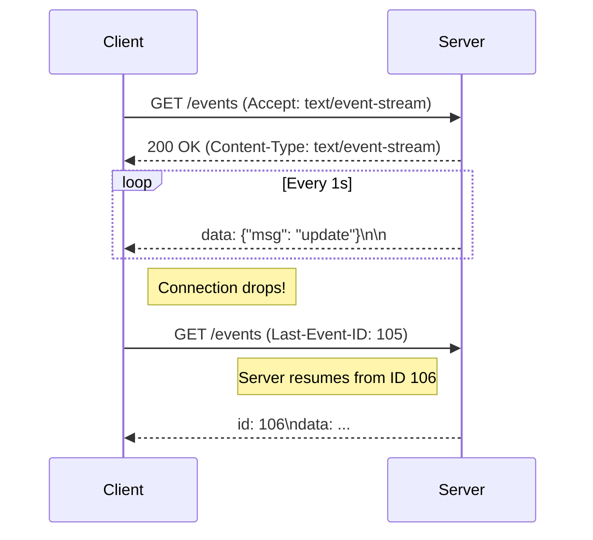

#API
---
---

# Server-Sent Events (SSE)

## Summary
Server-Sent Events (SSE) is a web standard that allows servers to stream updates to clients over a standard HTTP connection. Unlike WebSockets, SSE is **unidirectional** (Server → Client). The client sends a request once, and the server keeps the connection open, pushing text-based "events" as they occur. It is natively supported by browsers via the `EventSource` API and is ideal for feeds, notifications, and live status updates where the client doesn't need to send real-time data back.

## Detailed Explanation

### 1. The Protocol (text/event-stream)
SSE operates over standard HTTP/1.1 or HTTP/2. The key requirement is setting the Content-Type header to `text/event-stream`.

**Data Format:**
Each message is a block of text separated by a pair of newlines.
*   `data`: The payload (usually JSON).
*   `event`: (Optional) The type of event (allows client to add specific listeners).
*   `id`: (Optional) A unique ID for the event. If the connection drops, the browser sends this ID back in the `Last-Event-ID` header, allowing the server to resend missed messages.
*   `retry`: (Optional) Reconnection timeout in milliseconds.

**Example Stream:**
```http
HTTP/1.1 200 OK
Content-Type: text/event-stream
Cache-Control: no-cache
Connection: keep-alive

id: 101
event: user_joined
data: {"username": "alice"}

id: 102
event: message
data: {"text": "hello world"}

: This is a comment (keepalive)
```

### 2. HTTP/2 Multiplexing Benefits
Under HTTP/1.1, browsers are limited to ~6 simultaneous open connections per domain. Since SSE holds a connection open, using multiple SSE tabs could quickly exhaust this limit.
**HTTP/2 solves this** by allowing multiple streams (SSE connections) to share a single TCP connection, making SSE highly efficient and practically unlimited in modern infrastructure.

### 3. Go Implementation: Using `http.Flusher`
In Go, handling SSE requires ensuring that data is flushed to the client immediately rather than buffered.

```go
package main

import (
	"fmt"
	"net/http"
	"time"
)

func sseHandler(w http.ResponseWriter, r *http.Request) {
	// 1. Set Headers
	w.Header().Set("Content-Type", "text/event-stream")
	w.Header().Set("Cache-Control", "no-cache")
	w.Header().Set("Connection", "keep-alive")
	w.Header().Set("Access-Control-Allow-Origin", "*")

	// 2. Assert Flusher interface
	flusher, ok := w.(http.Flusher)
	if !ok {
		http.Error(w, "Streaming unsupported!", http.StatusInternalServerError)
		return
	}

	// 3. Listen for client disconnect
	ctx := r.Context()

	// 4. Stream Loop
	for i := 0; i < 10; i++ {
		select {
		case <-ctx.Done():
			fmt.Println("Client disconnected")
			return
		default:
			// Write Event
			// Format: "data: <payload>\n\n"
			fmt.Fprintf(w, "data: {\"time\": \"%s\", \"count\": %d}\n\n", time.Now().Format(time.RFC3339), i)
			
			// Flush immediately
			flusher.Flush()
			
			time.Sleep(1 * time.Second)
		}
	}
}

func main() {
	http.HandleFunc("/events", sseHandler)
	http.ListenAndServe(":8080", nil)
}
```

### 4. Client-Side (JavaScript)
```javascript
const evtSource = new EventSource("/events");

evtSource.onmessage = (event) => {
  const data = JSON.parse(event.data);
  console.log("New message:", data);
};

evtSource.addEventListener("user_joined", (e) => {
  console.log("User Joined:", e.data);
});

evtSource.onerror = (err) => {
  console.error("EventSource failed:", err);
};
```

## Connection Flow (Mermaid)



## Interview Questions

1.  **What is the main limitation of SSE compared to WebSockets?**
    *   **Unidirectional:** SSE only sends data from Server to Client. If the client needs to send data back (e.g., a chat message), it must use a separate standard HTTP request (POST/PUT). WebSockets allow bidirectional communication on the same connection.

2.  **How does SSE handle connection drops?**
    *   **Automatic Reconnection:** The browser's `EventSource` API automatically attempts to reconnect after a failure (default timeout usually 3s).
    *   **State Recovery:** Using the `id` field in the stream and the `Last-Event-ID` header in the reconnection request, the server can "replay" missed messages.

3.  **Why is `http.Flusher` necessary in Go for SSE?**
    *   Go's `http.ResponseWriter` buffers data by default to optimize network packets. For streaming, we need the client to receive data *immediately* as it's generated. Calling `Flush()` forces the buffered data to be written to the wire.

4.  **Can SSE send binary data?**
    *   No. SSE is strictly a text-based protocol (UTF-8). If you need to send binary data (like images), you must Base64 encode it, which adds ~33% overhead. WebSockets support binary frames natively.

5.  **How do you support 100,000 concurrent SSE connections in Go?**
    *   Each SSE connection is a goroutine. Go handles this well (lightweight threads). However, you must ensure you have enough **File Descriptors** (ulimit) on the OS level, and use a message broker (Redis/NATS) to broadcast messages to all goroutines efficiently without blocking.
