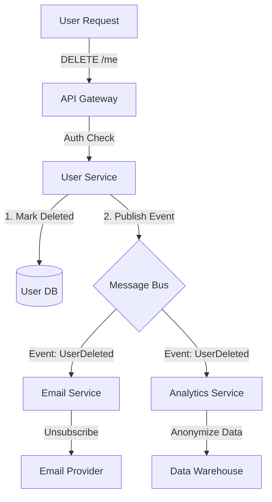

#API
---
---

# GDPR Compliance for APIs

## Summary
The **General Data Protection Regulation (GDPR)** is a comprehensive data privacy law enacted by the EU. It applies to **any** organization that processes the personal data of individuals residing in the EU, regardless of where the company is based. Key principles include transparency, data minimization, and granting users control over their data.

## Detailed Explanation

### Key User Rights in API Design
1.  **Right to be Forgotten (Erasure)**: Users can request the deletion of all their personal data.
    *   *Implementation*: A `DELETE /users/{id}` endpoint that triggers a "soft delete" (flagging as deleted) or "hard delete" (wiping from DB) and propagates this event to third-party services (e.g., Stripe, Analytics).
2.  **Right to Data Portability**: Users can request a copy of their data in a structured, machine-readable format.
    *   *Implementation*: A `GET /users/{id}/export` endpoint that returns a JSON or CSV dump of the user's profile, activity logs, and preferences.
3.  **Consent**: Processing requires explicit, informed consent.
    *   *Implementation*: Logging the timestamp, IP, and specific version of the Terms of Service the user agreed to during sign-up.

### Deletion Architecture Flow


### Go Example: Audit Logging & Deletion
Middleware is useful for tracking consent and data access, while a service layer handles the complex deletion logic.

```go
package main

import (
	"context"
	"log"
	"net/http"
	"time"
)

// AuditLogMiddleware records access to sensitive endpoints
func AuditLogMiddleware(next http.Handler) http.Handler {
	return http.HandlerFunc(func(w http.ResponseWriter, r *http.Request) {
		start := time.Now()
		// Process request
		next.ServeHTTP(w, r)
		
		// Log metadata (NEVER log the body content if it contains PII)
		log.Printf("Method: %s, Path: %s, Duration: %s, UserID: %s", 
			r.Method, r.URL.Path, time.Since(start), r.Header.Get("X-User-ID"))
	})
}

// HandleErasureRequest simulates the Right to be Forgotten
func HandleErasureRequest(w http.ResponseWriter, r *http.Request) {
	userID := r.PathValue("id")
	ctx := r.Context()

	// 1. Transactional Delete/Anonymize in Main DB
	if err := deleteUserFromDB(ctx, userID); err != nil {
		http.Error(w, "Failed to delete user", http.StatusInternalServerError)
		return
	}

	// 2. Async Notification to other services (Simulated)
	go func() {
		// publish("user.deleted", userID)
		log.Printf("Propagating deletion for user %s to downstream services...", userID)
	}()

	w.WriteHeader(http.StatusOK)
	w.Write([]byte(`{"status": "erasure_initiated"}`))
}

func deleteUserFromDB(ctx context.Context, id string) error {
	// Logic to execute DELETE FROM users...
	return nil
}
```

## Interview Questions

1.  **What is the difference between "Data Controller" and "Data Processor"?**
    *   *Answer*: The **Controller** determines *why* and *how* data is processed (e.g., your company deciding to collect emails). The **Processor** processes data on behalf of the controller (e.g., AWS hosting the database).

2.  **How do you handle "Right to be Forgotten" in backups?**
    *   *Answer*: It is technically difficult to modify immutable backups. GDPR acknowledges this; usually, the requirement is to ensure that if a backup is restored, the deleted user's data is re-deleted immediately or not processed.

3.  **What qualifies as "Personal Data" under GDPR?**
    *   *Answer*: Any information related to an identified or identifiable natural person. This includes names, emails, IP addresses, cookie IDs, and location data.

4.  **How would you implement "Data Minimization" in a Go API?**
    *   *Answer*: By returning only the fields explicitly requested (using GraphQL or sparse fieldsets) and not storing data that isn't necessary for the business function (e.g., not logging full request bodies).

5.  **If your API uses a third-party analytics tool, does GDPR apply?**
    *   *Answer*: Yes. You must have a Data Processing Agreement (DPA) with the vendor, and you must ensure they offer mechanisms to delete user data when a user exercises their Right to Erasure.
