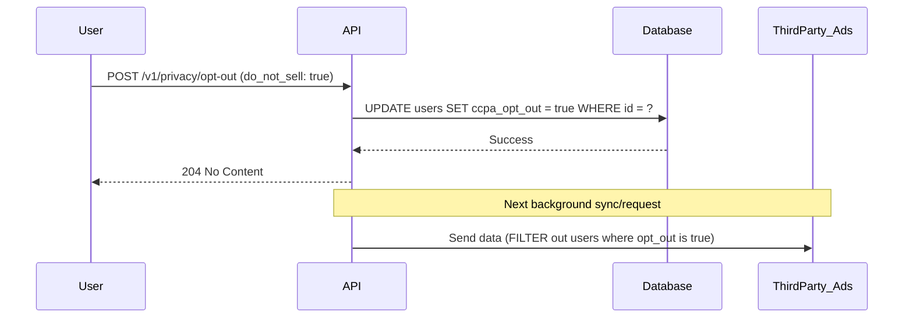

#API
---
---

# CCPA Compliance for APIs

## Summary
The **California Consumer Privacy Act (CCPA)** is a state-level statute intended to enhance privacy rights and consumer protection for residents of California. While it shares similarities with the EU's **GDPR**, there are fundamental differences in approach:

| Feature | GDPR | CCPA |
| --- | --- | --- |
| **Philosophy** | **Opt-in** (Consent required before processing). | **Opt-out** (Right to stop the sale of data). |
| **Scope** | Any entity processing data of EU residents. | For-profit entities meeting specific revenue/data volume thresholds in CA. |
| **"Personal Info"** | Broadly defined as data relating to an identified person. | Includes "household" data and specific identifiers like IP addresses. |
| **Key Requirement** | Right to be forgotten, data portability. | Right to Know, Right to Opt-Out of Sale. |

## Detailed Explanation

### 1. Right to Know and Right to Delete
APIs must provide endpoints that allow users to request a report of what personal data is being collected and to request its deletion. For a Go-based microservice, this often involves:
- **Data Mapping**: Knowing exactly where PII (Personally Identifiable Information) resides across SQL, NoSQL, and caches.
- **Cascading Deletes**: Ensuring that a delete request triggers the removal of data from backups (within reasonable time) and downstream third-party services.

### 2. Right to Opt-Out ("Do Not Sell")
The most visible requirement of CCPA is the "Do Not Sell My Personal Information" link. Technically, "selling" includes sharing data for "valuable consideration." 
- **The Flag**: User models should include a boolean flag (e.g., `do_not_sell` or `ccpa_opt_out`).
- **Downstream Propagation**: If a user opts out, your API must stop sending their data to third-party analytics, ad-tech, or data brokers.

### 3. Implementation Flow


### 4. Go Example: Handling Opt-Out Preferences

In Go, we typically represent this in the user model and provide a dedicated endpoint for privacy updates.

```go
package main

import (
	"encoding/json"
	"net/http"
	"sync"
)

// User represents the data model with CCPA compliance flags
type User struct {
	ID          string `json:"id"`
	Email       string `json:"email"`
	DoNotSell   bool   `json:"do_not_sell"` // CCPA Opt-out flag
	IsRestricted bool  `json:"is_restricted"`
}

// Mock Database
var (
	db = make(map[string]*User)
	mu sync.RWMutex
)

// UpdatePrivacySettings handles CCPA opt-out requests
func UpdatePrivacySettings(w http.ResponseWriter, r *http.Request) {
	if r.Method != http.MethodPatch {
		http.Error(w, "Method not allowed", http.StatusMethodNotAllowed)
		return
	}

	userID := r.URL.Query().Get("user_id")
	
	var input struct {
		DoNotSell bool `json:"do_not_sell"`
	}

	if err := json.NewDecoder(r.Body).Decode(&input); err != nil {
		http.Error(w, "Invalid request body", http.StatusBadRequest)
		return
	}

	mu.Lock()
	user, reset := db[userID]
	if !reset {
		mu.Unlock()
		http.Error(w, "User not found", http.StatusNotFound)
		return
	}

	// Update the "Do Not Sell" preference
	user.DoNotSell = input.DoNotSell
	mu.Unlock()

	w.WriteHeader(http.StatusNoContent)
}

func main() {
	http.HandleFunc("/api/v1/user/privacy", UpdatePrivacySettings)
	// http.ListenAndServe(":8080", nil)
}
```

## Interview Questions

1. **How does the definition of "Personal Information" differ between CCPA and GDPR?**
   *Answer*: CCPA specifically includes "households" in its definition and focuses heavily on the "sale" of data, whereas GDPR is broader regarding any data that can identify an individual.

2. **What technical measures would you implement to handle a "Right to Know" request in a microservices architecture?**
   *Answer*: I would implement a centralized Privacy Service that queries an "Identity Map" or uses event-driven architecture to gather PII fragments from various service databases to generate a consolidated report.

3. **In Go, how would you ensure that background workers or third-party integrations respect the `DoNotSell` flag?**
   *Answer*: I would use a middleware or a decorator pattern in the data-export service. Before any batch job or API call to an external vendor, the service must verify the `DoNotSell` status from the user profile.

4. **What is the significance of the "Lookback Period" in CCPA?**
   *Answer*: CCPA requires businesses to provide information for the 12-month period preceding the consumer's request. This means APIs and logging systems must ensure data lineage is preserved for at least a year.
