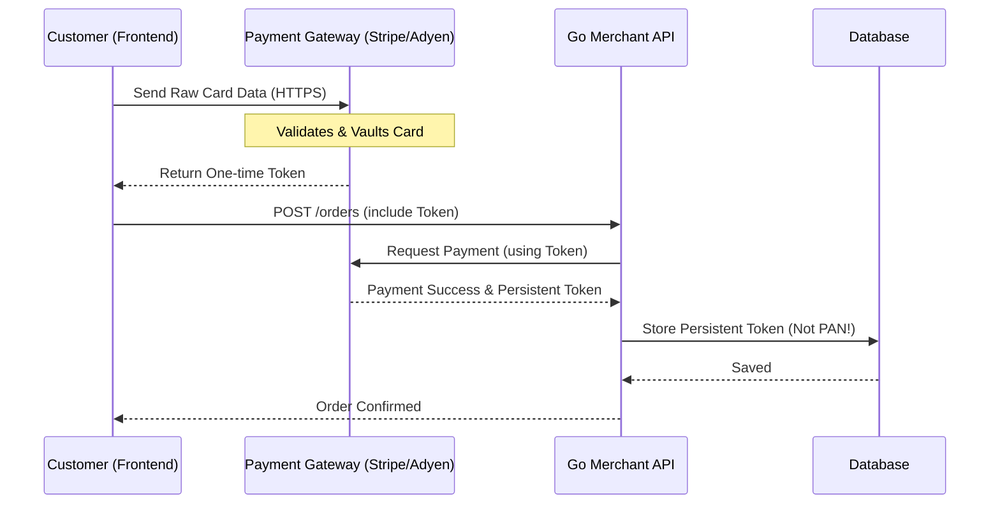

#API
---
---

# PCI DSS Compliance for APIs

## Summary
The **Payment Card Industry Data Security Standard (PCI DSS)** is a global security standard mandated by major card brands (Visa, Mastercard, Amex, etc.) for any organization that handles, processes, stores, or transmits credit card data. For API development, PCI DSS compliance focuses on securing **Cardholder Data (CHD)**—primarily the Primary Account Number (PAN)—and **Sensitive Authentication Data (SAD)** like CVV/CVC codes. The primary goal is to minimize "scope" (the systems that touch card data) to reduce the risk of massive data breaches.

## Detailed Explanation

### 1. Scope Reduction and Payment Gateways
The most effective way to achieve compliance is to avoid touching raw credit card data entirely.
- **Payment Gateways (Stripe, PayPal, Adyen):** By using client-side SDKs (like Stripe Elements), the card data is sent directly from the user's browser to the payment provider. Your Go API only receives a **Token**.
- **Impact:** This moves your API into a "reduced scope" category (e.g., SAQ A or SAQ A-EP), significantly simplifying the audit process.

### 2. Tokenization vs. Encryption
- **Tokenization:** Replacing the PAN with a mathematically unrelated value (a token). The token is useless to hackers without access to the secure "Vault."
- **Encryption:** Using algorithms like AES-256 to reversible-scramble data. PCI DSS Requirement 3 requires strong cryptography for data at rest, and Requirement 4 requires TLS 1.2+ for data in transit.

### 3. The "Golden Rule" of Logging
**NEVER** log Sensitive Authentication Data (SAD). Even if encrypted, storing the following after authorization is a violation:
- CVV/CVC (Card Verification Value)
- PIN/PIN Block
- Full contents of the magnetic stripe or chip

### 4. Tokenization Flow (MermaidJS)



### 5. Implementation in Go: Masking Sensitive Data
When handling structs that might contain sensitive info, implement the `json.Marshaler` interface or use specialized logging wrappers to ensure data never leaks into logs.

```go
package main

import (
	"encoding/json"
	"fmt"
	"strings"
)

// CreditCard represents a card structure. 
// PAN should ideally never reach your API, but if it does, it must be handled safely.
type CreditCard struct {
	HolderName string `json:"holder_name"`
	PAN        string `json:"pan"` // Primary Account Number
	CVV        string `json:"cvv"`
}

// MarshalJSON implements custom masking logic for the JSON encoder.
// This prevents sensitive fields from appearing in logs if the struct is logged as JSON.
func (c CreditCard) MarshalJSON() ([]byte, error) {
	type Alias CreditCard
	return json.Marshal(&struct {
		PAN string `json:"pan"`
		CVV string `json:"cvv"`
		*Alias
	}{
		PAN:   maskPAN(c.PAN),
		CVV:   "***",
		Alias: (*Alias)(&c),
	})
}

func maskPAN(pan string) string {
	if len(pan) < 4 {
		return "****"
	}
	// Reveal only the last 4 digits
	return strings.Repeat("*", len(pan)-4) + pan[len(pan)-4:]
}

func main() {
	card := CreditCard{
		HolderName: "John Doe",
		PAN:        "4111222233334444",
		CVV:        "123",
	}

	// When logging or sending as JSON, the data is automatically masked
	data, _ := json.Marshal(card)
	fmt.Println(string(data)) 
	// Output: {"pan":"************4444","cvv":"***","holder_name":"John Doe"}
}
```

## Interview Questions

1. **What is the difference between PCI DSS Scope and Segmentation?**
   *Answer:* Scope includes all people, processes, and technologies that touch cardholder data. Segmentation (using firewalls/VLANs) isolates the Cardholder Data Environment (CDE) from the rest of the corporate network to reduce the number of systems that must be audited.

2. **Can you store a CVV if you encrypt it with a hardware security module (HSM)?**
   *Answer:* No. PCI DSS strictly prohibits the storage of Sensitive Authentication Data (SAD) like the CVV after authorization, regardless of encryption.

3. **How does TLS help with PCI DSS compliance?**
   *Answer:* Requirement 4 mandates the use of strong cryptography and security protocols (like TLS 1.2 or 1.3) to safeguard sensitive cardholder data during transmission over open, public networks.

4. **Why is Tokenization preferred over Encryption for long-term storage?**
   *Answer:* Encryption keys must be rotated and managed, and the data is still "technically" the PAN. Tokens have no intrinsic value and, if stolen, cannot be reversed into a PAN without access to the provider's vault, often removing the storage system from PCI scope.
