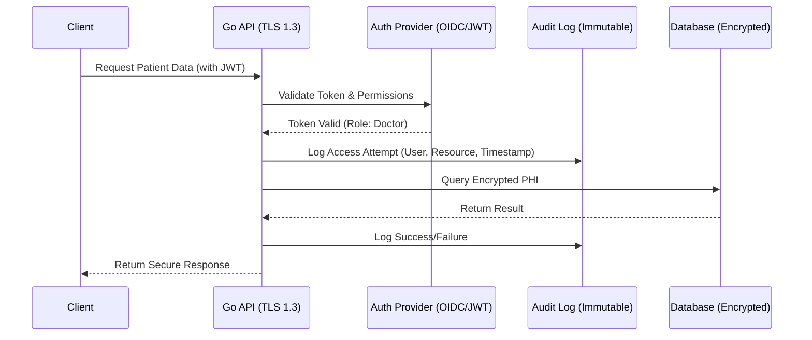

#API
---
---

# HIPAA Compliance for APIs

## Summary
The **Health Insurance Portability and Accountability Act (HIPAA)** is a US federal law that establishes national standards for the protection of sensitive patient health information. In the context of APIs, the primary goal is the safeguarding of **Protected Health Information (PHI)** through technical, administrative, and physical safeguards. Any organization handling PHI (Covered Entities) or their service providers (Business Associates) must ensure that APIs are secure, audited, and encrypted to prevent unauthorized disclosure.

## Detailed Explanation

### 1. Technical Safeguards
To make an API HIPAA-compliant, several technical controls must be implemented:
- **Encryption in Transit**: All API communication must happen over HTTPS (TLS 1.2 or higher).
- **Encryption at Rest**: PHI stored in databases or file systems must be encrypted (e.g., AES-256).
- **Access Controls**: Implementing Role-Based Access Control (RBAC) or Attribute-Based Access Control (ABAC) to ensure users only see the data they are authorized to access (Principle of Least Privilege).
- **Integrity**: Ensuring PHI is not altered or destroyed in an unauthorized manner (using checksums or digital signatures).

### 2. Audit Controls (The "Paper" Trail)
HIPAA requires hardware, software, and/or procedural mechanisms that record and examine activity in information systems that contain or use electronic PHI. Every access, modification, or deletion of patient records must be logged.

### 3. Business Associate Agreements (BAA)
If your API uses third-party services (Cloud providers like AWS/GCP, Email providers, or Logging services), you **must** have a signed BAA with them. This contract ensures the third party also adheres to HIPAA standards.

### 4. Implementation Flow


### Go Example: Strict Audit Logging Middleware
In Go, middleware is the ideal place to implement audit trails. It ensures that every request to sensitive endpoints is recorded before and after execution.

```go
package main

import (
	"context"
	"log"
	"net/http"
	"time"

	"github.com/google/uuid"
)

// AuditEntry represents the structure of a HIPAA-compliant audit log
type AuditEntry struct {
	RequestID  string    `json:"request_id"`
	UserID     string    `json:"user_id"`
	Action     string    `json:"action"`
	Resource   string    `json:"resource"`
	Timestamp  time.Time `json:"timestamp"`
	StatusCode int       `json:"status_code"`
	IPAddress  string    `json:"ip_address"`
}

// HIPAAAuditMiddleware logs every access to PHI-related endpoints
func HIPAAAuditMiddleware(next http.Handler) http.Handler {
	return http.HandlerFunc(func(w http.ResponseWriter, r *http.Request) {
		start := time.Now()
		requestID := uuid.New().String()
		
		// In a real app, extract UserID from JWT context
		userID := r.Header.Get("X-User-ID") 
		if userID == "" {
			userID = "anonymous"
		}

		// Use a custom ResponseWriter to capture the status code
		lrw := &loggingResponseWriter{ResponseWriter: w, statusCode: http.StatusOK}

		// Process request
		next.ServeHTTP(lrw, r)

		// Finalize audit entry
		entry := AuditEntry{
			RequestID:  requestID,
			UserID:     userID,
			Action:     r.Method,
			Resource:   r.URL.Path,
			Timestamp:  start,
			StatusCode: lrw.statusCode,
			IPAddress:  r.RemoteAddr,
		}

		// CRITICAL: Log to an immutable, secure sink (e.g., CloudWatch, SIEM)
		// Do NOT log the actual PHI content, only the fact that it was accessed.
		log.Printf("[AUDIT] %+v\n", entry)
	})
}

type loggingResponseWriter struct {
	http.ResponseWriter
	statusCode int
}

func (lrw *loggingResponseWriter) WriteHeader(code int) {
	lrw.statusCode = code
	lrw.ResponseWriter.WriteHeader(code)
}

func main() {
	mux := http.NewServeMux()
	
	// Sensitive endpoint wrapped in Audit Middleware
	mux.Handle("/v1/patients/", HIPAAAuditMiddleware(http.HandlerFunc(func(w http.ResponseWriter, r *http.Request) {
		w.Write([]byte("Sensitive Patient Data"))
	})))

	log.Fatal(http.ListenAndServe(":8443", mux)) // Use ListenAndServeTLS in production
}
```

## Interview Questions

1. **What is PHI and what determines if an API must be HIPAA compliant?**
   *   *Answer:* PHI (Protected Health Information) is any health information that can be linked to a specific individual. An API must be compliant if it transmits, receives, or stores PHI on behalf of a Covered Entity (healthcare provider, health plan) or as a Business Associate.

2. **Can you log PHI data in your application logs for debugging?**
   *   *Answer:* No. PHI should never appear in application logs (stdout/stderr). Logs should contain metadata about the access (who, when, what resource ID) but not the actual clinical data or identifiers.

3. **How do you handle "Right to be Forgotten" in a HIPAA context vs GDPR?**
   *   *Answer:* Unlike GDPR, HIPAA does not have a "Right to Erasure" that overrides medical record retention laws. In fact, HIPAA and other state laws often *require* providers to retain records for several years (usually 6+ years).

4. **What are the encryption requirements for HIPAA?**
   *   *Answer:* HIPAA doesn't specify a particular algorithm (it is "technology-neutral"), but it refers to NIST standards. Currently, this means TLS 1.2+ for data in transit and AES-256 for data at rest.

5. **Why is a BAA important when using a third-party logging service?**
   *   *Answer:* Without a BAA, the third party is not legally bound to protect the PHI under HIPAA. Sending PHI (even accidentally) to a service without a BAA is a direct violation and can result in heavy fines.
