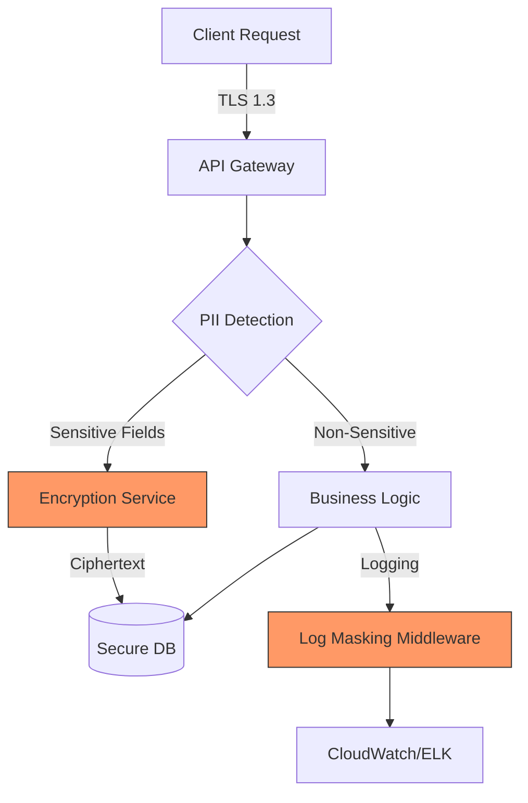

#API
---
---

# PII (Personally Identifiable Information) Protection in API Design

## Summary

Personally Identifiable Information (PII) is any data that can be used to identify a specific individual. In modern API design, protecting PII is not just a best practice but a legal requirement (GDPR, CCPA, HIPAA).

### What Qualifies as PII?
*   **Direct Identifiers**: Full name, Social Security Number (SSN), driver’s license number, email address, passport number.
*   **Indirect Identifiers**: IP addresses, MAC addresses, biometric data (fingerprints, facial recognition), geolocation, birth dates.

### Sensitivity Levels
1.  **Non-Sensitive PII**: Publicly available information (e.g., business phone numbers, public directory info).
2.  **Sensitive PII**: Information that, if disclosed, could harm the individual (e.g., health records, financial info, ethnic origin, religious beliefs).
3.  **Highly Sensitive/Restricted**: Credentials, SSNs, and private cryptographic keys.

---

## Detailed Explanation

### 1. Data Minimization Principle
The most effective way to protect PII is to **never collect it** if it's not strictly necessary for the application's functionality.
*   **Action**: Audit your API endpoints. If you only need to verify a user is over 18, ask for a boolean check rather than their full date of birth.

### 2. Masking & Redaction in Logs
Logs are the most common source of PII leaks. Developers often log entire request/response bodies for debugging, accidentally including passwords or emails.
*   **Masking**: Replacing sensitive parts (e.g., `user@example.com` becomes `u***@example.com`).
*   **Redaction**: Complete removal or replacement with a placeholder (e.g., `[REDACTED]`).

### 3. Encryption
*   **In Transit**: Enforce TLS 1.3 for all API communication.
*   **At Rest**: Use industry-standard algorithms like **AES-256-GCM** for database fields containing PII. Never use home-grown encryption.

### 4. Go Example: Protecting PII

In Go, we can protect PII by using **custom types** that implement the `fmt.Stringer` and `json.Marshaler` interfaces. This ensures that even if a struct is logged or converted to JSON, the sensitive data remains hidden.

```go
package main

import (
	"encoding/json"
	"fmt"
)

// SecretString is a custom type for sensitive data
type SecretString string

// String implements the fmt.Stringer interface.
// This prevents sensitive data from leaking in logs (fmt.Printf, etc.)
func (s SecretString) String() string {
	return "[REDACTED]"
}

// MarshalJSON implements the json.Marshaler interface.
// This ensures that when the struct is converted to JSON, the field is masked.
func (s SecretString) MarshalJSON() ([]byte, error) {
	return json.Marshal("********")
}

type User struct {
	ID    int          `json:"id"`
	Name  string       `json:"name"`
	Email SecretString `json:"email"`    // Protected via custom methods
	Token string       `json:"-"`        // Completely omitted from JSON
}

func main() {
	u := User{
		ID:    1,
		Name:  "John Doe",
		Email: "john.doe@example.com",
		Token: "super-secret-session-token",
	}

	// 1. Logging the struct (calls .String() for SecretString)
	fmt.Printf("Logging User: %+v\n", u) 
	// Output: Logging User: {ID:1 Name:John Doe Email:[REDACTED]}

	// 2. Converting to JSON (calls .MarshalJSON() and respects `json:"-"`)
	jsonData, _ := json.Marshal(u)
	fmt.Println("JSON Output:", string(jsonData))
	// Output: JSON Output: {"id":1,"name":"John Doe","email":"********"}
}
```

### 5. Data Flow Architecture



---

## Interview Questions

1.  **What is the difference between Data Masking and Data Encryption?**
    *   *Answer:* Encryption is reversible (with a key) and transforms data into ciphertext for storage. Masking is typically non-reversible or used for display/logging purposes to hide parts of the data while maintaining the format.

2.  **How would you prevent PII from leaking into your application logs in a Go microservice?**
    *   *Answer:* Use custom types with a `String()` method that returns a redacted value, implement middleware to scrub sensitive headers/fields, and use structured logging libraries (like Zap or Logrus) with custom filters.

3.  **What is "Pseudonymization" under GDPR?**
    *   *Answer:* It is the processing of personal data in a way that it can no longer be attributed to a specific data subject without the use of additional information, which must be kept separately.

4.  **Why is AES-GCM preferred over AES-CBC for encrypting PII at rest?**
    *   *Answer:* AES-GCM provides both confidentiality and **integrity** (authenticated encryption), whereas CBC is vulnerable to padding oracle attacks if not implemented with a separate MAC.

5.  **If a user requests "The Right to be Forgotten" (GDPR), how do you handle their PII in backups?**
    *   *Answer:* While immediate deletion from backups is technically difficult, you should ensure that if a backup is restored, the "deletion" signal is re-applied. Alternatively, using "Crypto-shredding" (deleting the unique encryption key for that user's data) effectively renders the PII unreadable.
