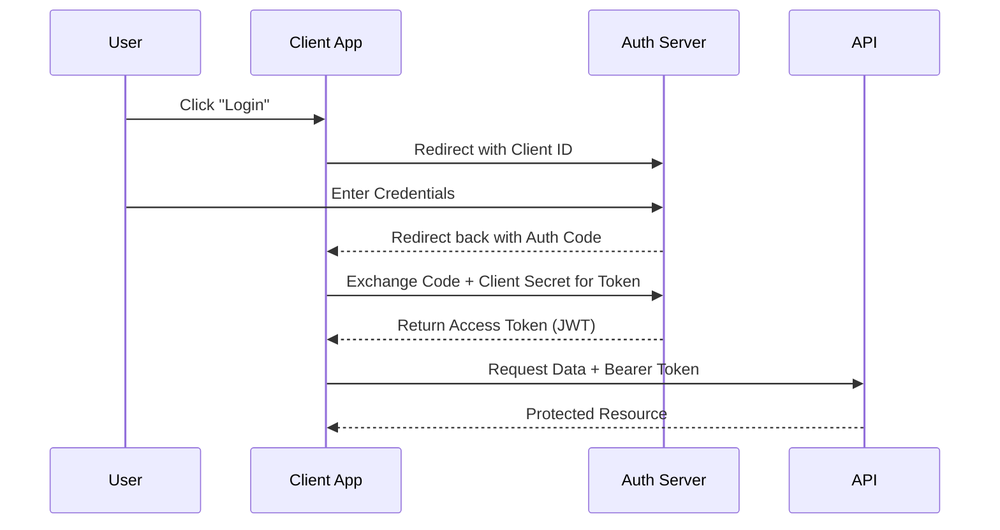

#API
---
---

# Avoid Basic Auth: Use Standard Authentication

## Summary
**HTTP Basic Auth** is an outdated authentication mechanism where credentials (`username:password`) are sent in the HTTP header, base64-encoded. Because base64 is encoding (not encryption), these credentials are essentially cleartext. If TLS fails or is stripped (Man-in-the-Middle), the credentials are compromised immediately. Furthermore, Basic Auth has no concept of session expiration or scope limits.

**Recommended Standards**:
*   **OAuth2**: Delegated authorization framework.
*   **OpenID Connect (OIDC)**: Identity layer on top of OAuth2.
*   **JWT (JSON Web Tokens)**: A compact, self-contained way to securely transmit information.

## Detailed Explanation

### OAuth2 Authorization Code Flow
OAuth2 is the industry standard for securing APIs. The "Authorization Code Flow" is the most secure method for server-side applications.



### JSON Web Tokens (JWT)
A JWT is a string comprising three parts separated by dots (`.`):
1.  **Header**: Algorithm and token type (`{"alg": "HS256", "typ": "JWT"}`).
2.  **Payload**: Claims (data) (`{"sub": "123", "name": "John Doe", "exp": 1516239022}`).
3.  **Signature**: Hash of the Header + Payload + Secret.

**Key Benefit**: The server is stateless. It doesn't need to query a database to verify the user; it only needs to verify the signature.

### Go Example: Validating a JWT Middleware
Using the standard `github.com/golang-jwt/jwt/v5` library.

```go
package main

import (
	"fmt"
	"net/http"
	"strings"

	"github.com/golang-jwt/jwt/v5"
)

var hmacSampleSecret = []byte("super_secret_signature_key")

func ValidateJWTMiddleware(next http.Handler) http.Handler {
	return http.HandlerFunc(func(w http.ResponseWriter, r *http.Request) {
		// 1. Extract Bearer Token
		authHeader := r.Header.Get("Authorization")
		if authHeader == "" {
			http.Error(w, "Missing Auth Header", http.StatusUnauthorized)
			return
		}
		tokenString := strings.TrimPrefix(authHeader, "Bearer ")

		// 2. Parse and Validate
		token, err := jwt.Parse(tokenString, func(token *jwt.Token) (interface{}, error) {
			if _, ok := token.Method.(*jwt.SigningMethodHMAC); !ok {
				return nil, fmt.Errorf("unexpected signing method: %v", token.Header["alg"])
			}
			return hmacSampleSecret, nil
		})

		if err != nil || !token.Valid {
			http.Error(w, "Invalid Token", http.StatusUnauthorized)
			return
		}

		next.ServeHTTP(w, r)
	})
}
```

## Interview Questions

1.  **Why is sending Base64 encoded passwords in Basic Auth considered insecure even over HTTPS?**
    *   *Answer:* HTTPS only protects the transmission. If the logs (server-side, proxy, or client-side history) capture the header, the credentials can be trivially decoded. Additionally, Basic Auth credentials don't expire, meaning a leak is permanent until the password is changed.

2.  **What is the difference between Authentication (AuthN) and Authorization (AuthZ)?**
    *   *Answer:* **Authentication** confirms *who* you are (e.g., logging in). **Authorization** determines *what* you can do (e.g., scopes like `read:users`). OIDC handles AuthN; OAuth2 handles AuthZ.

3.  **What happens if you change the "alg" header in a JWT to "none"?**
    *   *Answer:* This is a classic vulnerability. If the library isn't secure, it might skip signature verification, allowing an attacker to forge tokens. Modern libraries (like `golang-jwt`) require you to whitelist algorithms to prevent this.

4.  **When would you use Opaque Tokens instead of JWTs?**
    *   *Answer:* Use Opaque Tokens (random strings) when you need instant revocation (e.g., "Log out all devices"). Since JWTs are stateless, they are valid until they expire unless you implement a blacklist (which reintroduces state). Opaque tokens require a database lookup on every request but allow full control over the session lifecycle.
