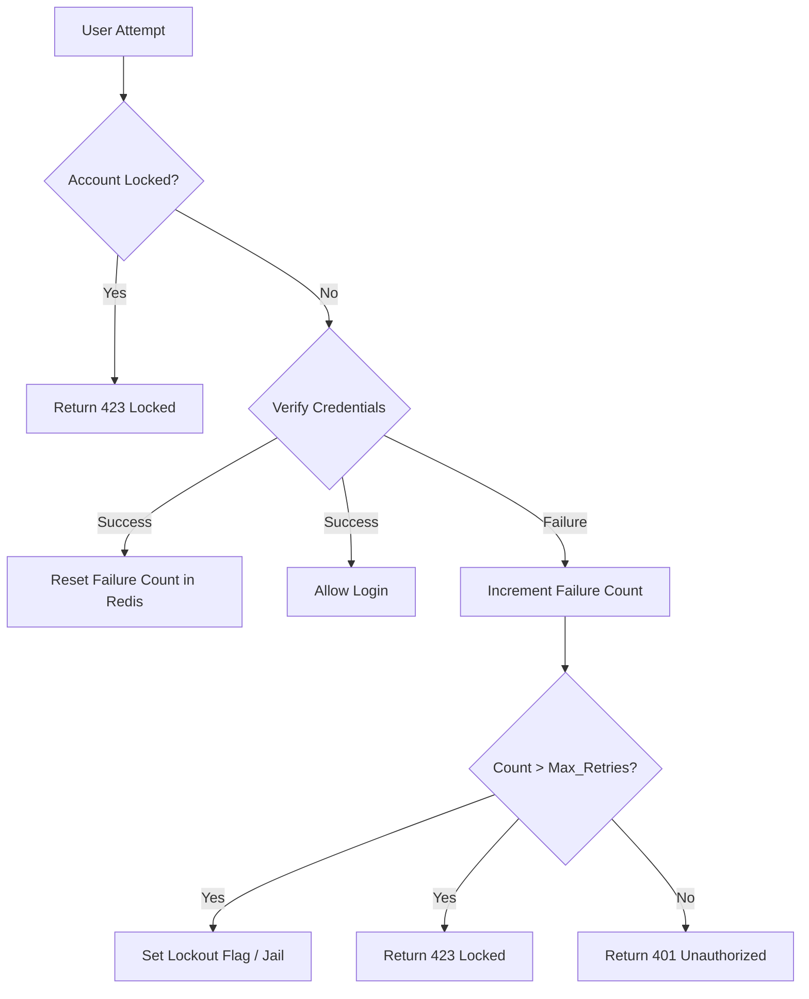

#API
---
---

# Max Retry and Jail Features

## Summary
**Max Retry** and **Jail Features** are critical defense mechanisms in API security designed to mitigate brute force attacks and credential stuffing. 
- **Max Retry**: Limits the total number of authentication or sensitive action attempts allowed within a specific time window.
- **Jail (Lockout)**: Escalates the penalty by temporarily or permanently "jailing" (blocking) an entity (IP, User ID, or API Key) after they exceed the retry threshold. 
Together, they ensure that while legitimate users can recover from accidental typos, malicious automated scripts are slowed down or stopped entirely.

## Detailed Explanation

### 1. Implementing Exponential Backoff
Instead of a static delay, exponential backoff increases the wait time between retries (e.g., 1s, 2s, 4s, 8s...). This effectively "starves" brute force bots of the high-frequency attempts they need to be successful.

### 2. Temporary Lockouts (Jails)
A "Jail" is a state where a client is completely barred from even attempting a request for a set duration.
- **Soft Lockout**: 5-15 minutes after 5 failed attempts.
- **Hard Lockout (Jail)**: 24 hours or manual admin unlock after 10-20 failed attempts.

### 3. Fail2Ban vs. Application-Level Logic
| Feature | Fail2Ban / OS Level | Application-Level (Go + Redis) |
| :--- | :--- | :--- |
| **Layer** | Network/Transport (Layer 3/4) | Application (Layer 7) |
| **Target** | IP Addresses | User IDs, Account Emails, API Keys |
| **Storage** | Log files / IP tables | Distributed Cache (Redis) |
| **Pros** | Protects system resources (CPU/RAM) | Multi-tenant aware; protects specific accounts |
| **Cons** | Aggressive; can block shared NAT IPs | Higher overhead on the application stack |

### 4. Lockout Logic (Mermaid)



### 5. Go Example: Simple Login Throttler using Redis

This example uses `github.com/redis/go-redis/v9` to track failed attempts and enforce a lockout.

```go
package security

import (
	"context"
	"fmt"
	"time"

	"github.com/redis/go-redis/v9"
)

const (
	MaxRetries     = 5
	LockoutDuration = 15 * time.Minute
	WindowDuration  = 10 * time.Minute
)

type Throttler struct {
	rdb *redis.Client
}

func (t *Throttler) HandleFailedAttempt(ctx context.Context, identifier string) (bool, error) {
	key := fmt.Sprintf("auth_fail:%s", identifier)
	lockKey := fmt.Sprintf("lockout:%s", identifier)

	// 1. Check if already jailed
	locked, _ := t.rdb.Exists(ctx, lockKey).Result()
	if locked > 0 {
		return true, nil // Already locked
	}

	// 2. Increment failure count
	pipe := t.rdb.TxPipeline()
	count := pipe.Incr(ctx, key)
	pipe.Expire(ctx, key, WindowDuration)
	_, err := pipe.Exec(ctx)
	if err != nil {
		return false, err
	}

	// 3. Check if threshold reached
	if count.Val() >= MaxRetries {
		t.rdb.Set(ctx, lockKey, "jailed", LockoutDuration)
		t.rdb.Del(ctx, key) // Clear counter once jailed
		return true, nil
	}

	return false, nil
}

func (t *Throttler) Reset(ctx context.Context, identifier string) {
	t.rdb.Del(ctx, fmt.Sprintf("auth_fail:%s", identifier))
	t.rdb.Del(ctx, fmt.Sprintf("lockout:%s", identifier))
}
```

## Interview Questions

1. **How does a "Sliding Window" algorithm differ from "Fixed Window" in rate limiting?**
   *Answer:* Fixed Window resets at specific intervals (e.g., top of the hour), allowing a burst of double the limit if requests happen at the boundary. Sliding Window tracks the exact time of each request, providing smoother enforcement.

2. **Why should you use Redis instead of in-memory maps for lockout logic in Go?**
   *Answer:* In-memory maps are local to a single instance. In a distributed microservices environment, a bot could cycle through 10 different pods to bypass the limit. Redis provides a centralized, shared state for all instances.

3. **What is "IP Whitelisting" and why is it problematic when combined with Jails?**
   *Answer:* Whitelisting bypasses security for "trusted" IPs. However, if a developer's machine is compromised, the "Jail" won't trigger. Additionally, blocking a NAT IP (like a corporate office) might "jail" hundreds of innocent users.

4. **In Go, how would you implement an exponential backoff for a client retrying an API?**
   *Answer:* Use a loop with `time.Sleep(time.Duration(math.Pow(2, float64(retryCount))) * time.Second)` and always add "jitter" (randomness) to prevent the "Thundering Herd" problem.
