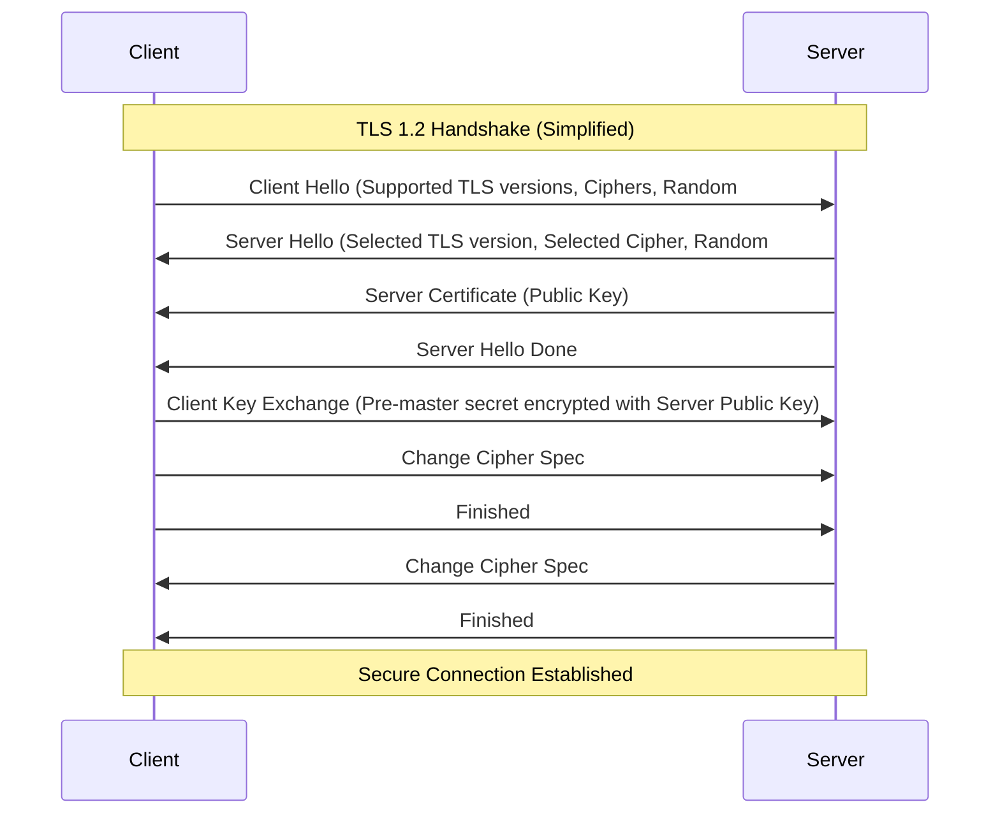

#API
---
---

# HTTPS and Secure Ciphers in Go

## Summary

Implementing HTTPS in Go involves configuring the `crypto/tls` package to ensure encrypted communication between clients and servers. Security is built upon three pillars:
1.  **TLS Versions**: Protocols that define how the handshake and encryption occur. Modern standards require **TLS 1.2** as a minimum, with **TLS 1.3** being the preferred choice due to its improved speed and security.
2.  **Cipher Suites**: Combinations of algorithms for key exchange, authentication, encryption, and message integrity. Secure configurations prioritize AEAD (Authenticated Encryption with Associated Data) ciphers like AES-GCM and ChaCha20-Poly1305.
3.  **Perfect Forward Secrecy (PFS)**: A property ensuring that if a server's private key is compromised, past session keys remain secure. This is achieved using ephemeral key exchanges (ECDHE).

## Detailed Explanation

### The TLS Handshake (Visualized)

The handshake establishes the secure tunnel before any HTTP data is sent.



### Configuring `crypto/tls` in Go

Go's `net/http` server uses the `crypto/tls` package. To secure a server, you must provide a `tls.Config`.

#### 1. Disabling Legacy Protocols
TLS 1.0 and 1.1 are deprecated and vulnerable. You should explicitly set the minimum version.

```go
tlsConfig := &tls.Config{
    MinVersion:               tls.VersionTLS12,
    CurvePreferences:         []tls.CurveID{tls.CurveP256, tls.X25519},
    PreferServerCipherSuites: true,
}
```

#### 2. Recommended Cipher Suites
For TLS 1.2, you should select ciphers that support PFS and AEAD. Note that **TLS 1.3 manages cipher suites automatically** and ignores the `CipherSuites` field in Go.

```go
tlsConfig.CipherSuites = []uint16{
    tls.TLS_ECDHE_ECDSA_WITH_AES_128_GCM_SHA256,
    tls.TLS_ECDHE_RSA_WITH_AES_128_GCM_SHA256,
    tls.TLS_ECDHE_ECDSA_WITH_AES_256_GCM_SHA384,
    tls.TLS_ECDHE_RSA_WITH_AES_256_GCM_SHA384,
    tls.TLS_ECDHE_ECDSA_WITH_CHACHA20_POLY1305,
    tls.TLS_ECDHE_RSA_WITH_CHACHA20_POLY1305,
}
```

### HTTP/2 Requirements
Go enables HTTP/2 automatically if HTTPS is used. However, HTTP/2 has a "black-list" of forbidden cipher suites. If you manually configure `CipherSuites`, ensure you include `TLS_ECDHE_RSA_WITH_AES_128_GCM_SHA256` or `TLS_ECDHE_ECDSA_WITH_AES_128_GCM_SHA256`, as they are required for the HTTP/2 handshake.

### Obtaining Certificates

#### Self-Signed (Development)
Used for local testing, but browsers will show a warning.
```bash
go run $GOROOT/src/crypto/tls/generate_cert.go --host localhost
```

#### Let's Encrypt / AutoCert (Production)
For production, the `golang.org/x/crypto/acme/autocert` package automates certificate retrieval and renewal via the ACME protocol.

```go
package main

import (
    "crypto/tls"
    "net/http"
    "golang.org/x/crypto/acme/autocert"
)

func main() {
    certManager := autocert.Manager{
        Prompt:     autocert.AcceptTOS,
        HostPolicy: autocert.HostWhitelist("example.com"),
        Cache:      autocert.DirCache("certs"),
    }

    server := &http.Server{
        Addr: ":443",
        TLSConfig: certManager.TLSConfig(),
    }

    // Serve HTTP/1.1 and HTTP/2
    server.ListenAndServeTLS("", "")
}
```

## Interview Questions

1.  **Why should you disable TLS 1.0 and 1.1 in a Go web server?**
    *   They are vulnerable to attacks like BEAST and POODLE and lack support for modern, secure cipher suites. Setting `MinVersion: tls.VersionTLS12` is a security baseline.

2.  **What is the difference between TLS 1.2 and TLS 1.3 in the context of Go's `tls.Config`?**
    *   TLS 1.3 is faster (1-RTT handshake) and more secure. In Go, you cannot manually choose cipher suites for TLS 1.3; it uses a predefined set of secure defaults. TLS 1.2 still allows manual configuration via the `CipherSuites` field.

3.  **Explain Perfect Forward Secrecy (PFS).**
    *   PFS ensures that session keys are not derived from the server's long-term private key. In Go, this is implemented using `ECDHE` (Elliptic Curve Diffie-Hellman Ephemeral) ciphers. If the server's private key is stolen later, the thief cannot decrypt recorded past traffic.

4.  **How does Go handle HTTP/2 and TLS?**
    *   Go's `net/http` package automatically upgrades connections to HTTP/2 if the server is running on HTTPS and the `TLSConfig` is compatible. HTTP/2 requires TLS 1.2 or higher and specific AEAD ciphers.

5.  **What is the role of `autocert` in a Go application?**
    *   It handles the ACME protocol to automatically request, verify, and renew TLS certificates from Let's Encrypt, removing the manual overhead of certificate management.
