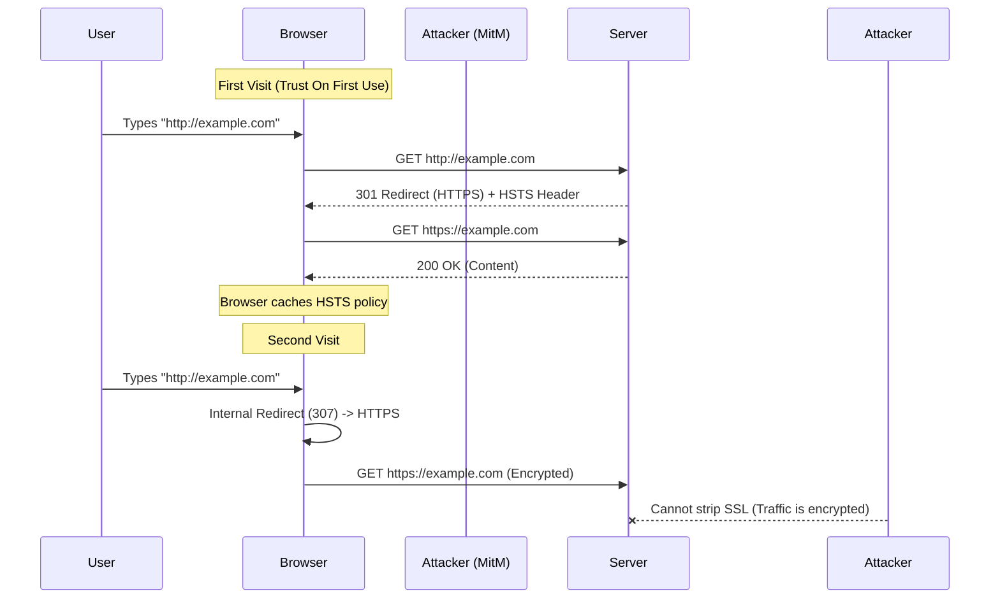

#API
---
---

# HTTP Strict Transport Security (HSTS) in Go

## Summary
**HTTP Strict Transport Security (HSTS)** is a web security policy mechanism that protects websites against protocol downgrade attacks (like SSL Stripping) and cookie hijacking. It allows a web server to declare that user agents (browsers) should only interact with it using secure HTTPS connections, and never via insecure HTTP.

Key component:
*   **`Strict-Transport-Security` Header**: The server sends this header to tell the browser "remember to use HTTPS for this domain for the next X seconds."

## Detailed Explanation

### 1. The HSTS Header Directives
A typical HSTS header looks like this:
`Strict-Transport-Security: max-age=31536000; includeSubDomains; preload`

*   **`max-age`**: (Required) The time in seconds that the browser should remember that this site is only accessible via HTTPS. Common value: 31536000 (1 year).
*   **`includeSubDomains`**: (Optional) Tells the browser that this policy applies to all subdomains (e.g., `api.example.com`, `admin.example.com`).
*   **`preload`**: (Optional) Allows the domain to be included in the browser's hardcoded "HSTS Preload List." This protects users even on their *very first* visit, before they have ever received the header.

### 2. Browser Redirection Flow
Without HSTS, a user typing `http://example.com` relies on a server-side 301 Redirect to get to HTTPS. This initial HTTP request is vulnerable to Man-in-the-Middle (MitM) attacks. With HSTS, the browser performs an **Internal Redirect**.



### 3. Go Implementation: Middleware
Injecting the header is best done via middleware so it applies to all responses.

```go
package main

import (
	"log"
	"net/http"
)

// HSTSMiddleware adds the Strict-Transport-Security header
func HSTSMiddleware(next http.Handler) http.Handler {
	return http.HandlerFunc(func(w http.ResponseWriter, r *http.Request) {
		// 1 Year = 31536000 seconds
		// includeSubDomains: Apply to subdomains
		// preload: Allow submission to browser preload list
		w.Header().Set("Strict-Transport-Security", "max-age=31536000; includeSubDomains; preload")
		
		next.ServeHTTP(w, r)
	})
}

func main() {
	mux := http.NewServeMux()
	mux.Handle("/", http.HandlerFunc(func(w http.ResponseWriter, r *http.Request) {
		w.Write([]byte("Secure Content"))
	}))

	// Wrap the mux with HSTS middleware
	// Note: HSTS is only respected by browsers if served over HTTPS
	log.Fatal(http.ListenAndServeTLS(":443", "cert.pem", "key.pem", HSTSMiddleware(mux)))
}
```

## Interview Questions

1.  **Why doesn't the HSTS header work over HTTP?**
    *   *Answer:* The specification (RFC 6797) explicitly states that browsers must ignore HSTS headers received over insecure HTTP. This prevents an attacker from injecting a malicious HSTS header (e.g., setting `max-age=0` to disable it) into unencrypted traffic.

2.  **What is the risk of enabling `includeSubDomains` immediately?**
    *   *Answer:* If you have legacy internal subdomains (e.g., `intranet.example.com`) that still use HTTP, enabling `includeSubDomains` on the root domain (`example.com`) will break access to them. You must audit all subdomains to ensure they support HTTPS first.

3.  **How does "HSTS Preloading" protect the very first connection?**
    *   *Answer:* Normal HSTS is "Trust On First Use" (TOFU)—the user is vulnerable during the very first HTTP request before they receive the header. "Preloading" involves submitting your domain to a list maintained by browser vendors (Chrome, Firefox, etc.) which is hardcoded into the browser binary. This ensures the browser *knows* to enforce HTTPS before ever connecting to the site.

4.  **How do you disable HSTS if you accidentally break your site?**
    *   *Answer:* You must serve the header with `max-age=0` over HTTPS. The browser will update its cache and remove the policy. However, if your domain is "Preloaded," this process is extremely difficult and can take months to propagate via browser updates.

5.  **Can HSTS prevent all MitM attacks?**
    *   *Answer:* It prevents "SSL Stripping" attacks where the attacker downgrades the connection to HTTP. However, it does not prevent attacks where the attacker has a valid (but fraudulent) certificate for your domain trusted by the user's browser.
