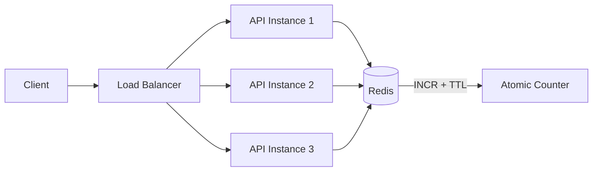

#API
---
---

# Limit Requests (Throttling)

## Summary
Rate Limiting (Throttling) is a critical API security control that restricts the number of requests a client can make within a given time window. It protects against **Denial of Service (DoS)**, **brute-force attacks**, and **resource exhaustion** (OWASP API4:2023 – Unrestricted Resource Consumption).

*   **Rate Limiting**: Rejecting requests that exceed a defined threshold (e.g., 100 req/min).
*   **Throttling**: Slowing down (delaying) requests instead of outright rejection.
*   **Quota Management**: Limiting total usage over longer periods (e.g., 10,000 API calls/month).

---

## Detailed Explanation

### 1. Common Algorithms

| Algorithm | Description | Best For |
| :--- | :--- | :--- |
| **Token Bucket** | Tokens are added at a fixed rate. Each request consumes a token. Allows bursts up to bucket capacity. | APIs needing burst tolerance |
| **Leaky Bucket** | Requests "leak" out at a constant rate. Excess requests queue or drop. | Smoothing traffic spikes |
| **Fixed Window** | Counts requests in fixed time slots (e.g., per minute). Resets at boundaries. | Simple implementations |
| **Sliding Window** | Combines current and previous window counts weighted by time. No "reset spike". | Distributed systems |

### 2. Token Bucket Implementation in Go

Go's standard library extension `golang.org/x/time/rate` provides a production-ready Token Bucket implementation.

```go
package main

import (
	"net/http"
	"sync"

	"golang.org/x/time/rate"
)

// Per-client rate limiter storage
var (
	clients = make(map[string]*rate.Limiter)
	mu      sync.RWMutex
)

// getClientLimiter returns or creates a limiter for a given client IP
func getClientLimiter(ip string) *rate.Limiter {
	mu.Lock()
	defer mu.Unlock()

	if limiter, exists := clients[ip]; exists {
		return limiter
	}

	// 10 requests per second, burst of 30
	limiter := rate.NewLimiter(rate.Limit(10), 30)
	clients[ip] = limiter
	return limiter
}

// RateLimitMiddleware enforces per-client rate limits
func RateLimitMiddleware(next http.Handler) http.Handler {
	return http.HandlerFunc(func(w http.ResponseWriter, r *http.Request) {
		ip := r.RemoteAddr // In production, parse X-Forwarded-For

		limiter := getClientLimiter(ip)
		if !limiter.Allow() {
			w.Header().Set("Retry-After", "1")
			w.Header().Set("X-RateLimit-Limit", "10")
			w.Header().Set("X-RateLimit-Remaining", "0")
			http.Error(w, "Too Many Requests", http.StatusTooManyRequests)
			return
		}

		next.ServeHTTP(w, r)
	})
}

func main() {
	mux := http.NewServeMux()
	mux.HandleFunc("/api/data", func(w http.ResponseWriter, r *http.Request) {
		w.Write([]byte(`{"status": "ok"}`))
	})

	http.ListenAndServe(":8080", RateLimitMiddleware(mux))
}
```

### 3. HTTP Response Headers

Modern APIs use standardized headers to communicate rate limit status to clients:

| Header | Description |
| :--- | :--- |
| `429 Too Many Requests` | HTTP status code for rate limit violations |
| `Retry-After` | Seconds until the client can retry |
| `X-RateLimit-Limit` | Maximum requests allowed in the window |
| `X-RateLimit-Remaining` | Requests remaining in current window |
| `X-RateLimit-Reset` | Unix timestamp when the window resets |

### 4. Distributed Rate Limiting

For microservices, use a centralized store like Redis with a Sliding Window Counter:



### 5. Best Practices

*   **Tiered Limits**: Different limits for anonymous, authenticated, and premium users.
*   **Endpoint-Specific**: Stricter limits on `/login`, `/search`, `/upload` vs. `/health`.
*   **Graceful Degradation**: Consider throttling (slowing) instead of hard blocking.
*   **Jitter on Reset**: Add randomness to prevent "thundering herd" when limits reset.

---

## Interview Questions

### 1. What is the difference between a Token Bucket and a Leaky Bucket?
**Token Bucket** allows bursts: tokens accumulate up to a maximum, and requests consume tokens. If the bucket is full, the client can make rapid requests.
**Leaky Bucket** enforces a constant output rate: requests queue up and "leak" out at a fixed rate, smoothing traffic but not allowing bursts.

### 2. How would you implement rate limiting in a distributed microservices environment?
Use a **centralized store** like Redis with atomic operations (`INCR`, `EXPIRE`). Implement a Sliding Window Counter to avoid the "reset spike" of Fixed Windows. Consider using a service mesh sidecar (Envoy/Istio) for consistent enforcement across services.

### 3. What is the "Thundering Herd" problem in rate limiting?
When many clients hit their limit simultaneously and all retry at the exact moment the window resets, causing a traffic spike. **Solution**: Add jitter (random delay) to `Retry-After` values.

### 4. How do you handle race conditions in a Redis-based rate limiter?
Use **Lua scripts** or Redis transactions (`WATCH/MULTI`) to ensure `INCR` and `EXPIRE` happen atomically. Example: `EVAL "local c = redis.call('INCR', KEYS[1]); if c == 1 then redis.call('EXPIRE', KEYS[1], ARGV[1]) end; return c"`.

### 5. What status code and headers should you return when rate limiting?
Return **429 Too Many Requests** with:
- `Retry-After`: Seconds to wait
- `X-RateLimit-Limit`: The limit
- `X-RateLimit-Remaining`: 0
- `X-RateLimit-Reset`: When the limit resets (Unix timestamp)
