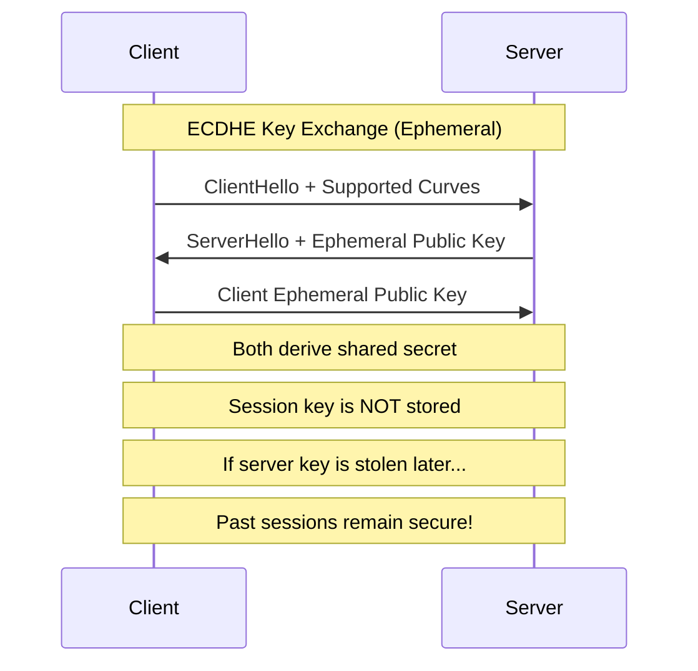

#API
---
---

# HTTPS and Secure Ciphers

## Summary
HTTPS (HTTP over TLS) encrypts data in transit between clients and servers, preventing eavesdropping and man-in-the-middle attacks. The security of HTTPS depends critically on the **TLS version** and **cipher suites** configured on the server.

*   **TLS 1.3** (2018): The modern standard with mandatory Forward Secrecy and simplified cipher selection.
*   **TLS 1.2** (2008): Still acceptable but requires careful cipher configuration.
*   **TLS 1.0/1.1**: **Deprecated** - Must be disabled (PCI-DSS requirement since 2018).

---

## Detailed Explanation

### 1. TLS 1.2 vs TLS 1.3 Comparison

| Feature | TLS 1.2 | TLS 1.3 |
| :--- | :--- | :--- |
| **Handshake** | 2 Round Trips (2-RTT) | 1 Round Trip (1-RTT) |
| **Certificate Privacy** | Sent in cleartext | Encrypted during handshake |
| **Cipher Suites** | ~37 variants (many insecure) | 5 secure suites only |
| **Forward Secrecy** | Optional (ECDHE) | **Mandatory** |
| **Static RSA Key Exchange** | Allowed (vulnerable) | **Removed** |

### 2. Secure Cipher Suites

#### Recommended Ciphers (TLS 1.2)
Focus on **AEAD** (Authenticated Encryption with Associated Data) suites:
- `TLS_ECDHE_ECDSA_WITH_AES_128_GCM_SHA256`
- `TLS_ECDHE_RSA_WITH_AES_256_GCM_SHA384`
- `TLS_ECDHE_RSA_WITH_CHACHA20_POLY1305_SHA256`

#### Deprecated Ciphers (MUST Avoid)
| Cipher | Vulnerability |
| :--- | :--- |
| RC4 | Broken (Bar Mitzvah attack) |
| DES/3DES | Sweet32 attack (64-bit block) |
| CBC Mode | Padding oracle attacks (POODLE, Lucky13) |
| MD5/SHA-1 | Collision vulnerabilities |

### 3. Go TLS Configuration

Go's `crypto/tls` package provides secure defaults. Since Go 1.17, cipher suites are automatically ordered based on hardware capabilities.

```go
package main

import (
	"crypto/tls"
	"net/http"
	"time"
)

func main() {
	// Hardened TLS Configuration
	tlsConfig := &tls.Config{
		// Minimum TLS 1.2 (or VersionTLS13 for high-security APIs)
		MinVersion: tls.VersionTLS12,

		// Prefer modern elliptic curves
		CurvePreferences: []tls.CurveID{
			tls.X25519,    // Fastest, most secure
			tls.CurveP256, // NIST standard
		},

		// Server chooses the cipher (prevents downgrade attacks)
		PreferServerCipherSuites: true,

		// Restrict to AEAD ciphers for TLS 1.2
		CipherSuites: []uint16{
			tls.TLS_ECDHE_ECDSA_WITH_AES_128_GCM_SHA256,
			tls.TLS_ECDHE_RSA_WITH_AES_256_GCM_SHA384,
			tls.TLS_ECDHE_RSA_WITH_CHACHA20_POLY1305_SHA256,
		},
	}

	server := &http.Server{
		Addr:         ":443",
		TLSConfig:    tlsConfig,
		ReadTimeout:  5 * time.Second,
		WriteTimeout: 10 * time.Second,
		IdleTimeout:  120 * time.Second,
	}

	// Requires valid certificate files
	err := server.ListenAndServeTLS("server.crt", "server.key")
	if err != nil {
		panic(err)
	}
}
```

### 4. Forward Secrecy

Forward Secrecy (also called Perfect Forward Secrecy, PFS) ensures that if a server's private key is compromised in the future, past encrypted sessions cannot be decrypted.



### 5. Common Misconfigurations

| Misconfiguration | Risk | Fix |
| :--- | :--- | :--- |
| `InsecureSkipVerify: true` | MITM attacks | Never use in production |
| No `MinVersion` set | Downgrade to TLS 1.0 | Set `MinVersion: tls.VersionTLS12` |
| Static RSA ciphers | No Forward Secrecy | Use only ECDHE suites |
| Self-signed certs in prod | Trust warnings, phishing | Use Let's Encrypt or CA-signed |

---

## Interview Questions

### 1. Why does TLS 1.3 remove the need for `PreferServerCipherSuites`?
In TLS 1.3, all available cipher suites are equally secure (only 5 AEAD suites exist). The server automatically selects based on client preferences, eliminating the need for manual prioritization used in TLS 1.2 to avoid weak ciphers.

### 2. What is "Forward Secrecy" and how does Go ensure it?
Forward Secrecy ensures past sessions cannot be decrypted even if the server's private key is later compromised. Go achieves this by prioritizing **ECDHE** (Ephemeral Diffie-Hellman) cipher suites, which generate unique session keys that are never stored.

### 3. What is the security risk of `InsecureSkipVerify: true`?
It disables certificate validation, allowing any server (including an attacker's) to present any certificate. This enables **Man-in-the-Middle (MITM) attacks** where the attacker can intercept and modify all traffic.

### 4. Why should you set server timeouts when using TLS?
Without timeouts, attackers can exhaust server resources via **Slowloris attacks** (keeping connections open indefinitely). Setting `ReadTimeout`, `WriteTimeout`, and `IdleTimeout` limits resource consumption per connection.

### 5. How would you test if your server has weak ciphers enabled?
Use tools like:
- `nmap --script ssl-enum-ciphers -p 443 example.com`
- `testssl.sh https://example.com`
- Qualys SSL Labs: `ssllabs.com/ssltest`
