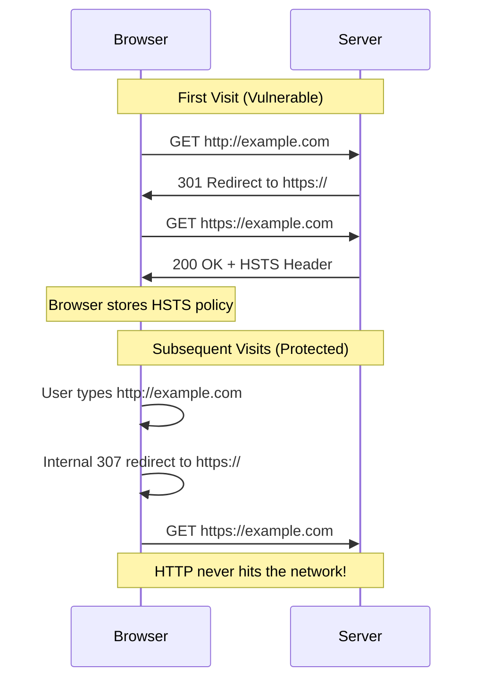

#API
---
---

# HSTS Header with SSL

## Summary
**HTTP Strict Transport Security (HSTS)** is a security policy mechanism that forces browsers to only communicate with a server over HTTPS. Once a browser receives the HSTS header, it automatically upgrades all HTTP requests to HTTPS for that domain, protecting against **protocol downgrade attacks** and **cookie hijacking**.

*   **`max-age`**: How long (seconds) the browser remembers to use HTTPS only.
*   **`includeSubDomains`**: Applies the policy to all subdomains.
*   **`preload`**: Requests inclusion in browser-hardcoded HSTS lists.

---

## Detailed Explanation

### 1. How HSTS Works



### 2. HSTS Directives

| Directive | Description | Recommended Value |
| :--- | :--- | :--- |
| `max-age` | Duration in seconds to remember HSTS | `31536000` (1 year) |
| `includeSubDomains` | Apply to all subdomains | Required for preload |
| `preload` | Request browser preload list inclusion | Optional but recommended |

**Example Header:**
```
Strict-Transport-Security: max-age=31536000; includeSubDomains; preload
```

### 3. HSTS Preload List

The preload list is **hardcoded into browsers** (Chrome, Firefox, Safari, Edge), protecting users from the very first connection (which HSTS alone cannot protect).

**Requirements for Preload Submission:**
1. Serve a valid TLS certificate
2. Redirect HTTP to HTTPS on the same host
3. Serve all subdomains over HTTPS
4. HSTS header with:
   - `max-age` >= 31536000 (1 year)
   - `includeSubDomains` directive
   - `preload` directive

**Submit at:** https://hstspreload.org

### 4. Go Implementation

```go
package main

import (
	"fmt"
	"net/http"
)

// HSTSConfig holds HSTS header configuration
type HSTSConfig struct {
	MaxAge            int
	IncludeSubDomains bool
	Preload           bool
}

// HSTSMiddleware adds Strict-Transport-Security header
func HSTSMiddleware(config HSTSConfig, next http.Handler) http.Handler {
	// Build header value once
	headerValue := fmt.Sprintf("max-age=%d", config.MaxAge)
	if config.IncludeSubDomains {
		headerValue += "; includeSubDomains"
	}
	if config.Preload {
		headerValue += "; preload"
	}

	return http.HandlerFunc(func(w http.ResponseWriter, r *http.Request) {
		// CRITICAL: Only send HSTS over HTTPS
		// Check TLS connection or proxy header
		if r.TLS != nil || r.Header.Get("X-Forwarded-Proto") == "https" {
			w.Header().Set("Strict-Transport-Security", headerValue)
		}
		next.ServeHTTP(w, r)
	})
}

func main() {
	mux := http.NewServeMux()
	mux.HandleFunc("/", func(w http.ResponseWriter, r *http.Request) {
		w.Write([]byte("Secure API"))
	})

	config := HSTSConfig{
		MaxAge:            31536000, // 1 year
		IncludeSubDomains: true,
		Preload:           true,
	}

	handler := HSTSMiddleware(config, mux)

	// In production: use ListenAndServeTLS
	fmt.Println("Server starting on :443...")
	http.ListenAndServeTLS(":443", "server.crt", "server.key", handler)
}
```

### 5. HSTS Risks and Considerations

| Scenario | Risk | Mitigation |
| :--- | :--- | :--- |
| Subdomain without HTTPS | `includeSubDomains` breaks access | Ensure ALL subdomains support HTTPS |
| Expired certificate | Browser shows hard error (no bypass) | Monitor cert expiration religiously |
| Wrong `max-age` too long | Can't easily undo if issues arise | Start with short `max-age`, increase gradually |
| Preload removal | Takes months to propagate | Only preload when 100% committed |

### 6. Disabling HSTS

To disable HSTS (not recommended), send:
```
Strict-Transport-Security: max-age=0
```

**Note:** If the domain is on the preload list, you must also submit a removal request at hstspreload.org, which can take months to propagate.

---

## Interview Questions

### 1. What is the "Trust on First Use" (TOFU) problem in HSTS?
HSTS only protects **after** the browser receives the header for the first time. The very first connection is vulnerable to downgrade attacks. This is why the **HSTS Preload List** exists—domains on the list are hardcoded into browsers, protecting even the first visit.

### 2. Why should you NOT send HSTS headers over HTTP?
RFC 6797 mandates that browsers **ignore** HSTS headers received over insecure connections. If browsers accepted HSTS over HTTP, an attacker could inject a fake header with `max-age=0` to disable security for a target domain.

### 3. What happens if the SSL certificate expires on an HSTS-enabled site?
Browsers display a **hard error** with no option to proceed. Unlike normal certificate warnings where users can click "Advanced" → "Proceed anyway", HSTS **forbids** this bypass. The site becomes completely inaccessible until the certificate is renewed.

### 4. What is the risk of using `includeSubDomains`?
If **any** subdomain (e.g., `internal.example.com`, `dev.example.com`) does not support HTTPS, it becomes inaccessible to users once the browser receives the HSTS header from the main domain. Audit all subdomains before enabling.

### 5. How long should you set `max-age` when first deploying HSTS?
Start with a **short duration** (e.g., 300 seconds / 5 minutes) to test. Gradually increase to 1 week, 1 month, then 1 year (`31536000`). This allows quick recovery if issues arise. Only submit for preload when fully committed.
