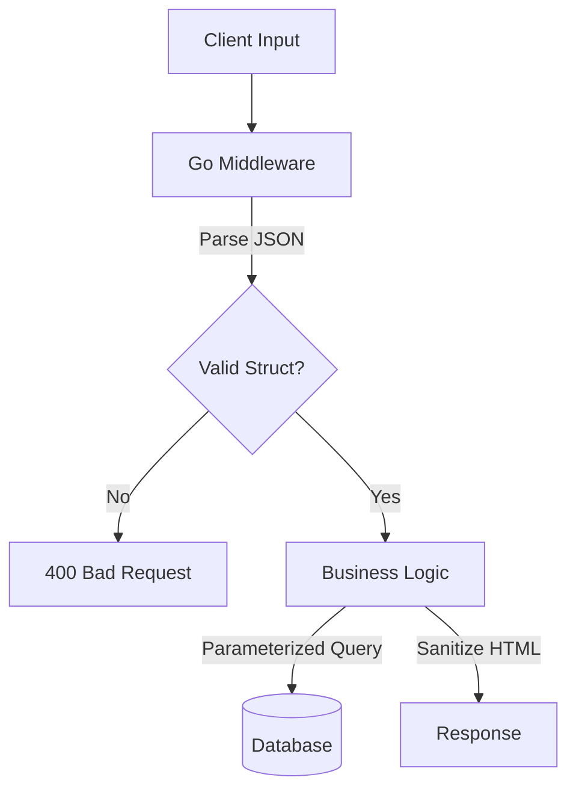

#API
---
---

# Validate User Input

## Summary
Input Validation is the first line of defense against injection attacks. It ensures that incoming data conforms to expected formats (length, type, pattern) **before** it is processed by business logic.

*   **Validation**: Checking *syntax* and *semantics* (e.g., "Is this an email?").
*   **Sanitization**: Cleaning data to make it safe (e.g., removing `<script>` tags). However, validation is generally preferred over sanitization because modifying input can lead to data integrity issues.

**Primary Threats Mitigated:**
*   **SQL Injection (SQLi)**: Malicious SQL fragments.
*   **Cross-Site Scripting (XSS)**: Malicious scripts embedded in input.
*   **Buffer Overflow**: Input exceeding expected length.

---

## Detailed Explanation

### 1. Structured Validation with `go-playground/validator`
In Go, the standard for struct validation is the `validator` package. It uses struct tags to enforce rules declaratively.

```go
import "github.com/go-playground/validator/v10"

type UserRequest struct {
    Username string `json:"username" validate:"required,alphanum,min=3,max=20"`
    Email    string `json:"email"    validate:"required,email"`
    Age      int    `json:"age"      validate:"gte=18,lte=120"`
}

func validateUser(u *UserRequest) error {
    validate := validator.New()
    return validate.Struct(u)
}
```

### 2. Preventing SQL Injection
Never perform "sanitization" (escaping) manually for SQL. Use **Parameterized Queries** provided by `database/sql`. This treats input strictly as data, not executable code.

*   **Bad**: `db.Query("SELECT * FROM users WHERE name = '" + name + "'")`
*   **Good**: `db.Query("SELECT * FROM users WHERE name = ?", name)`

### 3. Preventing XSS with `bluemonday`
If you must accept HTML input (e.g., for a blog post), validate it against a whitelist of safe tags using a policy engine like `bluemonday`.

```go
import "github.com/microcosm-cc/bluemonday"

func sanitizeHTML(input string) string {
    p := bluemonday.UGCPolicy() // Policy: Allow safe tags (b, i, p), strip scripts
    return p.Sanitize(input)
}
```

### Validation Flow (Mermaid)



---

## Interview Questions

### 1. What is the difference between Validation and Sanitization?
*   **Validation** accepts or rejects input based on rules (e.g., "Must be an integer"). It preserves data integrity.
*   **Sanitization** modifies input to remove dangerous characters (e.g., removing quotes). It should be used sparingly as it changes the user's intent and can lead to double-encoding issues.

### 2. Why are Parameterized Queries effective against SQL Injection?
They separate the SQL code (the query structure) from the data (the user input). The database driver sends the SQL template first, and then the user data is sent separately. The database treats the data purely as a literal value, making it impossible for input like `' OR 1=1; --` to alter the query logic.

### 3. Should you validate input on the Client or the Server?
**Both, but Server validation is mandatory.** Client-side validation improves UX (immediate feedback) but provides zero security, as it can be bypassed by tools like `curl` or Postman. Server-side validation is the true security gate.

### 4. How do you validate a UUID in Go?
You can use a regex pattern or a dedicated library like `google/uuid`.
Regex: `^[0-9a-fA-F]{8}-[0-9a-fA-F]{4}-[0-9a-fA-F]{4}-[0-9a-fA-F]{4}-[0-9a-fA-F]{12}$`.
Using `validator` tag: `validate:"uuid4"`.

### 5. What is "Allowlisting" (Whitelisting) vs "Blocklisting" (Blacklisting)?
*   **Allowlisting**: Only accepting known good input (e.g., "Only allow a-z, 0-9"). This is the secure approach.
*   **Blocklisting**: Rejecting known bad input (e.g., "Reject <script>"). This is insecure because attackers will always find bypasses you didn't anticipate (e.g., `<scr<script>ipt>`).
