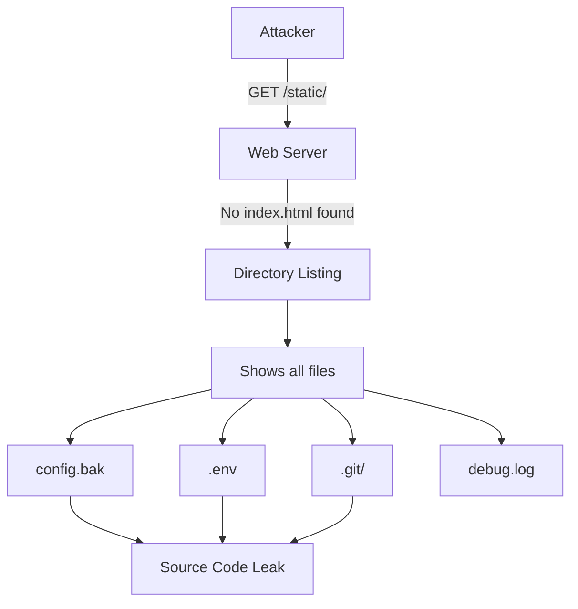

#API
---
---

# Turn Off Directory Listings

## Summary
**Directory Listings** is a web server feature that displays a list of files and subdirectories when a directory is accessed without a default index file (e.g., `index.html`). While useful for development, it is a critical **information disclosure vulnerability** (CWE-548) in production environments.

Exposing directory listings allows attackers to:
*   Discover backup files (`config.php.bak`, `database.sql.gz`)
*   Find sensitive configurations (`.env`, `credentials.json`)
*   Locate source code artifacts (`.git/`, `*.swp` files)
*   Map application structure for further attacks

---

## Detailed Explanation

### 1. The Security Risk



### 2. Go's Default Behavior

Go's `http.FileServer` **automatically generates directory listings** when no index file exists. This is insecure by default.

```go
// INSECURE: Shows directory listings
http.Handle("/static/", http.StripPrefix("/static/", http.FileServer(http.Dir("./static"))))
```

### 3. The "Neutered FileSystem" Pattern

The industry-standard solution in Go is to wrap `http.FileSystem` with a custom implementation that blocks directory access.

```go
package main

import (
	"net/http"
	"os"
	"path/filepath"
)

// NeuteredFileSystem prevents directory listings by returning 404
// when accessing directories without an index.html file.
type NeuteredFileSystem struct {
	fs http.FileSystem
}

func (nfs NeuteredFileSystem) Open(path string) (http.File, error) {
	f, err := nfs.fs.Open(path)
	if err != nil {
		return nil, err
	}

	// Check if the path is a directory
	stat, err := f.Stat()
	if err != nil {
		f.Close()
		return nil, err
	}

	if stat.IsDir() {
		// Check if index.html exists in this directory
		indexPath := filepath.Join(path, "index.html")
		if _, err := nfs.fs.Open(indexPath); err != nil {
			f.Close()
			return nil, os.ErrNotExist // Returns 404 Not Found
		}
	}

	return f, nil
}

func main() {
	mux := http.NewServeMux()

	// Wrap http.Dir with NeuteredFileSystem
	staticFS := NeuteredFileSystem{fs: http.Dir("./static")}
	fileServer := http.FileServer(staticFS)

	mux.Handle("/static/", http.StripPrefix("/static/", fileServer))
	
	http.ListenAndServe(":8080", mux)
}
```

### 4. Alternative: Custom Handler with Explicit File Check

For more control, use a custom handler that explicitly validates file access:

```go
func SecureFileHandler(staticDir string) http.HandlerFunc {
	return func(w http.ResponseWriter, r *http.Request) {
		// Clean the path to prevent directory traversal
		cleanPath := filepath.Clean(r.URL.Path)
		fullPath := filepath.Join(staticDir, cleanPath)

		// Check if file exists and is not a directory
		info, err := os.Stat(fullPath)
		if err != nil || info.IsDir() {
			http.NotFound(w, r)
			return
		}

		http.ServeFile(w, r, fullPath)
	}
}
```

### 5. Server Configuration References

#### Nginx
```nginx
server {
    location /static/ {
        autoindex off;  # Explicitly disable directory listing
    }
}
```

#### Apache (.htaccess)
```apache
# Disable directory browsing
Options -Indexes
```

### 6. Defense in Depth

Disabling directory listings is **not sufficient** on its own:

| Layer | Action |
| :--- | :--- |
| **Server Config** | Disable `autoindex` (Nginx) or `Options -Indexes` (Apache) |
| **Application Code** | Use NeuteredFileSystem pattern in Go |
| **File Permissions** | Remove read permissions on sensitive files |
| **File Placement** | Keep `.env`, backups, and configs **outside** web root |
| **gitignore** | Never commit sensitive files to repository |

---

## Interview Questions

### 1. What is a "Neutered FileSystem" in Go and why would you use it?
A NeuteredFileSystem is a custom implementation of `http.FileSystem` that wraps another filesystem. When a directory is requested, it checks if an `index.html` exists. If not, it returns `os.ErrNotExist` (which translates to a 404 response), preventing `http.FileServer` from generating a directory listing.

### 2. Why is disabling directory listings NOT a "silver bullet" for file security?
It's **security through obscurity**. Even with listings disabled, if an attacker knows or guesses a filename (e.g., `config.json`, `backup.sql`), they can still download it directly. Proper file permissions and keeping sensitive files outside the web root are the primary defenses.

### 3. How does directory listing facilitate the "reconnaissance" phase of an attack?
It allows attackers to discover unlinked resources, backup files (`.bak`, `.old`), configuration files, and internal structure. This information helps identify software versions and libraries, which can be cross-referenced with known CVEs to find exploitable vulnerabilities.

### 4. In a Go application behind Nginx, where should you disable directory listings?
**Both places** (Defense in Depth):
1. **Nginx**: `autoindex off;` in the location block
2. **Go**: Use NeuteredFileSystem pattern for any `http.FileServer` usage

This ensures protection even if one layer is misconfigured.

### 5. What CWE classification covers directory listing vulnerabilities?
**CWE-548: Exposure of Information Through Directory Listing**. It's classified as a Medium to High risk depending on the content exposed, and fails PCI-DSS and SOC2 compliance requirements.
