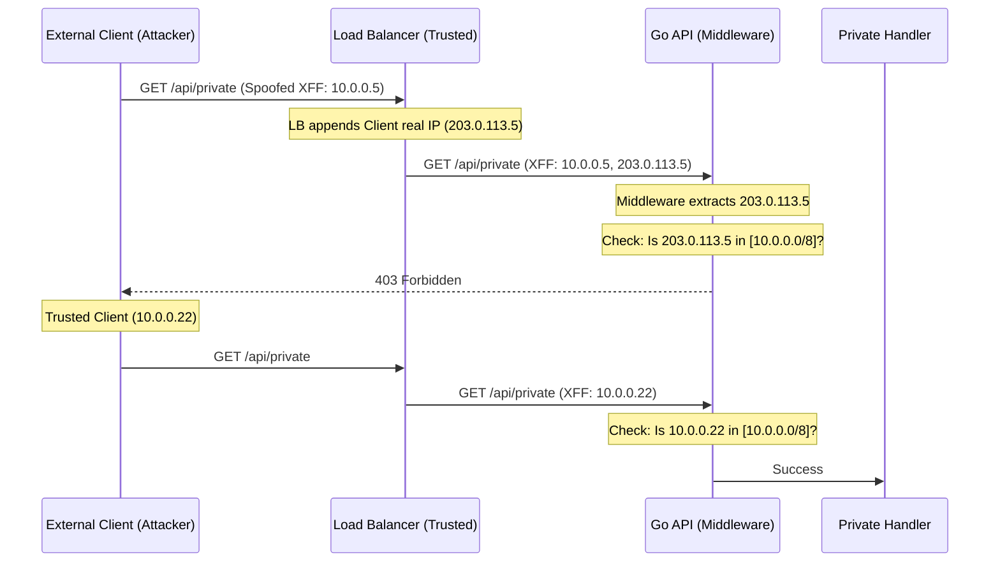

#API
---
---

# Safe Listed IPs (IP Whitelisting)

## Summary
**Safe Listed IPs** (also known as IP Whitelisting) is a network-based access control mechanism that restricts API access to a predefined set of trusted source IP addresses or CIDR ranges. In the context of private APIs, it acts as a secondary layer of defense (Defense in Depth) to ensure that even with valid credentials, requests are rejected if they originate from outside a trusted network (e.g., a corporate VPN, specific microservices, or partner infrastructure).

## Detailed Explanation

### 1. Middleware Approach in Go
In Go, IP whitelisting is best implemented as a **Middleware**. This allows the logic to be decoupled from business handlers and applied globally or to specific routes.

```go
func IPWhitelistMiddleware(allowedRanges []*net.IPNet) func(http.Handler) http.Handler {
    return func(next http.Handler) http.Handler {
        return http.HandlerFunc(func(w http.ResponseWriter, r *http.Request) {
            clientIP := getClientIP(r)
            
            isAllowed := false
            for _, ipNet := range allowedRanges {
                if ipNet.Contains(clientIP) {
                    isAllowed = true
                    break
                }
            }

            if !isAllowed {
                http.Error(w, "Forbidden: IP not whitelisted", http.StatusForbidden)
                return
            }
            next.ServeHTTP(w, r)
        })
    }
}
```

### 2. Handling `X-Forwarded-For` behind Proxies
When a Go application is behind a Load Balancer (LB) or Reverse Proxy (Nginx, Cloudflare), `r.RemoteAddr` will contain the IP of the **proxy**, not the client. To get the actual client IP, we must parse the `X-Forwarded-For` (XFF) header.

- **Structure**: `X-Forwarded-For: client, proxy1, proxy2`
- **Standard Practice**: The header is a comma-separated list. The leftmost IP is the original client, and each subsequent proxy appends the IP it received the request from.

### 3. CIDR Parsing and Matching
Go's `net` package provides the tools for handling network ranges:
- `net.ParseCIDR(s string)`: Parses a string like `"192.168.1.0/24"` into an `IP` and an `*IPNet`.
- `(*IPNet).Contains(ip IP)`: Checks if a specific IP falls within that range.

### 4. Security Risks: IP Spoofing
**The Danger of the Leftmost IP**: An attacker can manually add an `X-Forwarded-For` header to their request:
`X-Forwarded-For: 1.2.3.4 (Spoofed)`
When it hits your proxy, the proxy appends the attacker's real IP:
`X-Forwarded-For: 1.2.3.4, 203.0.113.5 (Real Attacker IP)`

**Mitigation Strategies**:
1. **Trust Only Your Proxy**: Configure your proxy to overwrite the XFF header or use a "Trusted Proxies" list in your Go app.
2. **Rightmost IP Parsing**: If you know you have exactly $N$ proxies, count $N$ positions from the right.
3. **Internal Network Only**: For strictly private APIs, ensure the LB itself drops any incoming XFF headers from the public internet.

### Flow Diagram (Mermaid)



## Interview Questions

1. **How do you retrieve the real client IP in Go if the app is behind Nginx?**
   - Answer: You should check the `X-Forwarded-For` or `X-Real-IP` headers. However, you must only trust these headers if they come from a known, trusted proxy to prevent spoofing.

2. **Why is `net.ParseIP` followed by a string comparison inefficient for whitelisting?**
   - Answer: `net.ParseIP` only handles single addresses. For ranges, you need CIDR logic (`*net.IPNet`). String comparison fails to account for different representations (e.g., IPv4-mapped IPv6) and doesn't handle masks.

3. **What is "IP Spoofing" in the context of HTTP headers, and how do you prevent it?**
   - Answer: It's when a client provides a fake `X-Forwarded-For` header. Prevention involves configuring the edge proxy to strip/reset the header or having the application logic only parse the IP appended by the trusted edge load balancer (usually the last or second-to-last entry).

4. **How would you implement a dynamic IP whitelist that doesn't require a service restart?**
   - Answer: Store the CIDR ranges in a thread-safe atomic value (`atomic.Value`) or a synchronized map. Use a background goroutine or a webhook to refresh the list from a database or configuration provider (like Etcd or Consul) and update the atomic pointer.