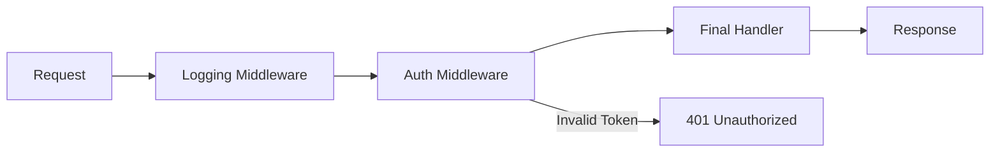

# API Security: Protected Endpoints (Authentication)

---
---

## Summary
Protected endpoints are API resources that require a verified identity (Authentication) and appropriate permissions (Authorization) before processing a request. Implementing robust protection ensures that sensitive data and operations are only accessible to legitimate users, following the "Zero Trust" model where every request is validated regardless of its origin.

## Detailed Explanation

### Authentication vs. Authorization
In the context of API security, these two concepts are often confused but serve distinct purposes:

1.  **Authentication (AuthN)**: The process of verifying **who** the caller is. It validates credentials (API keys, JWTs, sessions).
    *   **HTTP 401 Unauthorized**: Returned when the request lacks valid authentication credentials.
2.  **Authorization (AuthZ)**: The process of verifying **what** the authenticated caller is allowed to do. It checks roles or permissions (RBAC/ABAC).
    *   **HTTP 403 Forbidden**: Returned when the user is known but does not have permission to access the specific resource.

### Zero Trust Strategy
Zero Trust is a security framework that requires all users, whether in or outside the organization's network, to be authenticated, authorized, and continuously validated for security configuration and posture before being granted or keeping access to applications and data.

*   **Never Trust, Always Verify**: Don't assume requests from "internal" services or specific IP ranges are safe.
*   **Least Privilege**: Grant only the minimum permissions required to perform a task.
*   **Assume Breach**: Design systems assuming that parts of the environment may already be compromised.

### Middleware Pattern for Protecting Routes
Middleware is a software pattern where functions are chained together to process an HTTP request before it reaches the final handler. In Go, this is typically implemented by wrapping an `http.Handler` with another.



## Go Application

In Go, authentication is best implemented as a middleware that checks for headers (like `Authorization: Bearer <token>`) and injects user information into the request context.

### Example: Protecting an Endpoint with Middleware

```go
package main

import (
	"context"
	"fmt"
	"net/http"
)

// UserKey is a custom type for context keys to avoid collisions
type UserKey string

const UserIDKey UserKey = "userID"

// AuthMiddleware intercepts the request to validate a token
func AuthMiddleware(next http.Handler) http.Handler {
	return http.HandlerFunc(func(w http.ResponseWriter, r *http.Request) {
		token := r.Header.Get("Authorization")

		// Simple mock validation (In production, use JWT or Session DB)
		if token != "Bearer secret-token" {
			http.Error(w, "401 Unauthorized: Invalid or missing token", http.StatusUnauthorized)
			return
		}

		// Inject user info into context for down-stream handlers
		ctx := context.WithValue(r.Context(), UserIDKey, "user_123")
		next.ServeHTTP(w, r.WithContext(ctx))
	})
}

// ProtectedHandler is the actual business logic
func ProtectedHandler(w http.ResponseWriter, r *http.Request) {
	userID := r.Context().Value(UserIDKey)
	fmt.Fprintf(w, "Hello Authenticated User: %v\n", userID)
}

func main() {
	mux := http.NewServeMux()

	// Wrap the protected endpoint with AuthMiddleware
	mux.Handle("/api/private", AuthMiddleware(http.HandlerFunc(ProtectedHandler)))

	fmt.Println("Server starting on :8080...")
	http.ListenAndServe(":8080", mux)
}
```

## Interview Questions

**Q: What is the difference between a 401 and a 403 HTTP status code?**
**A:** 401 Unauthorized means the server doesn't know who you are (Authentication failed). 403 Forbidden means the server knows who you are but you don't have permission for that resource (Authorization failed).

**Q: Why is "Zero Trust" important for modern API development?**
**A:** Modern APIs often run in cloud environments where the network perimeter is porous. Zero Trust ensures that even if an internal service is compromised, the attacker cannot automatically access other services because every request requires explicit authentication and authorization.

**Q: How do you pass data from a middleware to a handler in Go?**
**A:** Using the `request.Context()`. You create a new context with `context.WithValue`, attach it to the request using `r.WithContext(ctx)`, and then retrieve it in the handler using `r.Context().Value(key)`.

**Q: What are the risks of "Reinventing the Wheel" in API Authentication?**
**A:** Security is hard. Custom implementations often miss edge cases like timing attacks, improper token revocation, or insecure storage of secrets. It is always better to use established standards like OAuth2, OIDC, or well-vetted libraries (e.g., `golang-jwt/jwt`).
