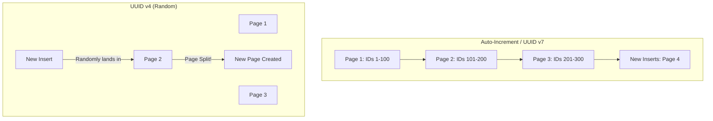

# Prefer UUID over Auto-Increment

## Summary
Using Universally Unique Identifiers (UUIDs) instead of sequential Auto-Incrementing Integers (Serial IDs) is a critical security best practice for APIs. This approach prevents **ID Enumeration** attacks, where malicious actors guess valid resource IDs by iterating through numbers. Additionally, it protects sensitive business intelligence by hiding the total volume of records and growth rates from competitors. While UUIDs introduce slightly larger storage requirements, modern versions like **UUID v7** provide a balance between security and database indexing performance.

## Detailed Explanation

### 1. Risk: ID Enumeration & IDOR
Sequential IDs (1, 2, 3...) are predictable. If an API endpoint is `/api/orders/1005`, an attacker can easily try `/api/orders/1006`, `/api/orders/1007`, etc.

*   **BOLA/IDOR**: Predictable IDs are the primary enabler for **Broken Object Level Authorization** (BOLA), also known as **Insecure Direct Object Reference** (IDOR). If the API fails to verify ownership for every request, an attacker can harvest the entire database simply by incrementing the ID in the URL.
*   **Harvesting**: Even with proper authorization, attackers can use sequential IDs to discover which resources exist, creating a map of your system's data.

### 2. Business Intelligence Leak (The "German Tank Problem")
Sequential IDs leak metadata about your company's performance:
*   **Total Volume**: An order ID of `500,000` tells a competitor exactly how many orders you have ever processed.
*   **Growth Rate**: By placing two orders a week apart and comparing the IDs, a competitor can calculate your weekly transaction volume.
*   **User Base**: Sequential User IDs reveal exactly how many users have registered on your platform.

Using UUIDs makes it impossible for external parties to estimate these metrics.

### 3. UUID Types: v4 vs v7

| Feature | UUID v4 | UUID v7 |
| :--- | :--- | :--- |
| **Generation** | Fully Random | Timestamp + Random |
| **Sortable** | No | Yes (Chronological) |
| **DB Performance** | Poor (Index fragmentation) | Excellent (B-Tree friendly) |
| **Entropy** | ~122 bits random | ~74 bits random + 48 bits time |
| **Recommended** | Non-sensitive, non-indexed IDs | **Primary Keys**, Sortable resources |

**UUID v7** is increasingly preferred for databases because it maintains "Locality of Reference." New records are inserted at the end of the index, avoiding the expensive "page splits" caused by the random nature of UUID v4.

### 4. Go (Golang) Implementation

The most common library for handling UUIDs in Go is `github.com/google/uuid`.

#### Generating UUID v4 (Random)
```go
package main

import (
	"fmt"
	"github.com/google/uuid"
)

func main() {
	// Generate a version 4 UUID
	id := uuid.New()
	fmt.Printf("UUID v4: %s\n", id.String())
}
```

#### Generating UUID v7 (Time-Ordered)
UUID v7 is available in `google/uuid` since version `v1.6.0`.

```go
package main

import (
	"fmt"
	"log"
	"github.com/google/uuid"
)

func main() {
	// Generate a version 7 UUID (Time-ordered)
	id, err := uuid.NewV7()
	if err != nil {
		log.Fatalf("failed to generate UUID: %v", err)
	}
	
	fmt.Printf("UUID v7: %s\n", id.String())
	
	// You can extract the timestamp from a v7 UUID
	timestamp := id.Time()
	fmt.Printf("Created at: %v\n", timestamp)
}
```

### 5. Visualizing the Index Impact



## Interview Questions

**Q: Why should you avoid using sequential IDs in public-facing APIs?**
**A:** Sequential IDs lead to ID Enumeration and IDOR vulnerabilities, allowing attackers to guess valid resource IDs. They also leak Business Intelligence, such as total order volume or user growth rates, which competitors can exploit.

**Q: What is the main disadvantage of using UUID v4 as a database primary key?**
**A:** UUID v4 is completely random, which causes high fragmentation in B-Tree indexes. Since new IDs are not sequential, the database must constantly re-order the index (page splits), leading to significant write performance degradation as the table grows.

**Q: How does UUID v7 solve the performance issues of UUID v4?**
**A:** UUID v7 includes a 48-bit timestamp at the beginning of the identifier. This makes the IDs "k-sortable" (mostly ordered by time). For databases, this means new records are appended to the end of the index, similar to auto-incrementing integers, preserving performance while maintaining global uniqueness and unpredictability.

**Q: If you must use sequential IDs internally for performance, how can you protect the API?**
**A:** You can use a "Public ID" (UUID) for external communication while keeping the "Internal ID" (Sequential) for database relations. Alternatively, you can use "Hashids" or "Optimized UUIDs" to mask the sequential nature of the internal IDs before exposing them to the client.
