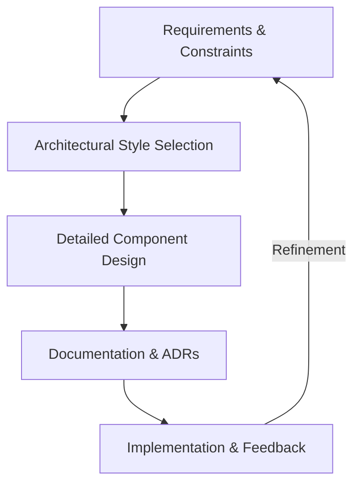

---
---

## Summary
**Design Architecture** is the process of defining a structured solution that meets both functional and technical requirements while optimizing for common quality attributes like performance, security, and manageability. It involves making high-level design choices and framing the technical standards, including software coding standards, tools, and platforms. As the "First Law of Software Architecture" states: *Everything in software architecture is a trade-off.*

## Detailed Explanation

### 1. Architectural Styles vs. Patterns
While often used interchangeably, **Styles** are the highest level of abstraction (the "gross" structure), whereas **Patterns** are recurring solutions to specific problems within that style.

| Style / Pattern | Description | Key Trade-offs |
| :--- | :--- | :--- |
| **Monolithic** | Single unified unit; easy to develop/test initially. | Hard to scale; single point of failure; long deployment cycles. |
| **Layered (N-Tier)** | Components organized into horizontal layers (UI, Service, Data). | Simple to understand but can lead to "sinkhole" anti-patterns. |
| **Microservices** | Collection of small, autonomous services organized by business domain. | High scalability and agility; high operational complexity (network, data consistency). |
| **Event-Driven** | Asynchronous communication via events (Pub/Sub). | High decoupling and responsiveness; difficult to track state and debug. |
| **Hexagonal (Ports & Adapters)** | Decouples core logic from external dependencies (DB, API) via interfaces. | High testability and flexibility; more boilerplate code. |

### 2. Designing for Non-Functional Requirements (NFRs)
Non-functional requirements (or Quality Attributes) define the "how" of the system.

*   **Scalability**: The ability to handle increasing load.
    *   *Horizontal*: Adding more instances (Load Balancers, Statelessness).
    *   *Vertical*: Adding more power to existing instances.
*   **Availability**: Ensuring the system is operational (uptime). Measured in "nines" (e.g., 99.9%). Requires redundancy and failover mechanisms.
*   **Reliability**: The system's ability to perform its intended function correctly under specified conditions (Fault Tolerance).
*   **Maintainability**: How easy it is to modify or extend the system. Relies on Clean Code, Modularization, and Domain-Driven Design (DDD).
*   **Security**: Protecting data and services. Employs "Defense in Depth," Principle of Least Privilege, and Zero Trust.

### 3. The Architecture Design Process
Designing architecture is an iterative lifecycle, not a one-time event:

1.  **Identify Stakeholders & Requirements**: Understand who the system is for and what it *must* do (Functional) vs. how it *should* behave (NFRs).
2.  **Define Constraints**: Budget, time-to-market, existing tech stack, and regulatory requirements (GDPR, SOC2).
3.  **Select Architectural Styles**: Choose the foundational style based on requirements (e.g., choosing Microservices for a highly scalable e-commerce platform).
4.  **Document Decisions (ADRs)**: Use **Architecture Decision Records** to document the *why* behind a choice, its context, and consequences.
5.  **Visualize (C4 Model)**: Use the C4 model (Context, Containers, Components, Code) for clear, multi-level diagrams.
6.  **Review & Iterate**: Perform architecture reviews (e.g., ATAM - Architecture Tradeoff Analysis Method) to validate assumptions.



## Go Application: Hexagonal Architecture Skeleton
In Go, Hexagonal Architecture is a popular choice for building maintainable services by isolating business logic from external frameworks.

```go
package main

import "fmt"

// --- Domain Layer (Core Business Logic) ---

// User represents our domain model
type User struct {
    ID   string
    Name string
}

// UserService defines the business logic interface
type UserService interface {
    RegisterUser(name string) error
}

type userLogic struct {
    repo UserRepository // Port: Driven Actor
}

func (u *userLogic) RegisterUser(name string) error {
    fmt.Printf("Business Logic: Registering user %s\n", name)
    return u.repo.Save(User{Name: name})
}

// --- Ports (Interfaces) ---

// UserRepository is an output port for data storage
type UserRepository interface {
    Save(user User) error
}

// --- Adapters (External Implementations) ---

// GormUserRepository is an adapter for a Postgres database using GORM
type GormUserRepository struct{}

func (r *GormUserRepository) Save(user User) error {
    fmt.Printf("Database Adapter: Saving user %s to Postgres\n", user.Name)
    return nil
}

// --- Entry Point ---

func main() {
    // Dependency Injection: Plugging the adapter into the core logic
    repo := &GormUserRepository{}
    service := &userLogic{repo: repo}

    // Triggering the process
    service.RegisterUser("Antigravity")
}
```

## Recommended Resources
*   **Books**:
    *   *Fundamentals of Software Architecture* by Mark Richards & Neal Ford.
    *   *Designing Data-Intensive Applications* by Martin Kleppmann (The "Bible" of system design).
    *   *Building Microservices* by Sam Newman.
    *   *Clean Architecture* by Robert C. Martin.
*   **Frameworks/Tools**:
    *   **C4 Model**: [c4model.com](https://c4model.com/) for visualization.
    *   **ADR Tools**: Command-line tools for managing Architecture Decision Records.

## Interview Questions
*   **Q: What is the difference between Scalability and Availability?**
    *   **A:** Scalability is the system's ability to handle more work (load), while Availability is the system's ability to remain operational even when parts of it fail. You can have a scalable system that is not available if it has a single point of failure.
*   **Q: Explain the CAP Theorem and how it affects architecture choices.**
    *   **A:** CAP stands for Consistency, Availability, and Partition Tolerance. The theorem states that in a distributed system, you can only guarantee two out of the three during a network partition. Architects must choose between CP (Consistency/Partition Tolerance) or AP (Availability/Partition Tolerance).
*   **Q: What are Architecture Decision Records (ADRs) and why use them?**
    *   **A:** ADRs are short text files that capture a significant architectural decision, the context leading to it, and the consequences. They are used to preserve institutional knowledge and prevent "architecture drift" by documenting the rationale behind past choices.
