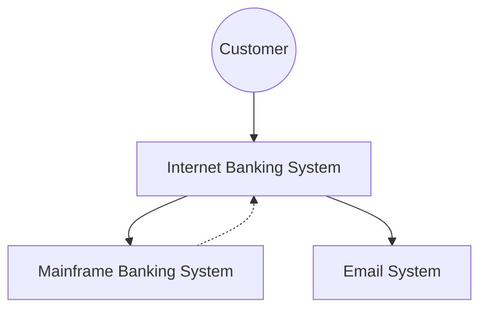

---
---

## Summary
Documentation in software architecture is the bridge between conceptual design and concrete implementation. It ensures that the "Why" behind decisions is preserved, provides a shared mental model for the team through the C4 hierarchy, and follows the "Documentation as Code" (DaC) philosophy to remain maintainable. Effective documentation is tailored to its audience—from stakeholders interested in business value to developers focused on implementation details.

## Detailed Explanation

### 1. Documentation as Code (DaC)
Documentation as Code is the practice of treating documentation with the same rigor as source code. This involves using version control (Git), automated builds, and plain-text formats (Markdown, AsciiDoc).

*   **Benefits**:
    *   **Proximity**: Docs live in the same repository as the code, reducing drift.
    *   **Collaboration**: Peer reviews via Pull Requests (PRs).
    *   **Automation**: Diagrams and API specs are generated automatically during CI/CD.
    *   **Searchability**: Plain-text files are easily searchable and greppable.

### 2. The C4 Model
Created by Simon Brown, the C4 model provides a hierarchical way to visualize software architecture using different levels of "zoom."

*   **Level 1: System Context**: Shows the system as a "black box" and its interactions with users and external systems. Target: Everyone (Stakeholders, Devs, Ops).
*   **Level 2: Containers**: Drills into the system to show applications (Web, Mobile), data stores, and microservices. Target: Developers and Operations.
*   **Level 3: Components**: Breaks down a container into its internal structural parts (e.g., Controllers, Services, Repositories). Target: Developers.
*   **Level 4: Code**: Detailed implementation diagrams (e.g., UML Class diagrams). Target: Developers (often generated or omitted).

#### C4 Context Diagram (Mermaid Example)


### 3. Architecture Decision Records (ADR)
An ADR is a short text file that captures an important architectural decision, its context, and its consequences.

*   **Structure**:
    *   **Title**: Clear and numbered (e.g., `001-use-postgresql.md`).
    *   **Status**: Proposed, Accepted, Superceded, Deprecated.
    *   **Context**: What problem are we solving? What were the constraints?
    *   **Decision**: What did we choose?
    *   **Consequences**: What are the trade-offs? (The "debt" we accepted).

### 4. Writing for Different Audiences
Architects must speak multiple "languages" depending on the reader:

| Audience | Focus | Key Artifacts |
| :--- | :--- | :--- |
| **Stakeholders** | Business value, ROI, Risk | C1 Context Diagrams, High-level Roadmaps |
| **Developers** | Implementation, API, DB Schema | C2/C3 Diagrams, ADRs, Swagger/OpenAPI |
| **Operations** | Deployment, Monitoring, Scale | Infrastructure Diagrams, Runbooks |
| **Security** | Data flow, AuthN/AuthZ | Threat Models, Trust Boundaries |

### 5. Essential Tooling
*   **Mermaid.js**: Best for quick, text-based diagrams directly in Markdown (supported by GitHub, GitLab, and Obsidian).
*   **PlantUML**: The industry standard for complex Diagrams as Code; very flexible but requires a rendering server.
*   **Structurizr DSL**: A "model-first" approach where you define the architecture in code (e.g., Java, C#, or Go DSL) and export it to various visual formats.
*   **Obsidian**: An excellent tool for maintaining a "Second Brain" of architecture notes, ADRs, and technical roadmaps using linked Markdown files.

## Application in Go (Golang)

In the Go ecosystem, documentation is deeply integrated into the development flow:

### 1. Self-Documenting Code with GoDoc
Go enforces a standard for comments that automatically generates documentation via `go doc`.
```go
// UserStore defines the interface for persisting user data.
// It follows the Repository pattern to decouple the domain from the DB.
type UserStore interface {
    Save(ctx context.Context, u *User) error
}
```

### 2. Diagrams as Code in CI/CD
You can automate the generation of C4 diagrams from Go code using libraries like `structurizr-go` or by embedding Mermaid snippets in your `README.md`.

### 3. API Documentation
Standardize on **OpenAPI/Swagger**. Tools like `swag` can parse Go comments to generate a `swagger.json` file.

## Interview Questions

**Q: What is the difference between a Container and a Component in the C4 model?**
**A:** A Container is a deployable unit (e.g., a Go microservice, a React frontend, or a PostgreSQL database) that runs as a separate process. A Component is a grouping of related functionality *within* a container (e.g., a PaymentService or a UserRepository) that is not independently deployable.

**Q: Why are "Consequences" the most important part of an ADR?**
**A:** Because every architectural choice is a trade-off. Capturing consequences ensures the team understands what they are giving up (e.g., "choosing NoSQL for speed means sacrificing strict ACID compliance") and prevents future teams from reverting the decision without understanding why it was made.

**Q: How do you handle documentation for a project that changes rapidly?**
**A:** I use "Documentation as Code." By keeping diagrams and records in the Git repo, they evolve alongside the code. I also prioritize automated artifacts (like Swagger for APIs) and high-level C4 diagrams over low-level implementation docs that drift easily.

**Q: When would you use PlantUML over Mermaid?**
**A:** I use Mermaid for simple, inline diagrams in Markdown for speed. I switch to PlantUML when I need advanced features like complex sequence diagrams, timing diagrams, or when I need a standardized styling that Mermaid might struggle to maintain across a large set of docs.
