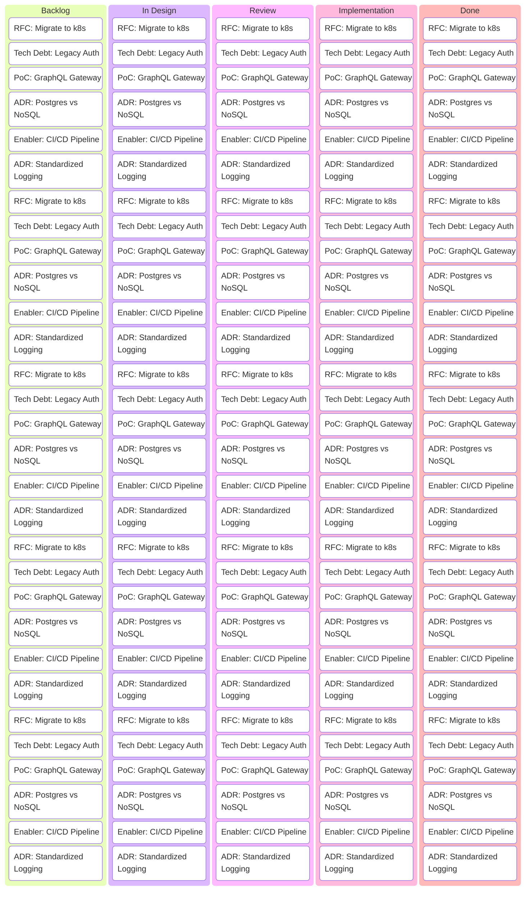

---
---

## Summary
Trello and Kanban boards serve as lightweight, visual tools for Software Architects to manage the **Architectural Runway**, track **Architecture Decision Records (ADRs)**, and oversee **Technical Debt**. By moving away from static documentation toward dynamic, visible workflows, architects can ensure alignment between long-term technical strategy and immediate delivery team needs.

## Detailed Explanation

### 1. Visualizing Architectural Runways and Technical Debt
The **Architectural Runway** consists of the existing code, components, and infrastructure necessary to implement near-term features without excessive redesign.

*   **Kanban Implementation**: Use a dedicated swimlane or board for "Enabler" items.
*   **Tech Debt Labels**: 
    *   `Debt: Technical` (Code smell, legacy libraries)
    *   `Debt: Architectural` (Bottlenecks, scaling limits)
    *   `Debt: Infrastructure` (Outdated CI/CD, manual processes)
*   **Visibility**: Columns like `Identified`, `Scheduled`, `Repaid`, and `Accepted (Permanent Debt)` allow stakeholders to see the "cost of doing business."

### 2. Tracking Decisions and RFCs (ADRs)
Software Architects often use Trello to manage the lifecycle of an **RFC (Request for Comments)** or an **ADR (Architecture Decision Record)**.

*   **Workflow**: `Ideation` → `Drafting` → `Review` → `Approved/Rejected` → `Archived`.
*   **Artifacts**: Attach Markdown files or links to GitHub PRs directly to cards. 
*   **Governance**: Use labels like `Critical`, `Breaking Change`, or `Cross-Team` to flag high-impact decisions.

### 3. Lightweight Management for Spikes and PoCs
**Architectural Spikes** are time-boxed investigations to reduce uncertainty.

*   **Structure**:
    *   **Goal**: Defined in the card description.
    *   **Success Criteria**: Checklists for what must be proven.
    *   **Outcome**: The card moves to "Done" only when a decision is made or a PoC is demonstrated.
*   **Trello Power-Ups**: Integration with GitHub/GitLab to track code experiments directly.

### 4. Cross-Team Visibility and Alignment
A "Portfolio Architecture" board provides a bird's-eye view of all major technical shifts across multiple squads.

*   **Dependency Tracking**: Use Trello's "Card Links" or "Attachments" to show how an infrastructure change in Team A affects the API in Team B.
*   **Automation**: Use Trello Butler to sync cards between a high-level Architect board and low-level Team Sprint boards.

## Mermaid Diagram: Architectural Workflow



## Go Application: Trello API Automation
Architects often automate board updates. Here is a simple Go example using the Trello API to fetch "Critical" architecture cards.

```go
package main

import (
	"encoding/json"
	"fmt"
	"net/http"
	"os"
)

type Card struct {
	ID   string `json:"id"`
	Name string `json:"name"`
	Desc string `json:"desc"`
}

func main() {
	apiKey := os.Getenv("TRELLO_API_KEY")
	token := os.Getenv("TRELLO_TOKEN")
	boardID := "your-board-id"

	url := fmt.Sprintf("https://api.trello.com/1/boards/%s/cards?key=%s&token=%s", boardID, apiKey, token)

	resp, err := http.Get(url)
	if err != nil {
		panic(err)
	}
	defer resp.Body.Close()

	var cards []Card
	if err := json.NewDecoder(resp.Body).Decode(&cards); err != nil {
		panic(err)
	}

	fmt.Println("Active Architecture Initiatives:")
	for _, card := range cards {
		fmt.Printf("- [%s] %s\n", card.ID, card.Name)
	}
}
```

## Interview Questions

*   **Q: How do you balance the Architectural Runway with Business Features in a Kanban board?**
*   **A:** By using "capacity allocation." We reserve a percentage of the WIP (Work In Progress) limits for "Enabler" cards (Architectural Runway) vs. "Feature" cards. This ensures technical health is prioritized alongside business value.

*   **Q: Why use a visual tool like Trello for ADRs instead of just a Git repo?**
*   **A:** Trello provides visibility for non-technical stakeholders and allows for an active "Review" stage where discussions are centralized. Once approved, the final ADR is typically committed to the Git repo for versioning.

*   **Q: What is the benefit of a cross-team Architecture Board?**
*   **A:** It identifies "Systemic Debt"—issues that affect multiple teams—and prevents silos by showing how one team's architectural decision might impact others before implementation starts.
