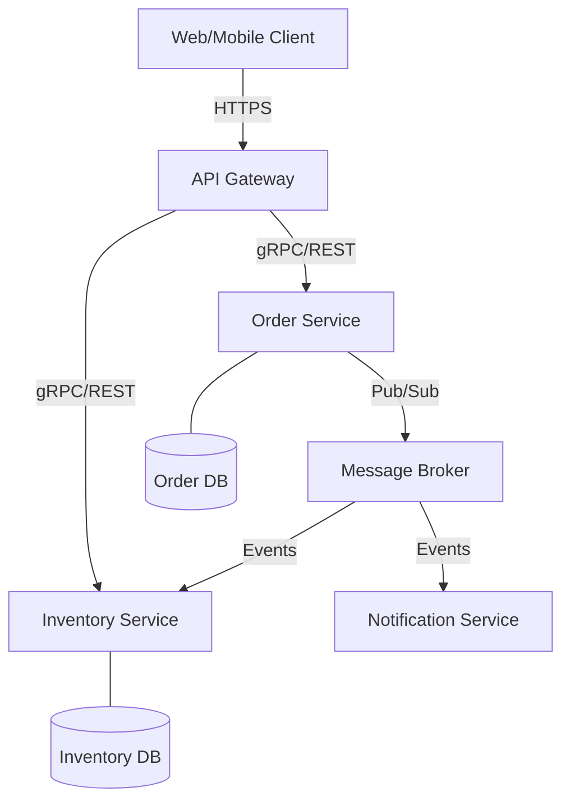
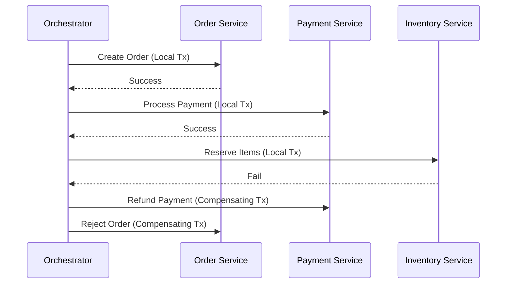

---
---

## Summary
Microservices architecture is an architectural style that structures an application as a collection of small, autonomous, and loosely coupled services. Each service is organized around a specific business capability and can be developed, deployed, and scaled independently. This approach enables rapid and reliable delivery of complex applications by allowing teams to work in parallel on different components, though it introduces significant complexity in terms of distributed data management, inter-service communication, and infrastructure overhead.

## Detailed Explanation

### 1. Decomposition Strategies
Defining service boundaries is the most critical task in microservices design.

#### By Business Capability
*   **Definition**: Services are aligned with business functions (e.g., Inventory Management, Order Processing, Shipping).
*   **Pros**: Direct mapping to business value and organizational structure.
*   **Cons**: May result in large, monolithic services if capabilities are too broad.

#### By Subdomain (Domain-Driven Design)
*   **Definition**: Uses DDD concepts to identify **Bounded Contexts**.
    *   **Core Subdomains**: Most important to the business (Competitive advantage).
    *   **Supporting Subdomains**: Related to what the business does but not the core (e.g., Catalog).
    *   **Generic Subdomains**: Not specific to the business (e.g., Authentication, Payments).
*   **Pros**: Clean boundaries based on domain models; handles complexity better.

### 2. Inter-Service Communication

#### Synchronous (Request-Response)
*   **HTTP/REST**: Simple, ubiquitous, but text-based (JSON) and higher overhead.
*   **gRPC**: High performance, binary (Protocol Buffers), uses HTTP/2, supports streaming. Best for internal service-to-service communication.
*   **Trade-off**: Tight temporal coupling; if the downstream service is down, the upstream service fails or hangs.

#### Asynchronous (Messaging)
*   **Patterns**: Pub/Sub, Point-to-Point.
*   **Tools**: RabbitMQ, Apache Kafka, Amazon SQS.
*   **Pros**: Temporal decoupling, better resilience, handles traffic spikes.
*   **Cons**: Increased complexity, eventual consistency challenges.

### 3. Data Management
In microservices, the **Database per Service** pattern is mandatory to ensure loose coupling.

#### Challenges
*   **Distributed Transactions**: Standard ACID transactions across services are impractical.
*   **Saga Pattern**: Manages distributed transactions as a sequence of local transactions.
    *   **Choreography**: Each service produces and listens to events (decentralized).
    *   **Orchestration**: A central orchestrator tells participants what to do (centralized).
*   **CQRS (Command Query Responsibility Segregation)**: Separates read and write operations, often used with **Event Sourcing** to reconstruct state from a stream of events.

### 4. Infrastructure Requirements
Microservices require a robust "chassis" to handle distributed system complexities.

*   **API Gateway**: The entry point for North-South traffic. Handles Auth, Rate Limiting, and Request Routing.
*   **Service Discovery**: Allows services to find each other dynamically (e.g., Consul, Eureka, or Kubernetes DNS).
*   **Circuit Breaker**: Prevents a failing service from causing a cascading failure (e.g., Hystrix, gobreaker).
*   **Service Mesh**: Manages East-West traffic (service-to-service) via sidecar proxies (e.g., Istio, Linkerd), handling retries, mTLS, and observability.

## Go Application Context

Go is a premier language for microservices due to its performance, concurrency model (goroutines), and robust standard library.

### gRPC Service Example
```go
// proto definition (simplified)
// service OrderService {
//   rpc CreateOrder(OrderRequest) returns (OrderResponse);
// }

package main

import (
	"context"
	"log"
	"net"

	"google.golang.org/grpc"
	pb "github.com/example/order-service/proto"
)

type server struct {
	pb.UnimplementedOrderServiceServer
}

func (s *server) CreateOrder(ctx context.Context, in *pb.OrderRequest) (*pb.OrderResponse, error) {
	log.Printf("Received: %v", in.GetOrderId())
	return &pb.OrderResponse{Message: "Order Created"}, nil
}

func main() {
	lis, err := net.Listen("tcp", ":50051")
	if err != nil {
		log.Fatalf("failed to listen: %v", err)
	}
	s := grpc.NewServer()
	pb.RegisterOrderServiceServer(s, &server{})
	if err := s.Serve(lis); err != nil {
		log.Fatalf("failed to serve: %v", err)
	}
}
```

### Circuit Breaker Implementation
Using `github.com/sony/gobreaker`:
```go
var cb *gobreaker.CircuitBreaker

func init() {
	st := gobreaker.Settings{
		Name:        "HTTP GET",
		MaxRequests: 3,
		Interval:    5 * time.Second,
		Timeout:     30 * time.Second,
		ReadyToTrip: func(counts gobreaker.Counts) bool {
			failureRatio := float64(counts.TotalFailures) / float64(counts.Requests)
			return counts.Requests >= 3 && failureRatio >= 0.6
		},
	}
	cb = gobreaker.NewCircuitBreaker(st)
}

func GetServiceData() ([]byte, error) {
	body, err := cb.Execute(func() (interface{}, error) {
		resp, err := http.Get("http://unreliable-service/api")
		if err != nil {
			return nil, err
		}
		defer resp.Body.Close()
		return ioutil.ReadAll(resp.Body)
	})
	if err != nil {
		return nil, err
	}
	return body.([]byte), nil
}
```

## Diagrams

### Microservices Ecosystem


### Saga Orchestration


## Interview Questions

**Q: What are the main challenges of data consistency in Microservices?**
**A:** The primary challenge is the lack of distributed transactions (ACID). Since each service has its own database, ensuring consistency across services requires the Saga pattern (compensating transactions) or Eventual Consistency, which increases complexity and makes the system harder to reason about.

**Q: When should you use gRPC instead of REST?**
**A:** gRPC is preferred for internal service-to-service communication when performance is critical (binary format), when you need strict contracts (Protobuf), or when bidirectional streaming is required. REST is better for public-facing APIs where ease of consumption by diverse clients is more important.

**Q: Explain the difference between API Gateway and Service Mesh.**
**A:** An API Gateway manages **North-South** traffic (from external clients to the internal network), focusing on concerns like authentication and edge routing. A Service Mesh manages **East-West** traffic (between internal services), focusing on observability, security (mTLS), and reliability (retries, circuit breaking) at the network layer.

**Q: How do you handle service failure in a microservices environment?**
**A:** Service failure is handled through **Circuit Breakers** (to stop cascading failures), **Retries** with exponential backoff, **Timeouts**, and providing **Fallbacks** (default responses or cached data). Monitoring and distributed tracing (e.g., Jaeger) are also essential to detect and diagnose failures.
