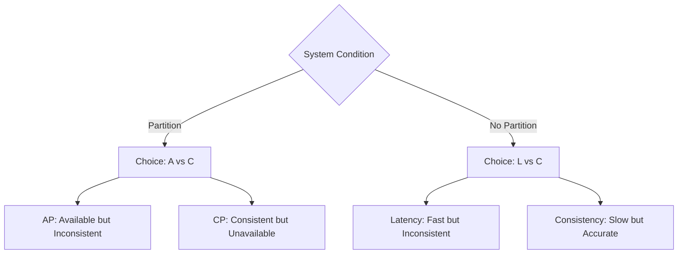

---
---

## Summary
Distributed systems are collections of independent computers that appear to users as a single coherent system. For a Software Architect, mastering distributed systems involves understanding the inherent trade-offs between consistency, availability, and latency, while acknowledging that network failures and delays are inevitable. This note covers the foundational theorems, fallacies, and algorithms that govern modern distributed architecture.

## Detailed Explanation

### 1. Fallacies of Distributed Computing
Originally identified by L. Peter Deutsch and others at Sun Microsystems, these are false assumptions that developers often make when moving from monolithic to distributed environments.

#### The Original Eight
1.  **The network is reliable**: Packets drop, switches fail, and cables get cut.
2.  **Latency is zero**: Moving data across the wire takes time (speed of light is a limit).
3.  **Bandwidth is infinite**: Network congestion and physical limits exist.
4.  **The network is secure**: Assume the network is hostile; encrypt and authenticate.
5.  **Topology doesn't change**: Nodes join/leave, routes change, and IP addresses are recycled.
6.  **There is one administrator**: Different teams/orgs manage different parts of the infra.
7.  **Transport cost is zero**: Serialization, deserialization, and cloud egress fees cost money and CPU.
8.  **The network is homogeneous**: Systems use different OSs, protocols, and hardware.

#### Modern Additions (Richards & Ford)
*   **Versioning is simple**: Updating 100 microservices simultaneously is impossible.
*   **Compensating updates always work**: Sagas/Distributed transactions can fail during cleanup.
*   **Observability is optional**: You cannot debug what you cannot see in a distributed trace.

### 2. CAP and PACELC Theorems

#### CAP Theorem
Proposed by Eric Brewer, it states that a distributed data store can only provide two of the following three guarantees:
*   **Consistency (C)**: Every read receives the most recent write or an error.
*   **Availability (A)**: Every request receives a (non-error) response, without the guarantee that it contains the most recent write.
*   **Partition Tolerance (P)**: The system continues to operate despite an arbitrary number of messages being dropped by the network between nodes.

**The Architect's Choice**: Since **P** is a requirement in any network-based system, the choice is always between **CP** (Consistency over Availability) or **AP** (Availability over Consistency).

#### PACELC Theorem
An extension of CAP that addresses the trade-off during **normal operation** (no partitions).
*   **P**artition: If there is a partition (**P**), one must choose between Availability (**A**) and Consistency (**C**).
*   **E**lse: **E**lse (under normal conditions), one must choose between Latency (**L**) and Consistency (**C**).



### 3. Consensus Algorithms
Consensus is the process of getting a group of nodes to agree on a single value/state.

#### Paxos
The "granddaddy" of consensus protocols. It is mathematically proven but notoriously difficult to implement.
*   **Roles**: Proposer, Acceptor, Learner.
*   **Phases**:
    1.  **Prepare/Promise**: Proposer asks for a quorum to ignore older proposals.
    2.  **Accept/Accepted**: Proposer asks for a quorum to commit a value.

#### Raft
Designed to be more understandable than Paxos while providing the same safety.
*   **Leader Election**: One node is elected leader; others are followers.
*   **Log Replication**: All writes go to the leader, who replicates them to a quorum.
*   **Safety**: Only nodes with the most up-to-date log can become leaders.

### 4. Replication and Sharding

#### Replication Strategies
Used for high availability and low latency.
*   **Single-Leader**: All writes to one node; reads from any (eventual consistency).
*   **Multi-Leader**: Writes to multiple nodes; complex conflict resolution (e.g., CRDTs).
*   **Leaderless (Dynamo-style)**: Write to $W$ nodes, read from $R$ nodes ($R+W > N$ for quorum).

#### Sharding (Partitioning)
Used for horizontal scaling (volume).
*   **Key Range Sharding**: Data sorted by key; allows range queries but risks hotspots.
*   **Hash Sharding**: Even distribution of data; no range queries.
*   **Rebalancing**: Moving shards as the cluster grows (consistent hashing).

## Application in Go (Golang)
In Go, distributed systems primitives are often built using `crypto` for hashing and `encoding/binary` for network-safe data representation.

### Shard Key Simulation
```go
package main

import (
	"crypto/md5"
	"encoding/binary"
	"fmt"
)

// ShardResolver determines which shard a key belongs to.
type ShardResolver struct {
	ShardCount int
}

// GetShard returns the shard index for a given key.
func (s *ShardResolver) GetShard(key string) int {
	hash := md5.Sum([]byte(key))
	// Convert first 8 bytes of hash to uint64
	val := binary.BigEndian.Uint64(hash[:8])
	return int(val % uint64(s.ShardCount))
}

func main() {
	resolver := ShardResolver{ShardCount: 4}
	keys := []string{"user_123", "order_456", "session_abc", "user_789"}

	for _, k := range keys {
		fmt.Printf("Key: %s -> Shard: %d\n", k, resolver.GetShard(k))
	}
}
```

## Interview Questions
*   **Q: Why is Partition Tolerance (P) not optional in distributed systems?**
*   **A:** Because network failures are a physical reality. If you choose CA, your system will crash or hang as soon as any network hiccup occurs between nodes, which is unacceptable for a "distributed" system.
*   **Q: How does PACELC change how we view a database like DynamoDB or Cassandra?**
*   **A:** It highlights that even without failures, these systems often choose **L** (Latency) over **C** (Consistency) to provide sub-millisecond responses, leading to eventual consistency models.
*   **Q: What is the main advantage of Raft over Paxos?**
*   **A:** Understandability and the explicit "Leader" state, which simplifies the implementation of log replication and membership changes.
