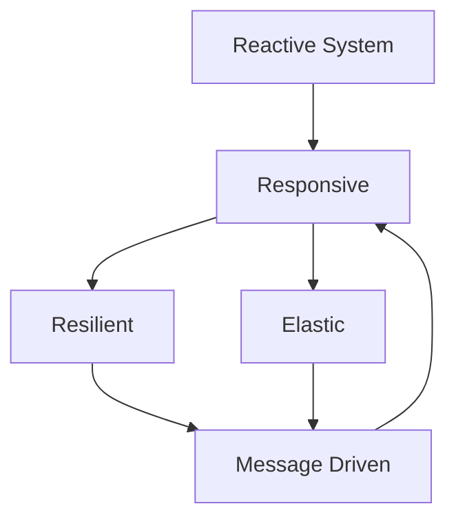

#SoftwareArchitecture

## Summary
Reactive Programming is a declarative programming paradigm concerned with data streams and the propagation of change. It enables developers to build systems that are asynchronous, non-blocking, and event-driven. In a broader sense, Reactive Systems (as defined by the Reactive Manifesto) focus on building robust, distributed architectures that remain responsive under heavy load and failure conditions by being resilient, elastic, and message-driven.

## Detailed Explanation

### The Reactive Manifesto
The Reactive Manifesto defines four core characteristics that a Reactive System must possess to meet modern application demands. These traits are interconnected:

1. **Responsive**: The system responds in a timely manner. It is the cornerstone of usability and utility.
2. **Resilient**: The system stays responsive in the face of failure. This is achieved by replication, containment, isolation, and delegation.
3. **Elastic**: The system stays responsive under varying workload. It can scale up or down based on demand without requiring a full redesign.
4. **Message-Driven**: Reactive Systems rely on asynchronous message-passing to establish a boundary between components that ensures loose coupling, isolation, and location transparency.



### Reactive Programming (Rx) vs. Reactive Systems
It is critical for an architect to distinguish between the *programming style* and the *system architecture*:

*   **Reactive Programming**: A functional approach to handling asynchronous data streams (e.g., RxJS, Project Reactor, RxGo). It focuses on the internal logic of a single component or service. It is a **tool** used to achieve responsiveness.
*   **Reactive Systems**: A holistic architectural approach focused on the interaction between multiple services (e.g., Akka, Microservices with Message Brokers). It focuses on **resilience and elasticity** at scale.

### Backpressure Handling
Backpressure is a feedback mechanism that allows a data consumer to signal to the producer that it is being overwhelmed. Without backpressure, a fast producer can exhaust the resources of a slow consumer, leading to system failure (OOM errors).

**Common Strategies:**
*   **Buffering**: Storing incoming data in a queue until the consumer is ready (limited by memory).
*   **Dropping**: Discarding the most recent data points when the buffer is full.
*   **Latest**: Keeping only the most recent value and discarding previous ones.
*   **Control (Request-based)**: The consumer explicitly requests a specific number of items (e.g., Reactive Streams `request(n)`).

### Go Implementation (Go-specific)
Go is inherently "reactive" due to its first-class support for goroutines and channels. While libraries like `RxGo` exist, many Go developers prefer native idiomatic patterns.

#### Native Go (Channels & Select)
Go channels provide built-in synchronization and can implement simple backpressure using buffered channels.

```go
package main

import (
	"fmt"
	"time"
)

func producer(ch chan<- int) {
	for i := 1; i <= 10; i++ {
		fmt.Printf("Producing: %d\n", i)
		ch <- i // Blocks if channel is full (Backpressure)
	}
	close(ch)
}

func consumer(ch <-chan int) {
	for val := range ch {
		fmt.Printf("Consuming: %d\n", val)
		time.Sleep(500 * time.Millisecond) // Simulate slow processing
	}
}

func main() {
	// Buffered channel of size 2 acts as a simple buffer
	dataStream := make(chan int, 2)

	go producer(dataStream)
	consumer(dataStream)
}
```

#### Using RxGo
For complex stream manipulations (filtering, mapping, merging), `RxGo` provides a more functional interface.

```go
import (
	"context"
	"fmt"
	"github.com/reactivex/rxgo/v2"
)

func main() {
	observable := rxgo.Just(1, 2, 3, 4, 5)()
	
	ch := observable.Filter(func(item interface{}) bool {
		return item.(int)%2 == 0
	}).Map(func(_ context.Context, item interface{}) (interface{}, error) {
		return item.(int) * 10, nil
	}).Observe()

	for item := range ch {
		fmt.Println(item.V)
	}
}
```

### Use Cases
*   **Real-time Dashboards**: Processing live telemetry or stock market data.
*   **High-Concurrency API Gateways**: Handling thousands of simultaneous requests without blocking threads.
*   **IoT & Sensor Networks**: Managing high-frequency data bursts from multiple devices.
*   **Stream Processing**: ETL pipelines where data is transformed on the fly.

## Interview Questions

**Q: What is the difference between Reactive Programming and Reactive Systems?**
**A:** Reactive Programming is a technique for managing data streams within a single application (e.g., using Rx libraries). Reactive Systems is an architectural pattern for distributed systems that ensures responsiveness through message-passing, resilience, and elasticity. You can build a Reactive System without using Reactive Programming, and vice versa.

**Q: Explain Backpressure and why it's vital in Reactive streams.**
**A:** Backpressure is a mechanism where a consumer signals to a producer that it cannot keep up with the data rate. It prevents system crashes due to resource exhaustion (like memory or CPU) by slowing down the producer or dropping data, ensuring the system remains stable under load.

**Q: How does the Reactive Manifesto define Resilience?**
**A:** Resilience is the ability of a system to remain responsive even when components fail. This is achieved by isolating failures (so they don't cascade), containing them within a single component, and delegating recovery to a supervisor or another component.

**Q: When should you NOT use a Reactive approach?**
**A:** Reactive systems introduce significant complexity (debugging challenges, stack trace issues, mental overhead). You should avoid it for simple CRUD applications, systems with low concurrency requirements, or where synchronous, imperative code is sufficient and more maintainable.
