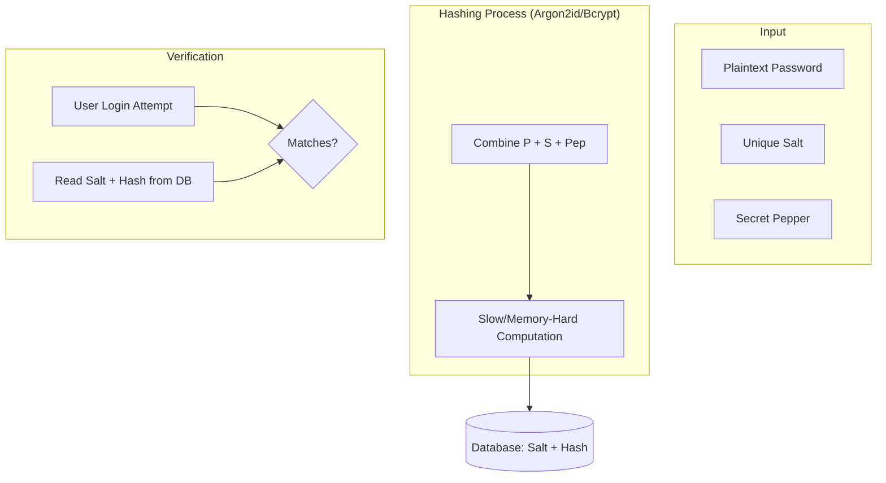

---
---

## Summary
**Hashing Algorithms** are one-way mathematical functions that transform arbitrary input data into a fixed-size bit string (digest). From an architectural perspective, the core challenge is selecting the right algorithm based on the use case: **Fast Hashes** for data integrity and performance, and **Slow/Memory-Hard Hashes** for secure password storage. Modern standards prioritize resistance against specialized hardware (GPUs/ASICs) using algorithms like **Argon2id**.

## Detailed Explanation

### 1. Hashing vs. Encryption vs. Encoding
Understanding the "Why" behind each transformation is fundamental:
*   **Encoding** (e.g., Base64, Hex): Purpose is **usability/transmission**. It is 100% reversible without a key and provides zero security.
*   **Encryption** (e.g., AES, RSA): Purpose is **confidentiality**. It is a two-way function, reversible only with the correct cryptographic key.
*   **Hashing** (e.g., SHA-256, Argon2): Purpose is **integrity and verification**. It is a one-way function designed to be irreversible.

### 2. Password Hashing (The "Slow" Path)
In password storage, **speed is a vulnerability**. High-speed hashing allows attackers to perform trillions of guesses per second using GPUs.
*   **Argon2id**: The modern gold standard (PHC winner). It is **memory-hard**, meaning it requires a configurable amount of RAM to compute, making it extremely expensive to crack with GPUs or ASICs.
*   **Bcrypt**: The traditional standard. Uses an adaptive "work factor" (cost) to slow down computation. While robust, it is less resistant to specialized hardware than Argon2.
*   **Scrypt**: An older memory-hard algorithm, often used in cryptocurrencies.
*   **PBKDF2**: A NIST-recommended, iteration-based algorithm. It is FIPS-compliant but lacks memory-hardness, making it more susceptible to GPU-based brute force compared to modern alternatives.

### 3. Data Integrity (The "Fast" Path)
These are designed to be fast to verify large files or stream data.
*   **MD5 & SHA-1**: **Legacy/Broken**. They are susceptible to **Collision Attacks** (finding two different inputs that produce the same hash). Use only for non-security checksums.
*   **SHA-2 (SHA-256, SHA-512)**: Current industry standard for digital signatures, TLS, and blockchain.
*   **SHA-3**: A newer sponge-construction standard, highly resistant to length-extension attacks.

### 4. Key Architectural Concepts
*   **Salt**: A unique, random string added to *each* user's password before hashing.
    *   *Purpose*: Prevents **Rainbow Table** attacks (precomputed hashes) and ensures that identical passwords result in different hashes.
*   **Pepper**: A secret value added to *all* passwords before hashing, stored **separately** from the database (e.g., in a Secrets Vault or HSM).
    *   *Purpose*: Provides defense-in-depth; even if the database is leaked, the hashes cannot be cracked without the pepper.
*   **Work Factor / Cost**: Parameters that define how much CPU/Memory is required to compute one hash. Architects must tune this to balance user login latency (~100-500ms) against security.
*   **Collision Resistance**: The property that makes it computationally infeasible to find two different inputs that map to the same output.

## Go Application

Go provides standard and extended (`x/crypto`) packages for all modern hashing needs.

```go
package main

import (
	"crypto/sha256"
	"fmt"
	"log"

	"golang.org/x/crypto/argon2"
	"golang.org/x/crypto/bcrypt"
)

func main() {
	password := "user-secure-password"

	// 1. Data Integrity: SHA-256 (Fast)
	// Use for: File checksums, API request signing
	h := sha256.Sum256([]byte(password))
	fmt.Printf("SHA256 (Integrity): %x\n", h)

	// 2. Password Storage: Bcrypt (Legacy Standard)
	// Cost 10 is standard; 12+ is better for high security
	hashedBcrypt, err := bcrypt.GenerateFromPassword([]byte(password), 12)
	if err != nil {
		log.Fatal(err)
	}
	fmt.Printf("Bcrypt Hash: %s\n", string(hashedBcrypt))

	// 3. Password Storage: Argon2id (Modern Standard)
	// Parameters: time=1, memory=64MB, threads=4, keyLen=32
	salt := []byte("unique-random-salt")
	hashedArgon2 := argon2.IDKey([]byte(password), salt, 1, 64*1024, 4, 32)
	fmt.Printf("Argon2id Hash (Hex): %x\n", hashedArgon2)
}
```

## Interview Preparation

**Q: Why shouldn't you use SHA-256 for storing passwords?**
**A:** SHA-256 is designed to be fast for data integrity. A modern GPU can compute billions of SHA-256 hashes per second, allowing an attacker to brute-force a leaked database in minutes. Password hashes like Argon2id are "slow" and "memory-hard" by design to neutralize this advantage.

**Q: What is the difference between a Salt and a Pepper?**
**A:** A Salt is unique per user and stored in the database next to the hash. It prevents rainbow table attacks. A Pepper is a single secret shared across all users and stored *outside* the database. It protects against cases where the database itself is compromised.

**Q: What is a Collision Attack, and which algorithms are vulnerable?**
**A:** A collision attack occurs when two different inputs produce the same hash output. MD5 and SHA-1 are cryptographically broken because it is now cheap to generate such collisions, allowing attackers to forge certificates or malicious files that appear valid.

**Q: How do you choose the "Cost" parameter for Bcrypt or Argon2?**
**A:** You should benchmark your production servers and set the cost so that a single hash calculation takes between 100ms and 500ms. This is imperceptible to a single user but makes brute-forcing millions of combinations computationally and financially expensive for an attacker.

## Diagram


