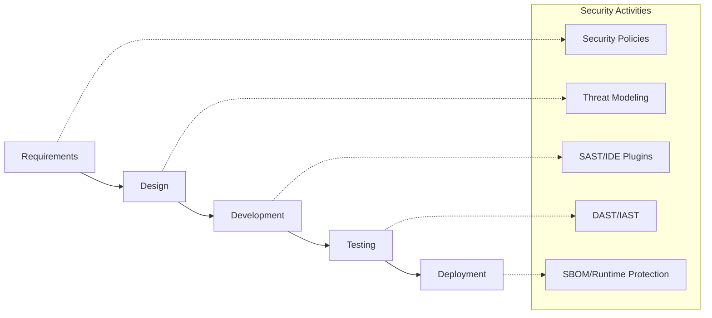

---
---

## Summary
The **OWASP Top 10** is a standard awareness document for developers and web application security, representing a broad consensus on the most critical security risks. For a Software Architect, it serves as the foundational baseline for designing secure systems. The **2025** version (the most recent update) emphasizes **Software Supply Chain Failures** and **Insecure Design**, reflecting the industry's shift towards complex dependency trees and the need for security at the architectural level.

## Detailed Explanation

The OWASP Top 10:2025 reflects modern threats, including automated supply chain attacks and complex business logic flaws.

### 1. A01: Broken Access Control
Access control ensures users cannot act outside of their intended permissions.
*   **Architectural Mitigations**:
    *   **Deny by Default**: Configure all access to be blocked unless explicitly permitted.
    *   **Centralized Enforcement**: Use a single, reusable access control module or middleware rather than scattered checks.
    *   **Least Privilege**: Grant users only the minimum access required for their role.
    *   **Server-Side Validation**: Never rely on client-side state for authorization decisions.

### 2. A02: Security Misconfiguration
Vulnerabilities arising from default settings, incomplete configurations, or ad-hoc changes.
*   **Architectural Mitigations**:
    *   **Infrastructure as Code (IaC)**: Use tools like Terraform or CloudFormation to ensure consistent, audited environments.
    *   **Hardened Baselines**: Establish "Golden Images" and standard configuration templates.
    *   **Automated Auditing**: Continuously scan environments for drift from security baselines.

### 3. A03: Software Supply Chain Failures
Risks from malicious or vulnerable dependencies, build tools, and CI/CD pipelines.
*   **Architectural Mitigations**:
    *   **Software Bill of Materials (SBOM)**: Generate and maintain an inventory of all components (CycloneDX, SPDX).
    *   **Dependency Pinning**: Use specific versions or hashes for dependencies.
    *   **SCA Integration**: Automatically scan for known CVEs in the build pipeline.
    *   **Signed Artifacts**: Use tools like Sigstore/Cosign to verify the integrity of build outputs.

### 4. A04: Cryptographic Failures
Exposure of sensitive data due to weak encryption or poor key management.
*   **Architectural Mitigations**:
    *   **Data Classification**: Identify sensitive data (PII, PHI) and apply appropriate controls.
    *   **Strong Algorithms**: Use industry standards like AES-GCM (256-bit) and Argon2 for password hashing.
    *   **KMS/HSM**: Offload key management to specialized services (AWS KMS, HashiCorp Vault).
    *   **Disable Weak Protocols**: Enforce TLS 1.3 and disable legacy ciphers.

### 5. A05: Injection
Attacker-supplied data is mistaken for code or commands (SQL, NoSQL, OS).
*   **Architectural Mitigations**:
    *   **Parameterized Queries**: Use prepared statements for all database interactions.
    *   **Safe APIs**: Prefer APIs that don't allow raw strings (e.g., ORMs).
    *   **Input Validation**: Use positive "allow-list" validation at the entry point.

### 6. A06: Insecure Design
Focuses on risks related to design and architectural flaws.
*   **Architectural Mitigations**:
    *   **Threat Modeling**: Systematically identify potential threats during the design phase (STRIDE/PASTA).
    *   **Secure Design Patterns**: Leverage "Paved Roads" (pre-approved security components).
    *   **Business Logic Reviews**: Analyze workflows for potential abuse (e.g., "Questions and Answers" for password recovery).

### 7. A07: Authentication Failures
Compromised identities and sessions.
*   **Architectural Mitigations**:
    *   **Multi-Factor Authentication (MFA)**: Enforce MFA for all user interactions.
    *   **Centralized Auth**: Use OIDC/OAuth2 providers (Okta, Auth0, Keycloak) instead of custom logic.
    *   **Secure Session Management**: Use short-lived, signed tokens (JWT) and secure cookie flags.

### 8. A08: Software and Data Integrity Failures
Code or data changes that are not verified for integrity.
*   **Architectural Mitigations**:
    *   **Integrity Checks**: Verify signatures for all code updates and data imports.
    *   **Immutable Infrastructure**: Ensure environments are rebuilt from scratch rather than patched.
    *   **No Untrusted Deserialization**: Avoid deserializing data from untrusted sources.

### 9. A09: Security Logging and Alerting Failures
Insufficient logging or monitoring that prevents the detection of breaches.
*   **Architectural Mitigations**:
    *   **Centralized Logging**: Stream logs to a secure, tamper-proof location (Elasticsearch, Splunk).
    *   **Structured Logging**: Use JSON format for easier automated analysis.
    *   **SIEM/SOAR**: Implement real-time monitoring and automated response playbooks.

### 10. A10: Mishandling of Exceptional Conditions
Improper error handling that leads to leaks or unstable states.
*   **Architectural Mitigations**:
    *   **Fail Closed**: Ensure that if a security check fails, the default state is "access denied."
    *   **Generic Error Messages**: Provide users with non-descriptive errors while logging detailed stack traces internally.
    *   **Centralized Error Handling**: Use a global exception handler to catch unhandled errors.

---

## Security in the SDLC (Shift Left)

Shifting Left means integrating security activities as early as possible in the development lifecycle.



### Key Phases:
1.  **Planning/Requirements**: Define security requirements (ASVS).
2.  **Design**: Conduct Threat Modeling sessions.
3.  **Build (SAST)**: Analyze source code for vulnerabilities during CI.
4.  **Test (DAST)**: Simulate attacks against the running application.
5.  **Release (SCA)**: Verify third-party dependencies.

---

## Scanning Tools

| Tool Type | Purpose | Examples |
| :--- | :--- | :--- |
| **SAST** | Static code analysis | CodeQL, Snyk, Checkmarx, SonarQube |
| **DAST** | Dynamic runtime testing | OWASP ZAP, Burp Suite, StackHawk |
| **SCA** | Dependency vulnerability scanning | Snyk, Mend, Dependabot, OWASP Dependency-Check |
| **Secret Scanning** | Detecting hardcoded credentials | TruffleHog, GitGuardian, Gitleaks |
| **IaC Scanning** | Checking infrastructure files | Checkov, Terrascan, tfsec |

---

## Go Code Examples

### 1. Preventing SQL Injection
Always use parameterized queries with the `database/sql` package.

```go
package main

import (
	"database/sql"
	_ "github.com/lib/pq"
	"log"
)

func getUser(db *sql.DB, userID string) {
	// GOOD: Parameterized query
	rows, err := db.Query("SELECT username FROM users WHERE id = $1", userID)
	if err != nil {
		log.Fatal(err)
	}
	defer rows.Close()
	// ... process rows
}
```

### 2. Secure Password Hashing
Use `bcrypt` for hashing instead of simple MD5 or SHA algorithms.

```go
package main

import (
	"golang.org/x/crypto/bcrypt"
	"fmt"
)

func hashPassword(password string) (string, error) {
	bytes, err := bcrypt.GenerateFromPassword([]byte(password), 14)
	return string(bytes), err
}

func checkPasswordHash(password, hash string) bool {
	err := bcrypt.CompareHashAndPassword([]byte(hash), []byte(password))
	return err == nil
}
```

### 3. Secure Error Handling
Avoid leaking internal information in error responses.

```go
package main

import (
	"net/http"
	"log"
)

func handler(w http.ResponseWriter, r *http.Request) {
	err := processData(r)
	if err != nil {
		// Log detailed error for developers
		log.Printf("Internal processing error: %v", err)
		
		// Send generic message to user (A10 Mitigation)
		http.Error(w, "An internal error occurred. Please try again later.", http.StatusInternalServerError)
		return
	}
}
```

---

## Interview Questions

**Q: What is the difference between Insecure Design and Insecure Implementation?**
**A:** Insecure Design (A06) refers to flaws where security controls are missing or incorrectly conceived (e.g., using "security questions" for recovery). Insecure Implementation refers to a defect in a correctly designed control (e.g., a SQL injection vulnerability in a login form that was correctly designed to use authentication).

**Q: How does a Software Bill of Materials (SBOM) help mitigate Supply Chain failures?**
**A:** An SBOM provides a comprehensive list of all components and transitive dependencies used in a project. This allows security teams to quickly identify if a newly discovered vulnerability (CVE) affects their software and trace exactly where that component is used.

**Q: Why is "Deny by Default" a critical architectural principle?**
**A:** It ensures that if an access control check is missed or fails to execute, the system defaults to a secure state (blocking access). This prevents "failing open" (A10), where an error might bypass security logic.

**Q: What is the "Shift Left" approach in security?**
**A:** It is the practice of integrating security early in the Software Development Life Cycle (SDLC), such as threat modeling in the design phase and SAST in the coding phase, rather than treating security as a final "check" before release.
